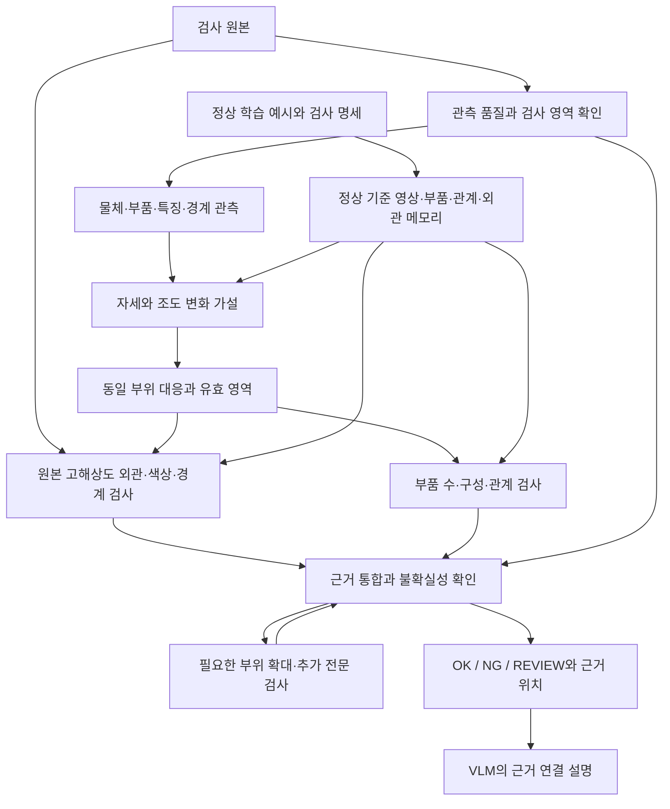

> 원문 스냅샷. 기록 안의 당시 결론은 이후 실험에서 바뀔 수 있습니다.
> 출처: [REASONING_INSPECTION_DESIGN_20260930.md](file:///E:/DH/Sandbox/Dinopatch/docs/REASONING_INSPECTION_DESIGN_20260930.md) · 가져온 날짜는 실험 날짜가 아닙니다. 로컬 경로 링크는 이 PC에서만 열립니다.

# 정상 기준과 관측 근거를 이용한 시각 검사 시스템

작성: 2026-09-30. 상태: 확장 연구 설계안. 이 문서의 통합 모델은 아직 구현·검증되지 않았다.

## 1. 사용자가 원하는 결과

양품 예시를 보고 제품의 구성과 허용 상태를 이해하고, 조도·위치·회전이 달라져도 같은 기준으로 검사한다. 이상 점수만 출력하지 않고 무엇이 달라졌는지, 촬영 조건으로 설명되는 변화와 실제 결함을 어떻게 구분했는지 원본 위치와 함께 제시한다. 속도보다 판정의 정확성과 검증 가능한 근거를 우선한다. VLM, DINO, SAM, 그래프 및 추가 학습을 후보에서 제한하지 않는다.

여기서 '사람처럼'은 인간 사고를 재현했다는 주장이 아니라, **기준 학습 → 관찰 → 대응 → 변화 가설 검증 → 국소 재검사 → 근거 기반 판정**을 명시적으로 수행한다는 뜻이다. 단일 RGB에 관측되지 않은 정보까지 복원하거나 모든 상황의 100% 정확도를 보장할 수는 없다. 어두워져 결함 정보 자체가 사라진 경우에는 재촬영을 요청하는 것이 올바른 출력이다.

## 2. 접근법 선택

| 접근 | 장점 | 우려 | 역할 |
|---|---|---|---|
| 큰 VLM에 정상·검사 이미지를 직접 입력 | 즉시 비교 설명 가능 | 미세 결함·좌표·설명의 사실성 검증 필요 | 독립 비교군 |
| 전용 이상탐지 모델과 정합을 결합 | 국소 수치 근거와 재현성 확보 | 구성·의미적 규칙 표현 부족 | 시각 증거 생성 기반 |
| 정상 모델, 전문 시각 모듈, 그래프, VLM의 근거 통합 | 부분별 역할·실패 원인 추적 가능 | 구성 요소별 검증과 학습 데이터 필요 | 권장 연구 구조 |

모듈 수가 아니라 각 모듈을 추가했을 때 오탐·미검·보류가 실제 개선되는지로 채택한다. 전용 시각 모듈과 논리 추론을 연결하는 방향은 AnomalyGPT와 LogicAD에서도 참고할 수 있지만, 아래 구조 자체는 이 프로젝트의 연구 제안이며 검증된 성능 주장이 아니다.

## 3. 현재 자산과 부족한 것

- DINO/PatchCore 패치 검사, 색상·장거리 관계·부품 그래프 실험, 조도 실험, SAM 자동 분할·정합 도구가 있다.
- 로컬 VLM 도구는 Qwen3-VL-2B-Instruct를 사용한다. 이는 초기 비교 후보이며 최종 모델 선택은 아니다.
- SAM 정상 FIT 179장 중 174장만 내부 후보 3개를 얻었다. RGB 회전 24건 중 2건은 부품을 놓쳤다. 후보 수 일치는 분할 정확도가 아니다.
- GPU는 RTX 5080 16GB다. 동결 모델 순차 실행·특징 캐시로 초기 실험을 구성할 수 있다. 더 큰 VLM의 실행/학습 가능성은 모델별 메모리 실측 후 정한다.
- IV: 확정 라벨 OK 991 / NG 990. 볼트: OK 2,701 / NG 17. 아직 분할하지 않았다. 볼트에는 동일 픽셀 중복 1쌍이 있다.
- Waterseal의 결함 정의는 찢어짐·절삭면 이상이다. IV와 볼트는 클래스 라벨은 있지만 결함 유형·위치·허용 공차를 이 문서에서 임의로 정하지 않는다.
- 새로 필요한 정보는 대표 부품/검사 영역 정답, 허용 변화 명세, 결함 위치·이유의 검수 표본이다. 정상 예시만으로 생산 규격의 의미 전체가 자동으로 결정되지는 않는다.

## 4. 시스템 흐름

확대 검사 반복은 기본 최대 2회로 제한한다. 결과를 개선할 관측이 없으면 REVIEW로 종료한다. 처리 시간이 넉넉해도 같은 이미지에 질문을 반복하는 것을 새로운 증거로 취급하지 않는다.

## 5. 정상에 대한 이해를 저장하는 방법

정상 기준은 하나의 대표 사진이 아니라 제품별 다음 묶음으로 저장한다.

1. **정상 외관 메모리:** 여러 정상 예시의 DINO 및 CNN 특징. 기준 영상은 fit에서만 선정한다.
2. **부품 목록:** 부품 영역, 상대 크기·형태 분포, 부위별 색상·표면 특징. 모든 제품에 동일 부품 수를 강제하지 않는다.
3. **관계 그래프:** 노드는 부품, 간선은 거리/비율/접촉/포함 관계다. 특정 방향이 규격으로 의미 있을 때만 방향 정보를 사용한다.
4. **검사 명세:** 허용 회전·이동·밝기 범위와 반드시 검사할 영역, 결함 정의. 자동 추론한 규칙과 사람이 확정한 규칙을 분리한다.
5. **품질·보류 기준:** 노출, 포화, 흐림, 가림, 영역 누락, 대응 모호성.

VLM은 정상 사진을 비교해 규칙 초안을 만들 수 있다. 그러나 '3개 있어야 한다'는 규칙은 예시 통계와 사람 명세로 확인하고 고정한다. 검사 도중 규칙을 바꾸거나 테스트 영상을 정상 메모리에 자동 편입하지 않는다.

## 6. 관찰과 상황 변화 추정

### 부품 관찰

SAM은 후보를 제공한다. DINO 대응점·제품 전체 마스크·고해상도 경계를 함께 확인한다. SAM 누락이 곧 실제 부품 누락은 아니다. 다른 관측에서도 지지될 때 구성 이상 근거로 채택한다. 색상으로 부품을 먼저 하나씩 강제 선택하지 않는다.

### 자세 변화

동일 제품 여부를 확인하고 대응점을 구한 뒤 RANSAC 등을 사용해 단일 전체 변환을 추정한다. 초기에는 회전·이동·균일 배율만 허용한다. 제품/촬영 조건이 요구할 때만 다른 변환을 별도 실험한다. 색상 일치나 이상 점수 최솟값만으로 자세를 정하지 않는다. 부품별 독립 이동과 자유 변형으로 결함을 정상 모양에 맞추지 않는다.

변환 후보별 대응 수, 잔차, 지지 영역, 검사 가능 범위를 기록한다. 대칭 때문에 여러 후보가 가능한 경우 물리적으로 허용되는 대칭군을 명세로 구분한다. 후보에 따라 결론이 달라지고 방향을 정할 증거가 없으면 REVIEW다. '가장 정상처럼 보이는 후보'만 선택하지 않는다.

### 조도 변화

초기 비교는 원본, 전역 밝기/감마 추정, 제한된 완만한 명암장 추정 세 조건으로 한다. 안정적으로 대응된 넓은 영역에서 강건하게 추정하고, 일부 구역으로 추정한 변화가 다른 구역에서도 성립하는지 검증한다. 추정은 촬영 변화와 일치한다는 가설이지 실제 광원의 원인을 알아냈다는 뜻이 아니다.

원본 RGB·색상 잔차 분기를 유지한다. 자유로운 픽셀별 보정이나 생성형 복원으로 결함을 덮지 않는다. 채널별 보정은 실제 변색을 지울 위험이 있으므로 초기 기본값에서 제외하고 색온도 스트레스 비교로 별도 취급한다. RAW/노출 메타데이터가 없으면 sRGB에서 얻은 '밝기 배율'을 물리 조도 배율이라고 표현하지 않는다.

어두운 부위가 밝아졌다고 유실된 세부 정보가 복구된 것은 아니다. 포화·암부 손실·가림·잘림은 unknown 영역으로 남긴다. 제품뿐 아니라 지그가 움직였을 가능성도 분리하며 지그 자세를 물체 자세로 단정하지 않는다.

## 7. 결함 증거와 그래프

| 검사 분기 | 검사할 것 | 보존할 근거 |
|---|---|---|
| 국소 외관 | 작은 찢어짐, 흠집, 표면 이상 | DINO/CNN 맵, 대응 정상 crop, 원본 crop |
| 형상·경계 | 절삭면 불균일, 돌출, 결손 | 원본 경계와 기준 경계, 변경 위치, 관측 품질 |
| 색상·재질 | 색상 교체, 국소 변색 | 대응 부품의 원본 색 분포와 조도 모델 잔차 |
| 구성·관계 | 부품 개수, 누락, 중복, 배치 | 노드·간선 관측값과 정상 허용 범위 |

첫 그래프는 관측 가능한 관계와 정상 분포를 비교한다. 학습형 GNN은 추가 비교군으로 두고, 정상+의도적으로 구성한 관계 교란으로 학습할 수 있다. 합성 교란의 종류가 실제 불량 전체를 대표한다고 가정하지 않는다. 감독학습을 쓰면 정상-only 방법과 별도 표로 비교한다.

메모리 최근접 이웃은 의미상 다른 부품으로 도망가지 않도록 부품 대응·위치 조건을 검증한 분기를 추가한다. 색상 결함을 검증하는 데 색상을 사용해 대응 자체를 바꾸는 순환을 막는다.

## 8. VLM의 역할과 추가 학습

VLM에 원본·정상 기준·대응 crop·그래프 관측·수치 검사 결과를 전달한다. 역할을 세 단계로 구분한다.

- 규칙 제안: 정상 예시의 공통 구조를 제품 명세 초안으로 만든다.
- 추가 관측 제안: 근거 부족 부위를 지정하고 확대/경계/색상 검사를 요청한다. 허용된 검사 도구만 호출한다.
- 설명: 확인된 evidence_id를 인용해 결론을 설명한다. 없는 좌표·부품·수치를 만들면 설명 검증 실패로 기록한다.

초기에는 VLM의 문장 자체를 최종 NG 증거로 사용하지 않는다. VLM 단독, 시각 모듈만, 시각 모듈+VLM의 추가 관측을 비교한다. 설명만 덧붙인 경우 판정 성능 향상이라고 부르지 않는다. 설명의 진실성과 사람이 이해하기 쉬운 정도도 별도 평가한다.

학습 단계에서는 검수된 정상/불량 사례에 기준 crop, 위치, 관측 변화, 결함 이유, 필요한 재검사를 연결한다. LoRA 등 소규모 적응은 데이터가 확보된 뒤 시행한다. 모델의 자동 설명을 그대로 정답으로 삼아 자기 확증 학습하지 않는다. 교사 모델 설명도 사람 확인 여부를 저장한다.

## 9. 최종 판정과 결과 형식

필수 검사 영역을 관측했고 유효한 분기가 모두 허용 범위이면 OK. 신뢰 가능한 분기가 실제 결함을 지지하면 NG. 관측 부족, 자세 모호성, 전문가 충돌이 해결되지 않으면 REVIEW. 실패를 정상 점수 0으로 바꾸지 않는다.

판정기는 분기별 정상 calibration을 이용해 기준을 고정한다. 원본 패치 점수를 무조건 OR 결합하면 조도·자세 오탐이 그대로 남으므로 적용 조건과 통합 규칙을 독립 검증한다. 정상-only calibration으로 결함 확률을 보장할 수 없으며, 검증되지 않은 숫자를 '불량 확률'로 표기하지 않는다.

결과에는 status, reference_ids, estimated_pose, photometric_hypothesis, observation_validity, evidence[], unresolved[]를 저장한다. evidence는 종류, 원본 좌표의 마스크/박스, 기준 위치, 측정값/허용 범위, 근거 파일, 모듈 버전을 포함한다. 예시 설명은 다음과 같은 형식이다. 아래 수치는 실험 결과가 아닌 형식 예시다.

> 기준 대비 약 15° 회전했고 전체 밝기 변화가 관측됩니다. 정합 후에도 오른쪽 절삭면의 국소 결손이 남습니다. NG 근거는 E03의 원본 crop과 경계 잔차입니다.

단일 RGB만으로 광원 노후화·물체 변색 등 원인을 확정할 수 없으면 '조도 변화와 일치하는 관측'처럼 추정임을 밝힌다.

## 10. 데이터와 실험 설계

제품은 cable 개발 → Waterseal 현장 검증 → IV와 볼트 확장 순서로 한다. 제품별 정상 기준을 새로 구축하는 적응과, 새 제품에 추가 학습 없이 적용하는 일반화를 구분한다.

분할은 이미지가 아니라 동일 픽셀·동일 물체·촬영 연속 구간을 우선 단위로 한다. fit / calibration / development / 최종 평가를 구분한다. 기존에 반복 확인한 cable 테스트는 개발 평가이며 새 독립 시험처럼 표기하지 않는다. IV·볼트는 먼저 촬영 시점과 결함 유형을 감사한 뒤 고정 분할을 만든다. NG 17장뿐인 볼트에서 학습과 평가 양쪽을 충분히 확보했다고 주장하지 않는다.

같은 정상/불량 원본에 다음 변화를 적용해 짝지은 비교를 만든다. 수치는 첫 시험 조건이며 실제 허용 규격이 아니다.

| 변화 | 첫 조건 |
|---|---|
| 전체 밝기 | 0.5, 0.75, 1.0, 1.25배 및 감마 0.7/1.4 |
| 자세 | 회전 ±15°, ±45°, 90°; 이동 가로·세로 ±5%, ±10% |
| 국소 명암 | 완만한 한 방향 감쇠와 그림자; 실제 암부 자료는 별도 |
| 복합 변화 | 어둡게 + 이동 + 회전 |
| 정보 유실 | 강한 암부, 과노출, 잘림·가림: 정상 유지가 아니라 보류 동작 평가 |

정상에만 변형하지 않고 실제 NG에도 적용해 결함 검출이 유지되는지 본다. 합성 입력은 원본 라벨, 의도 라벨, 관측 가능성, 검수 상태를 분리한다. 결함이 잘려 보이지 않으면 확정된 visible-NG처럼 평가하지 않으며 손실 사례 수를 별도로 포함한다. 여러 변형 이미지는 독립 표본 수로 부풀리지 않는다.

합성 생성 파라미터는 사후 평가 전용으로 보관하고 모델 입력·정합·조도 추정에 전달하지 않는다. 실제 dark나 다른 날짜 촬영을 별도 시험으로 둔다. 일반화는 새 세션/새 조건과 새 제품을 구분해 보고한다.

## 11. 비교군과 성능 판정

| ID | 구성 | 질문 |
|---|---|---|
| A0 | 기존 PatchCore / DINO 각각 | 원래 성능 |
| A1 | A0 + 전체 자세 대응 | 위치·회전 강건성 |
| A2 | A1 + 제한된 조도 모델, 원본 분기 유지 | 밝기 오탐 감소와 결함 보존 |
| A3 | A2 + 부품/관계 검사 | swap·누락 등 구성 결함 개선 |
| A4 | A3 + VLM의 추가 검사 선택 | 더 나은 관측으로 판정이 개선되는가 |
| A5 | VLM 단독 정상 예시 비교 | 전문 모듈 결합의 실제 이점 |
| A6 | 검수 데이터로 적응한 A4 | 추가 감독 데이터의 효과 |

가능하면 A3에서 각 분기를 하나씩 제거하는 비교도 한다. 백본·해상도·메모리 예산 차이와 감독 정보량을 표에 공개한다. 증강·정합을 fit과 추론에 동일하게 적용하고 정상 메모리를 다시 만든다.

핵심 지표는 정상 자동 NG율, NG 자동 OK율, NG 검출률, REVIEW율, 자동 판정 커버리지, 커버리지별 오류율이다. REVIEW를 정답으로 세지 않는다. AUROC와 고정 임계값 혼동행렬도 보고하며 실패를 지표에서 삭제하지 않는다. 조건별 최악 성능과 원본→변형 판정 전이표, 결함 위치 보존, 설명의 근거 연결률/허위 주장률을 함께 기록한다. 불확실성 구간은 변형 이미지가 아니라 원본/촬영 그룹을 단위로 산출한다.

성공 기준은 사전에 고정된 calibration 정책에서 A0보다 정상 오탐이 줄면서 결함 자동 OK가 늘지 않는지, REVIEW 증가로 개선을 가장하지 않는지다. 표본이 작으면 수치 차이를 우월성으로 단정하지 않고 실패 사례와 구간을 제시한다.

## 12. 구현 순서와 검토 지점

1. **기준과 데이터 고정:** 기존 코드 재사용 범위, 제품 명세, 분할·원본 좌표 체계·감사 기록 확정.
2. **설명 가능한 첫 실행:** 정상 기준 선택, 전체 대응, 원본/정합 crop, 유효 영역, 자세·밝기 가설을 저장. 정상과 NG 소량에서 전 과정이 실제 실행되는지 확인.
3. **국소 결함 유지 검증:** 패치·경계·색상 분기와 정상 메모리 구축. A0~A2 비교. 보정 때문에 사라진 결함을 우선 조사.
4. **구성 판단:** 그래프·부품 대응 추가. A3와 swap/누락 검사, 대칭 모호성 처리.
5. **VLM 결합:** 로컬 모델에 구조화된 근거와 제한된 추가 검사 권한 부여. A4/A5 비교 및 설명 검증.
6. **추가 학습과 현장 확장:** 효과가 확인된 구성에만 적응 학습. 실제 dark, 새로운 촬영 날짜, IV·볼트 검증.

각 단계의 산출물은 실행 코드, 설정·가중치 출처, 고정 분할, 모든 입력의 결과/실패 상태, 원본 좌표 맵, 확대 비교, 근거 JSON, HTML 보고서다. 현재 Dinopatch 공개 API는 유지하고 별도 실험 경로에서 검증한 구성만 라이브러리에 통합한다. 단계 중간 실패도 보고하며 모델을 더 붙이는 것으로 자동 해결됐다고 간주하지 않는다.

## 13. 첫 화면에서 보여줄 것

정상 기준 ↔ 검사 원본, 관측된 부품, 선택/대안 대응, 추정 자세·밝기 변화, 유효 관측 영역, 보정 전후의 잔차, 확대 결함 위치, 그래프 위반, 판정과 재확인 이유를 한 사례에 연결한다. 보정 이미지와 원본 이미지를 구분하고, 생성된 정상 그림을 실제 관측 증거로 표시하지 않는다.

## 14. 참고 자료와 검토 상태

- [DINOv2](https://arxiv.org/abs/2304.07193): 재사용 가능한 시각 특징 학습의 근거. 조도 불변이나 검사 성능 보장을 뜻하지 않는다.
- [AnomalyGPT](https://arxiv.org/abs/2308.15366): 산업 이상 검사를 위해 VLM에 국소 시각 처리와 학습을 결합한 참고 사례.
- [LogicAD](https://arxiv.org/abs/2501.01767): 구조화된 시각 언어 정보와 논리 추론을 이용한 논리적 이상 검사 참고 사례.
- [MVTec LOCO AD](https://www.mvtec.com/research-teaching/datasets/mvtec-loco-ad): 구조적 결함과 논리적 결함을 구분하는 평가 참고. 이번에 새로 다운로드하거나 실험한 데이터는 아니다.

자체 검토: 원본 보존, 평가 누수, 색상 기반 대응의 순환, 과도한 정합/조도 보정, SAM 누락과 실제 누락의 혼동, 모델 설명의 근거 검증, REVIEW 지표 포함 여부를 설계에 반영했다. 미정 사항은 IV·볼트의 결함 유형/공차, 촬영 그룹 정보, 실제 독립 검증 자료 확보이며 데이터 감사 단계에서 확정한다. 본 문서에 적힌 확장 구조의 성능 수치는 아직 없다.

## 15. 2026-10-01 실행에서 확인한 범위와 설계 변경

초기 제안과 실제 완료된 실험을 구분한다. 실행 수치·원인 분석·경로는 `REASONING_EXPERIMENT_LOG_20260930.md`에 계속 기록한다.

- 정상 증강 메모리는 촬영 변화 오탐을 줄였지만 원본 cable swap 12장을 모두 놓쳤다. 강건한 외관 분기와 독립 구성 분기를 각각 평가해야 한다.
- SIFT/DINO 단일 기준 정합은 성공으로 표시된 사례에도 일관성 오류가 많았다. 적은 오탐만 보고 개선으로 채택하지 않는다.
- 초기 색상 비사용 정합과 별도로, **FIT에서 색상 대응 비용·유일성이 확인된 경우에만 하나의 전체 유사 변환을 적용하는 semantic SAM pose**를 추가 실험했다. 초기 설계의 명시적 대안이다. 색상 구성 검사를 별도로 유지하고, 대응 모호성을 불량 없음으로 바꾸지 않는다. 보류가 많아 주 판정으로 채택하지 않았다.
- 로컬 VLM 2B/4B의 이미지 단독·측정 근거 동반 입력을 비교했다. 이는 제한된 추가 검사 도구를 스스로 호출하는 A4 전체 구현이 아니다. 잘못된 설명·미검이 남아 수치 판정을 덮어쓰지 않는다. 학습된 GNN·LoRA 적응 역시 아직 완료로 주장하지 않는다.
- 현장 IV/볼트에는 동일 촬영 분과 정확한 RGB 중복을 묶은 별도 분할·기준모델을 적용한다. IV 학습/보정 그룹 내 NG는 미평가로 남긴다. 볼트는 카메라1 원해상도 5NG만 포함하므로 작은 표본의 한계를 명시한다.
- 명시적 판정 기록은 관찰 수·점수·보정 기준·확인 불가능한 사항을 연결한다. 사람이 사고하는 전체 과정을 학습했다고 부르지 않는다.
