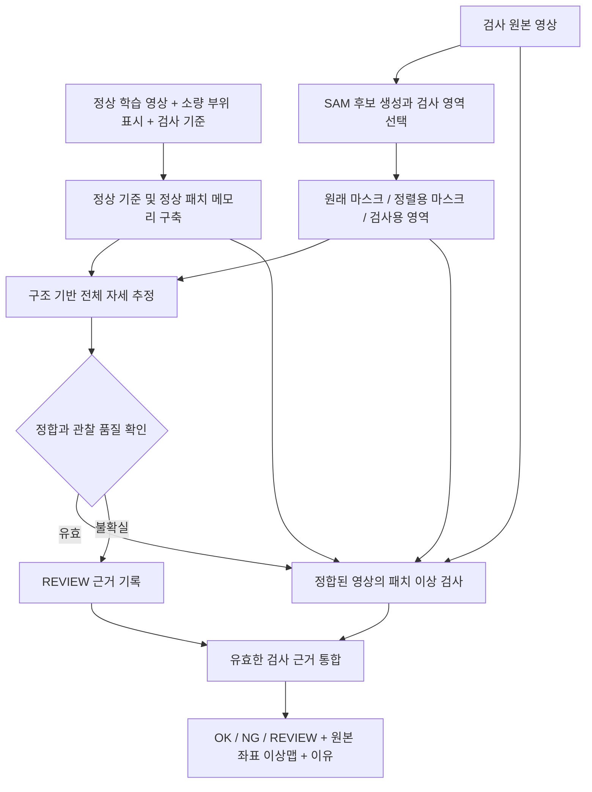

> 원문 스냅샷. 기록 안의 당시 결론은 이후 실험에서 바뀔 수 있습니다.
> 출처: [RESEARCH_DESIGN_20260930.md](file:///E:/DH/Sandbox/Dinopatch/docs/RESEARCH_DESIGN_20260930.md) · 가져온 날짜는 실험 날짜가 아닙니다. 로컬 경로 링크는 이 PC에서만 열립니다.

# 연구 구성 설계안

작성일: 2026-09-30  
상태: 연구·시스템 설계 초안. 아래의 자동화·검사·정량 평가는 아직 구현 또는 검증 완료된 것이 아니다.  
방향 문서: [연구 방향 재정리](file:///E:/DH/Sandbox/Dinopatch/docs/RESEARCH_DIRECTION_20260930.md)

## 1. 연구의 범위

제안 제목은 **부품 영역 분할과 자세 정합을 이용한 산업용 부품 이상 탐지의 강건성 개선**이다.

주요 질문은 정상 기준과 동일 부위를 비교하는 처리가 위치·회전 변화의 오탐을 줄이면서 결함 검출을 유지하는가이다. 첫 연구 단위는 자동 검사 영역 추출, 전체 정합, 패치 검사, 실패 관리다. cable 구성 검사와 Waterseal 현장 검증은 이 기본 단위가 성립한 뒤 추가한다. 조도는 후속 평가 축으로 분리한다.

기본 방법은 학습된 특징 추출기를 고정하고 정상 기준과 패치 메모리를 구축하는 방식이다. 사람의 지식은 검사 대상과 허용 변화, 소량의 정상 부위 표시로 입력한다. 사람이 평가 영상마다 점을 찍어주는 경우는 수동 보조 실험으로 별도 구분한다.

대안은 (1) 전체 패치 검사 유지, (2) 부품·자세 대응 후 패치 검사, (3) 영상 생성/VLM/그래프를 포함하는 통합 모델이다. 이번에는 기존 기준모델과 비교하기 쉽고 실패 원인을 나누어 볼 수 있는 (2)를 선택한다. 새로운 범용 추론 모델이나 모든 환경의 100% 성능을 주장하지 않는다.

## 2. 시스템 구조

내부 부품 개수·색상 검사는 이 기본 구조 이후의 선택적 추가 분기다. 해당 분기를 추가하기 전후를 별도 비교하며, 처음부터 기본 방법의 필수 요소로 묶지 않는다.

## 3. 입력과 정상 기준 구축

### 제품별 검사 명세

최소 항목은 검사 부위, 허용 자세 변화, 실제 결함 정의, 관찰 불가능 시 정책이다.

- cable: 전체 케이블/외피와 내부 단면을 구분한다. 전체 결함 평가에는 외피를 포함한다. 내부 세 부품만 검사한 결과는 내부 구성 검사 결과로 한정한다.
- Waterseal: 워터씰 전체와 절삭면을 검사 영역에 포함한다. 지그는 위치 탐색에 쓸 수 있지만 검사 대상에서 제외한다. 단, 지그의 방향이 곧 물체 회전각이라는 가정은 하지 않는다.
- 회전과 이동은 허용 변동, 내부 부품 누락·색상 교체·찢어짐·절삭면 이상은 검사 대상 변화로 정의한다. 정상 크기 편차 범위는 정상 학습 자료에서 기록한다.

### 학습 흐름

1. 원본 SHA256 및 디코딩 중복을 점검하고 fit/calibration/evaluation 역할을 고정한다.
2. fit 정상 일부에 제품 전체와 내부 부품의 박스 또는 마스크 예시를 지정한다. 작성 주체와 사람 검수 여부를 저장한다.
3. 정상 기준 영상과 형태 통계를 구축한다. 기준은 fit에서만 선택하며 평가 영상을 기준으로 등록하지 않는다.
4. fit 영상을 추론 때와 같은 영역 추출·정합 처리에 통과시킨 뒤 정상 패치 메모리를 만든다.
5. 별도 정상 calibration으로 품질 기준과 이상 판정 임계값을 정한다. 최종 평가에서 재조정하지 않는다.

초기에는 SAM과 특징 추출기를 동결한다. 여기서 fit은 정상 통계/메모리 구축이며, 신경망 가중치 재학습과 구분한다. 분할 실패로 메모리에 쓰지 못한 fit 수를 공개한다. 공통 성공 fit 부분집합 비교를 추가하면 학습 표본 수 차이의 영향을 점검할 수 있다.

## 4. 모듈별 설계

| 모듈 | 입력 | 출력 | 실패 시 처리 |
|---|---|---|---|
| 검사 영역 추출 | RGB와 제품 명세 | 제품/부품 후보 마스크, 품질 및 중복 정보 | 후보 부족·중복·범위 불명확을 기록 |
| 마스크 분리 | 원래 SAM 마스크 | raw, whole, alignment, changed, inspection | 검사 정보 손실 여부 검사 |
| 전체 정합 | 구조 특징과 정상 기준 | 단일 변환, 잔차, 유효 영역, 모호성 | REVIEW 또는 신뢰 가능한 별도 근거만 사용 |
| 이상 검사 | 정합 RGB, 검사용 영역, 정상 메모리 | 패치 거리, 이미지 점수, 원본 좌표 맵 | 검사하지 못한 영역은 unknown |
| 판정 | 점수와 모듈 품질 | OK/NG/REVIEW, 근거 | 불확실성을 정상으로 바꾸지 않음 |

### 4.1 자동 검사 영역 추출

첫 후보는 현재 실행 가능한 SAM 2.1의 자동 마스크 생성이다. 마스크 후보 전체를 만들고 정상 fit에서 정한 위치 범위·크기·포함 관계·형태 정보로 제품과 부품 후보를 선택한다. 색상을 먼저 분류해서 색상마다 하나씩 마스크를 강제 선택하지 않는다.

예상 부품 수는 검증할 규칙이지 출력 수를 강제하는 장치가 아니다. 상위 세 개를 무조건 골라 세 부품이 검출된 것으로 처리하지 않는다. 자동 후보가 성립하지 않으면 정상 부위 예시로 박스/점을 전달하는 방법으로 확장하되, 테스트 수동 보정과 구분한다.

평가 순서는 다음과 같다.

1. 소량의 수동 박스 분할: 분할 모델 자체가 해당 영역을 표현할 수 있는지 확인. 현재 일부 수행됨.
2. 고정된 자동 후보 선택: 매 평가 영상에 사람이 개입하지 않는 전체 흐름 확인.
3. 사람이 검수한 소규모 마스크 정답으로 품목/촬영 조건별 누락·과분할·외피 혼동을 측정.

SAM 자체 품질 점수는 정답 IoU가 아니며 품질 보증값으로 사용하지 않는다. 수동 보조 결과와 자동 결과를 별도 표로 제시한다.

### 4.2 정렬용 마스크와 검사 정보 보존

- raw: SAM 출력 그대로 보존.
- whole: 부품 전체 영역. 금속 중심도 포함하며 가장 큰 연결 영역과 내부 채움을 사용할 수 있다.
- alignment: 위치·회전 추정에 사용할 보정 마스크. 작은 opening 등을 적용한다.
- changed: 위 처리에서 제거/추가된 영역. 결함 판정이 아닌 확인 대상이다.
- inspection: 원래 영역과 변경 영역, 경계 주변을 포함하는 검사 범위.

현재 1024 영상의 11픽셀 opening과 5픽셀 검사 여유는 초기 실험 설정이다. 해상도가 바뀌면 동일한 물리/상대 크기에 대응하도록 변환하고 해당 값을 보고한다. 경계 주변에 실제 결함이 남는지 확인하기 전까지 보정된 마스크만으로 RGB를 잘라내지 않는다.

### 4.3 구조 기반 전체 정합

위치/배율은 물체 전체의 영역과 구조에서 추정한다. 회전은 가능한 경우 제품 자체의 안정적인 비대칭 외곽·기준점으로 결정한다. 지그는 카메라 또는 제품 위치의 기준이 될 수 있으나 제품 자체의 회전과 구분한다.

부품 중심을 이용할 때는 구조적으로 가능한 대응 후보를 만들고 물체 전체에 단일 similarity transform을 적용한다. 개별 부품 재배열, 반사, 비선형 왜곡은 허용하지 않는다. 색상 정상성이나 이상 점수 최솟값으로 자세를 선택하지 않는다.

**대칭 구조의 한계:** 세 원형 부품처럼 회전 대칭에 가까운 구조에서는 색상을 제외하면 방향을 유일하게 정하기 어려울 수 있다. 후보를 하나로 억지로 결정하지 않는다. 잔차뿐 아니라 후보 간 차이와 기준점의 안정성을 함께 기록하고 모호하면 REVIEW한다. 외관상 동일한 허용 회전과 내부 순서 변화를 영상만으로 구별할 정보가 없으면 검사 명세나 추가 촬영 기준이 필요하다.

품질 항목은 대응점 수, 정합 잔차, 겹침, 배율 범위, 잘림/유효 영역, 후보 모호성이다. 기준값은 fit/calibration에서 정하고 평가 전에 고정한다. 정합 실패를 점수 0이나 빈 정상 이상맵으로 바꾸지 않는다.

### 4.4 이상 검사

첫 버전은 기존 공식 PatchCore를 기준으로, **정합 후 같은 특징 추출·메모리 거리·점수 집계**를 사용한다. 우선 정합 자체의 효과를 분리한다. 이후 대응 위치 주변의 패치만 비교하는 제약을 별도 실험으로 추가한다. 여러 변경을 동시에 넣어 개선 원인을 혼동하지 않는다.

실험군마다 fit과 추론에 같은 전처리를 적용해 메모리를 다시 구축한다. 정합 전 학습 메모리에 정합 후 입력을 그대로 넣는 분포 불일치를 피한다. 백본, 입력 해상도, 패치 설정, 메모리 예산, 표본 선택 규칙과 seed는 비교군 사이에서 고정한다. 구체 실행값은 구현 계획에 기존 재현 설정을 바탕으로 확정한다.

전체 제품 검사를 목표로 할 때 중심 crop으로 잘려 평가하지 못하는 외피가 없는지 점검한다. 평가에서 제외된 영역은 unknown 마스크로 보존한다. 이상맵은 정합의 역변환으로 원본 좌표에 투영하고, 영상 밖/패딩/미관찰 영역은 정상 점수 0과 구분한다.

정렬용 마스크는 형태 추정에만 사용한다. 점수 계산은 보존된 검사 영역의 원본 특징을 사용한다. 변경 영역은 별도 확대 시각화로 추적한다.

## 5. 판정 정책

| 조건 | 출력 |
|---|---|
| 필요한 영역을 관찰했고 정합/검사가 유효하며 기준 이하 | OK |
| 유효한 검사에서 임계값 초과 또는 검증된 구성 위반 | NG |
| 관찰 부족, 분할/정합 실패, 모호한 부품 대응, 검사 범위 미충족 | REVIEW |

불확실한 분기가 있어도 다른 유효한 분기가 명확한 결함 근거를 제공하면 NG와 실패 원인을 함께 기록할 수 있다. 그러나 기존 원본 PatchCore의 높은 점수만을 항상 유효한 NG 증거로 간주하지 않는다. 그 점수 자체가 자세 변화 오탐일 수 있기 때문이다.

**초기 연구에서는 원본 기준모델을 비교군으로 두고, 최종 판정에 무조건 OR 결합하지 않는다.** 최종 원본 검사 분기를 추가할 경우 해당 분기의 적용 조건과 정상 오탐을 독립적으로 검증한다. 실패 시 자동 OK도, 기존 점수만으로 자동 NG도 만들지 않는다.

결과 기록은 status, score, threshold, score_valid, segmentation_status, alignment_status, transform, valid_region, anomaly_map, reason_codes, provenance를 포함한다. 이는 연구 결과의 기록 형식이며 현재 dinopatch 공개 API를 즉시 변경한다는 뜻은 아니다.

## 6. 연구 실험 구성

### 6.1 핵심 비교

| ID | 구성 | 검증 질문 |
|---|---|---|
| B0 | 기준 PatchCore | 원래 성능과 촬영 변화 취약성 |
| B1 | B0 + 검사 영역 제한 | 배경 영향이 줄어드는가 |
| B2 | B0 + 전체 정합 | 위치·회전 변화의 오탐이 줄어드는가 |
| B3 | B0 + 영역 제한 + 정합 | 두 효과가 함께 유지되는가 |

B2에서도 정합 추정용 SAM을 사용할 수 있다. B1/B3의 '영역 제한'은 최종 점수 계산 영역을 제한하는 효과를 뜻한다. 이렇게 정의해야 SAM 사용 여부와 점수 영역 제한을 혼동하지 않는다.

B3를 기준으로 마스크 보정 유무와 원본 경계 보존 유무를 비교한다. 경계를 버리는 조건은 그 위험을 측정하는 ablation일 뿐 적용안으로 채택하지 않는다. 그다음 위치 제약 패치 비교와 DINO 특징을 각각 별도 추가 비교한다.

### 6.2 촬영 변화 조건 초안

첫 구현의 조건 초안은 원본, 회전 ±5/±15/±30/90/180/270도, 수평·수직 이동 ±5/±10%다. 먼저 단일 변화를 평가한 후 회전+이동을 조합한다. 조건은 실행 전에 고정한다.

정상과 불량 모두에 같은 변환을 적용한다. 합성 이동/회전은 여유 캔버스와 유효 영역을 사용하여 물체가 잘린 사례를 감추지 않는다. 제품이 잘린 경우 관찰 실패 조건으로 별도 집계한다. 합성 라벨은 원본 라벨과 분리하고 변환된 결함이 관찰 가능한지 확인한다.

합성 변형은 매번 RGB부터 SAM·정합·탐지까지 다시 실행해야 전체 파이프라인 검증이 된다. 기존 마스크를 회전시킨 계산 검증을 대신 사용하지 않는다. 실제 촬영 변화 결과와 합성 결과는 별도로 보고한다.

조도는 핵심 자세 실험 후 정상·불량의 밝기/대비 변화와 실제 dark 데이터를 분리하여 추가한다. 합성 감마만으로 실제 조도 변화 일반화를 주장하지 않는다.

### 6.3 데이터와 감독 정보

- cable은 기존 fit179/calibration45/evaluation150을 개발용으로 유지한다. 평가 자료가 반복 관찰됐다는 점을 공개한다.
- 수동 부위 표시는 fit에서 선정하며 동일 분할을 사용한다. 기존 에이전트 좌표는 사람 검수 마스크 정답과 구분한다.
- Waterseal은 사용자가 정리한 원본 라벨을 보존하고, 제품/촬영 배치/날짜 그룹으로 분리할 수 있는지 확인한다. 동일 제품의 연속 프레임은 역할을 넘나들지 않게 한다.
- 최종 일반화 주장은 개발에 쓰지 않은 새 촬영 배치/미관측 조건을 확보했을 때만 평가한다.
- 모델별 정상 학습/메모리 사용 수, 보정 사용 수, 실패 수를 모두 보고한다.

### 6.4 평가와 채택 기준

주요 지표는 정상 FPR, 전체 불량 Recall, 불량 OK 통과율, 정상/불량별 REVIEW 비율, 자동 판정 비율이다. NG Recall은 REVIEW를 성공으로 포함하지 않는다. 분할과 정합이 성공한 표본만의 점수를 전체 성능처럼 표시하지 않는다.

같은 원본의 여러 변형은 서로 독립적인 새 표본으로 간주하지 않는다. 결과와 불확실성은 원본 이미지/촬영 그룹을 단위로 묶어 계산한다. 사례 수를 함께 표시하고 단일 수치에 과도한 의미를 부여하지 않는다.

채택은 정상 오탐 감소와 불량 검출/통과율 및 보류율의 변화를 함께 보고 결정한다. 오탐 감소가 보류 증가만으로 얻어진 결과인지 따로 확인한다. 허용 가능한 불량 통과율과 보류율은 현장 요구를 확인한 뒤 고정할 운영 기준이며 이번 문서에서 임의로 안전 수준을 정하지 않는다.

## 7. 단계별 산출물과 다음 작업

| 단계 | 작업 | 완료 산출물 / 통과 판단 |
|---|---|---|
| 1 | 자동 SAM 후보 및 제품/부품 선택 | fit 정상에서 누락·과분할·외피 혼동과 수동 검수 결과를 시각화. 실패를 감춘 후보 수 강제 없음 |
| 2 | 구조 기반 전체 대응과 실패 처리 | 원본 및 변형 RGB의 실제 재추론, 대응 후보/잔차/유효 영역 보고. 모호성 처리 확인 |
| 3 | 정합 후 정상 메모리 구축 및 검사 | B0~B3 같은 평가표, 정상/불량 원본 좌표 맵, 실패 포함 전체 집계 |
| 4 | 보정/경계 보존 기여 검증 | 사라진 영역의 실제 결함 여부와 미검출 비교, 효과 없는 처리 제거 |
| 5 | 현장 확장 | Waterseal 배치 분리 검증과 실제 촬영 변화 평가 |
| 후속 | 구성·조도·다른 특징 | 기본 구조를 고정한 상태에서 각 추가 효과 분리 |

즉시 구현할 다음 단위는 **정상 fit 이미지에서 수동 박스 없이 SAM 후보를 생성하고 검사 부품을 고르는 과정**이다. 그 단계가 성립하기 전에 자동 정합·불량 검출이 완성됐다고 주장하지 않는다.

## 8. 구현·기록 원칙

기존 `Config → fit → score → save/load` 사용 흐름을 유지하고 우선 별도 실험 도구에서 검증한다. 성능과 재현성이 확인된 기능만 라이브러리로 옮긴다. 범용 플러그인 프레임워크를 먼저 만들지 않는다.

실험마다 원본 해시, 분할, 감독 정보, 모델/설정, 정상 기준과 메모리, 임계값, 입력/원본 좌표 맵, 보정 차이 영역, 정합 유효 영역, 전체 판정 목록, 오류 사례, 상대경로 HTML과 검증 로그를 보존한다. 원본 데이터와 이전 결과는 덮어쓰지 않는다.

본 문서는 연구 구조를 검토할 수 있도록 구체화한 설계안이다. 자동 후보 선택과 정합 기준의 세부 수치는 정상 개발 자료를 확인하는 다음 구현 계획에서 고정하고, 테스트 결과를 본 뒤 조정한 것은 새 실험 버전으로 남긴다.
