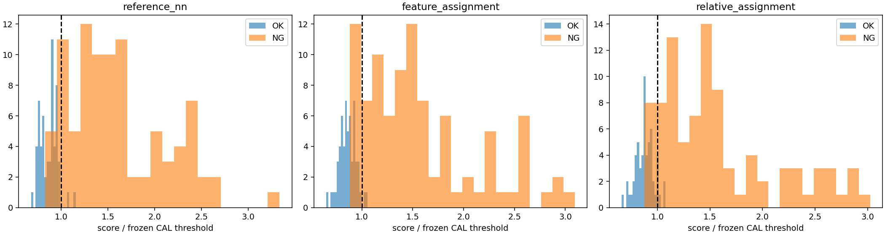
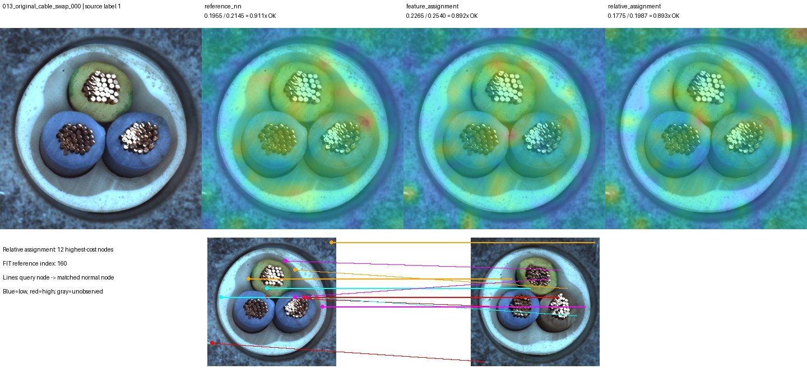

# 상대 위치와 DINO 특징을 함께 비교

질문: 절대 좌표 대신 상대 위치를 사용하면 구성 불량을 잡고 정상 회전·이동을 허용할 수 있는가?

## 실행과 변경

정상179장 FIT, 정상45장 CAL, Cable 원본150장 TEST. 원본과 회전15도·이동(+5%,-4%)·조합을 평가했다.
이미 관찰한 개발 데이터이며 독립 일반화 검증은 아니다. 원본 파일은 변경하지 않았다.
DINOv2 입력392, 2×2 평균 후14×14 영역, 정상 후보8장, 상위5% 점수.
중복 대응 허용 / 특징 일대일 대응 / 특징75%+상대 거리25% 일대일 대응을 비교했다.
상대 거리는 영역 간 거리의 RMS 정규화. 배경을 포함하고 부품 분할은 하지 않았다.
각 분기의 원본 정상 CAL q95로 임계값을 테스트 전에 고정했다.

## 검증된 결과

| 원본150장 | 오탐 | 미탐 | 정확도 | swap검출 |
|---|---:|---:|---:|---:|
| 정상 한 장 안의 중복 대응 | 2 | 11 | 91.33% | 2/12 |
| 특징 일대일 대응 | 2 | 12 | 90.67% | 3/12 |
| 특징+상대 거리 | 4 | 12 | 89.33% | 3/12 |

상대 거리 추가 시 회전 FP3→6/FN12→6, 이동 FP3→3/FN12→11,
조합 FP4→7/FN8→7. 원본 swap 미탐은 개선되지 않았고 정상 오탐이 증가했다.
정확한 분기 내 효과와 이전5×5 시스템 성능은 구분한다. 이전 증강12k는 원본93.33%,swap7/12였다.

그림은 원본·중복 허용·특징 일대일·특징+관계의 맵과 점수이며 아래는 관계 모델의 대응선이다.
선의 색상은 가독성용이고 이상도 크기를 의미하지 않는다. 맵은 파랑→빨강으로 비용이 증가한다.

## 해석과 결정

원본swap12장의 평균 관계 잔차는0.058457→0.009361로 줄었지만 검출은3/12로 같았다.
공간적으로 일관된 대응을 만드는 것과 불량을 구분하는 것은 같지 않았다.
배경 포함 격자, 부품 구분 부재, 색상 특징 부족 가능성이 있으나 원인은 별도 분리 검증이 필요하다.
거리만으로 대칭/거울 구성을 구분하지 못하고 실제 영상 특징까지 회전 불변인 것도 아니다.
현재 구조는 채택하지 않는다. 부품/영역의 종류·개수·색상과 관계를 분리해 보는 후속 실험을 고려한다.
테스트 결과로 lambda를 재조정하지 않았으며 다른 제품에 대한 일반화는 아직 미검증이다.

## 검증과 출처

unittest125개, 600입력/1800판정, HTTP이미지601개 검증.
저장된 특징·대응에서 점수와 판정을 독립 재계산했고 최대 노드 비용 오차1.073e-6.
분할 해시 중복 없음, 원본 픽셀과 source hash 보존.

- [시각화 보고서](http://127.0.0.1:8765/output/comparisons/relative_matching_20261002_112755/index.html)
- 실행: `E:/DH/Sandbox/Dinopatch/output/comparisons/relative_matching_20261002_112755`
- 구현: `E:/DH/Sandbox/Dinopatch/tools/experiment_relative_matching.py`
- 조건/결과: `docs/RELATIVE_MATCHING_PROTOCOL_20261002.md`, `docs/RELATIVE_MATCHING_RESULTS_20261002.md`
- 수치 근거: 실행 폴더의 `predictions/metrics.json`, `predictions/per_image.json`, `logs/validation.json`.
- 파일 해시: 실행 폴더 `artifact_manifest.json` 및 첨부 `상대위치대응_112755_출처.json`.
- Obsidian 저장 후 GitHub 반영은 기존18:00 예약 작업에 맡긴다.
