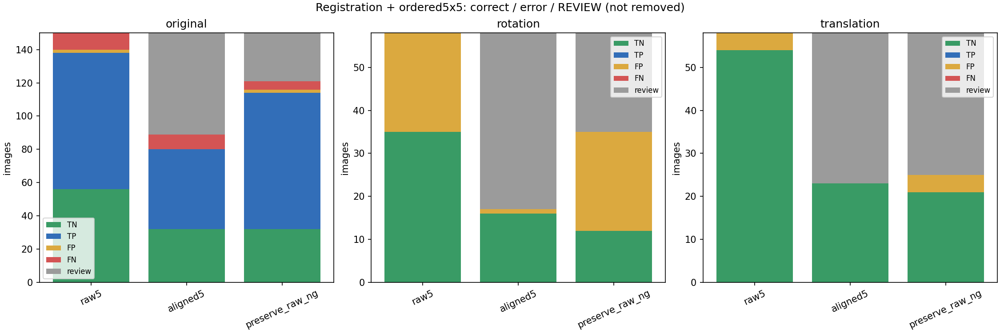
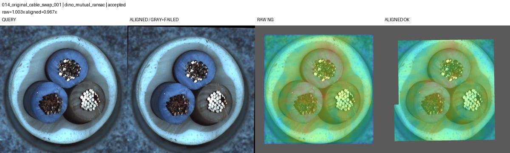

# 정합 후5×5 연결: 회전 오탐을 줄일 수 있는가

이전5×5는 미탐17→10건, swap0→5/12로 개선됐지만 정상15도회전 오탐이0→23/58로 늘었다.
정상기준000에 SIFT→실패시DINO상호대응으로 전체 이미지를 정합한다.
정합실패·관측률85%미만은보류하고, FIT179/CAL45도 같은처리로 재구성한다.
원본150장·정상회전58장·정상이동58장으로 비교한다.

기존NG를유지하는결합도대조하지만 기존오탐을낮출수없다는점을분리한다.
실행 완료. 이 구성은 채택하지 않는다.

## 결과

| 원본150장 | 오탐 | 미탐 | NG검출 | 정상보류 | NG보류 |
|---|---:|---:|---:|---:|---:|
|기존5×5|2|10|82|0|0|
|정합5×5|0|9|48|26|35|
|기존NG유지+정합|2|5|82|24|5|

정상회전58장에서오탐23→1이지만 보류41장, 정상통과35→16장이다.
원본정합단독swap검출2/12, 보류4/12, 미탐6/12.
기존NG유지결합의미탐감소는추가검출이아니라보류로이동한결과다.

## 왜 채택하지 않는가

정합은 FIT93/179·CAL28/45만수용했다. 시험원본61/150장과회전41/58장이보류됐다.
오탐만세면개선처럼보이지만 자동검사의성공비율은낮아졌다.
단일기준대응이병목이라는가설이남는다. 다음후보는여러정상기준에서기하신뢰도로
기준을고르는방식이며 아직검증하지않았다. 이상점수를최소화하는정합선택은피한다.

## 검증과 한계

121개테스트통과,798행판정·임계값·저장맵점수재계산,266개HTTP이미지확인.
같은개발데이터를반복관찰했고FIT/CAL수용집합도달라졌다. 독립검증이나정합만의
순수인과효과가아니다. 변형NG검출은이번실험범위에없다.

[전체 시각화 — 로컬 서버 필요](http://127.0.0.1:8765/output/comparisons/aligned_groups_20261002_100629/index.html)

출처: `E:/DH/Sandbox/Dinopatch/output/comparisons/aligned_groups_20261002_100629`
코드: `tools/experiment_aligned_groups.py`
정기Git반영은18시에수행한다.
