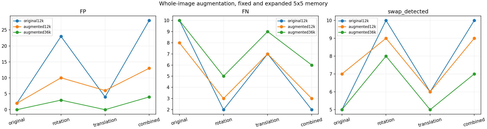
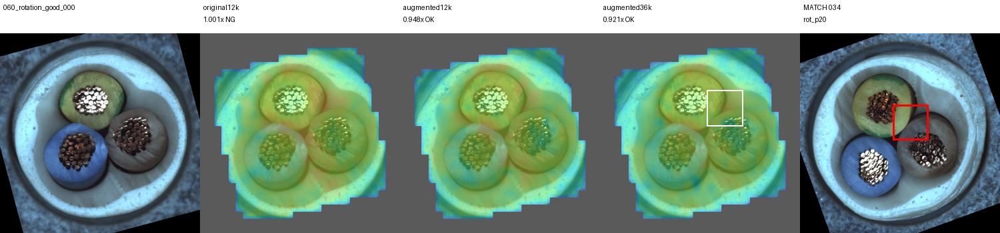
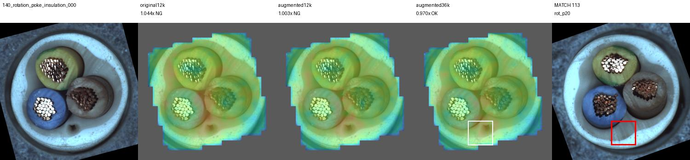

# 정합 대신 정상 회전·이동 증강을5×5에 적용

사용자 제안: 학습에 정상회전·이동을 포함하면 정합없이 대응할 수 있지 않은가?
단일기준정합의 과도한보류를확인한뒤 다중기준정합보다 이검증을우선한다.

## 비교 조건

정상FIT179, CAL45, TEST150(OK58/NG92), DINOv2regbase392, 5×5연결.
학습회전±10·±20도, 이동(+3%,-2%)및반대방향. 제품전체만변환한다.

- 원본12k: 기존메모리그대로.
- 증강12k: 원본4k+증강8k. 같은메모리예산.
- 증강36k: 원본12k+증강24k. 위두메모리를포함.

모든임계값은같은원본정상CAL q95. 테스트에는회전15도·이동5%/-4%와그조합을넣는다.
정상과NG모두변형하여검출유지여부를확인한다. 합성정답은원본라벨가정이며
결함마스크유실은추론후에별도로계산한다. 조도증강·정합은이번에추가하지않는다.

## 결과: 정합 없이 오탐 감소, 일부 NG 손실

각 셀은 **오탐 / 미탐**이다. 정상58장·NG92장, 모든 구성에서 보류0건.

| 조건 | 원본12k | 증강12k | 증강36k |
|---|---:|---:|---:|
|원본|2 / 10|2 / 8|0 / 10|
|회전15°|23 / 2|10 / 3|3 / 5|
|이동|4 / 7|6 / 7|0 / 9|
|회전+이동|28 / 2|13 / 3|4 / 6|

원본 정확도는92.00%→두 증강 구성 모두93.33%.
원본 swap은5/12→증강12k의7/12, 증강36k의5/12.
확대 메모리의 회전 정확도는83.33%→94.67%, 조합은80.00%→93.33%이다.
이는 원본 라벨을 가정한 합성 민감도이며 실제 현장 일반화 수치는 아니다.

## 해석과 다음 방향

사용자가 제안한 정상 증강은 회전·이동 오탐을 줄이는 데 효과가 있었다.
이전 정합 실험과 달리 보류를 늘려 얻은 결과가 아니다.
다만 정상 허용 범위를 넓히면서 변형 swap과 피복 결함 일부도 통과했다.
자세 변화 대응 후보로 남기고 부품 구성·작은 결함 근거의 보완을 다음 과제로 둔다.
현재 SAM·색상 결합 최종 모델과는 별도의5×5 비교이며 통합 모델 교체는 하지 않았다.

## 검증

123개 테스트 통과. 기존 CAL45·TEST266 점수의 최대 차이0.0.
메모리 상위집합·원본은행 일치,1800행점수·600카드·601HTTP이미지 링크 검증.
GT 결함 픽셀은 변형 후 모두99% 이상 남았다. 다만 가장자리 제외로 중심 평가 영역에
들어가는 결함 비율은 일부에서 낮았다(조합 최저58.49%). 세 메모리는 같은 영역을 사용한다.
이미 관찰한 개발셋이며 큰 회전·새 제품·새 조명의 독립 검증이 남아 있다.

[전체 시각화 — 로컬 서버 필요](http://127.0.0.1:8765/output/comparisons/augmented_groups_20261002_102157/index.html)

원본: `E:/DH/Sandbox/Dinopatch/output/comparisons/augmented_groups_20261002_102157`
코드: `tools/experiment_augmented_groups.py`
정기Git반영은18시.

## 미탐 8건 시각화

- 증강12k의 원본 테스트 미탐: cable_swap 000·003·004·006·011, missing_wire 000, poke_insulation 000·002.
- 원본, 실제 결함 라벨, 세 모델의 이상맵, 실제 점수·임계값·비율을 함께 표시했다. 라벨은 시각화 전용이다.
- 기존 저장 결과만 사용했으며 재학습하지 않았다. 8건과 HTTP 페이지·이미지 42개를 검증했다.
- [미탐 상세 화면](http://127.0.0.1:8765/output/comparisons/augmented_groups_20261002_102157/false_negatives/index.html)
- 생성 코드: E:/DH/Sandbox/Dinopatch/tools/visualize_augmented_false_negatives.py
- 브라우저 자동 실행은 정책상 차단되어 직접 링크를 제공했다.
