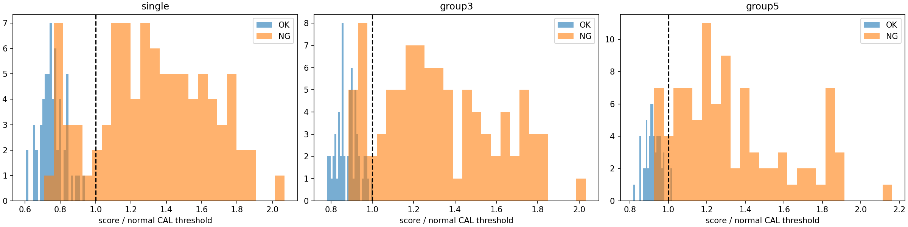
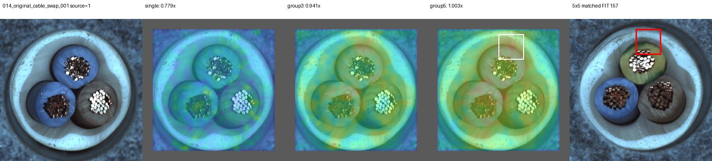
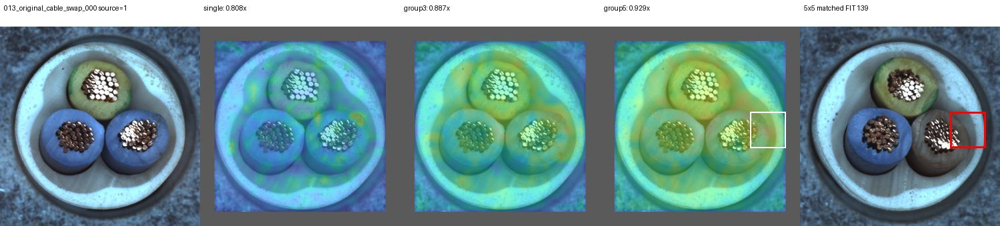

# 순서를 보존한 패치 묶음 비교

## 질문과 변경점

개별 패치가 아닌3×3·5×5 주변 특징을 같은 정상 영역과 통째로 비교하면 swap을 검출할 수 있는가?
정상179장 FIT, 정상45장 CAL, 원본150장 TEST, input392, 동일12000개 기준 중심.
NG·증강·SAM·VLM·정합은 사용하지 않았다. 가중치 학습 없이 메모리를 구성했다.

| 방식 | 정확도 | 오탐 | 미탐 | swap |
|---|---:|---:|---:|---:|
| 단일(공통 내부) |88.67%|0|17|0/12|
|3×3|90.00%|1|14|1/12|
|5×5|92.00%|2|10|5/12|
|단일+5×5|92.67%|2|9|4/12|

## 부작용과 판단 변화

정상15도 회전 오탐은 단일0/58에서5×5의23/58로 증가했다.
연결 확대만으로 채택하지 않고, 정합 후 비교를 다음 후보로 남긴다.
반복 관찰한 개발 데이터이며 미평가 가장자리가 있다. 기존SAM·색상 결합 모델과 다른 대조군이다.

## 검증과 재현

120개 테스트 통과.266개 카드·1596행 점수·267개HTTP 이미지 링크 검증.
[전체 보고서 — 이 PC의 서버 필요](http://127.0.0.1:8765/output/comparisons/patch_groups_20261002_094823/index.html)

[PATCH_GROUPS_RESULTS_20261002](../%EA%B7%BC%EA%B1%B0%EB%AC%B8%EC%84%9C/Dinopatch/PATCH_GROUPS_RESULTS_20261002.md)
