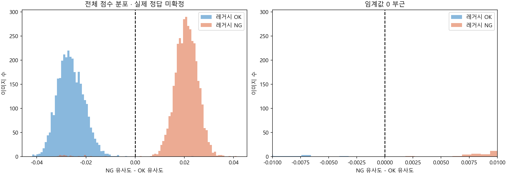

# 10월 2일 철환 신규 이미지 예측

기존에 선택한 DinoMatch 구별력 가중 패치 평균 k=1 모델로 신규 촬영 JPEG 7,193장을 예측했다. 레거시와 다른 판정은 21장이다. 실제 정답은 전부 미확정이므로 정확도·미탐·오탐은 아직 계산하지 않는다.

## 질문과 변경점

기존 평가 데이터에서 선택한 모델이 2026-10-02 현장 신규 이미지에서 어떤 점수와 판정을 내는지 확인한다. 모델·마스터·가중치·임계값은 고정했고 신규 데이터로 학습하거나 조정하지 않았다.

## 데이터와 평가 조건

- 원본: `D:/Jinyang/metalring/IV/OK/20261002/IV00007` 및 `NG/20261002/IV00007`.
- JPEG만 7,193장, 모두 640×480. PNG 2장은 대상에서 제외했다. SEG 파일은 예측 대상에서 제외하는 규칙을 적용했다.
- 레거시 OK 3,385장, NG 3,808장. 폴더 이름은 장비 판정이며 실제 정답으로 사용하지 않았다.
- 파일 해시와 RGB 픽셀 해시 기준 각각 7,193개로 중복이 없다. 기존 마스터와 중복도 없다.
- 백본 DINOv2 ViT-S/14 reg4, FP32, 전체 이미지 letterbox 280, 유효 300패치. ROI 없음.
- 기존 OK16·NG16 마스터, 구별력 가중 패치 평균, 클래스 대표 특징 50% + 최근접 마스터 50%, k=1.
- 임계값 0. score<0이면 OK, score>=0이면 NG.
- 고정 모델로 신규 날짜를 예측한 결과다. 사람 확인 전이므로 독립 검증 성능을 입증한 결과는 아니다.

## 결과

| 레거시 판정 | AI OK | AI NG | 합계 |
|---|---:|---:|---:|
| OK | 3,384 | 1 | 3,385 |
| NG | 20 | 3,788 | 3,808 |
| 합계 | 3,404 | 3,789 | 7,193 |

위 표는 두 시스템 판정의 교차표다. 정답 기준 혼동행렬이 아니다. 불일치 21장, |score|≤0.005인 경계 후보는 2장이다.

불일치 전부, 경계 후보, AI 클래스별 임계값에 가장 가까운 20장의 합집합인 61장을 검토 대상으로 저장했다. 표준 상세 보고서의 61장과 전수 점수 파일의 7,193장을 혼동하지 않는다. 차이맵은 61장만 저장했으며 OK 마스터와의 차이를 이미지별 정규화한 것이다. 분류 점수 기여도 또는 실제 결함 마스크가 아니다. 오버레이는 원본 비율 640×480 JPEG다.

색상은 실제 정답이 아닌 레거시 판정이다. GPU 배치 처리 시간은 56.02초이며 이미지 읽기·전처리·원본 복사·해시 확인을 포함한다. 운영 환경의 단일 이미지 추론 속도 측정은 아니다.

## 검증과 한계

- 전수 예측 7,193건, 실제 정답은 모두 null임을 확인했다.
- 저장 모델을 strict 방식으로 로딩했고, 실행 전후 체크포인트 해시가 동일하다.
- 표준 산출물 검증 통과: 파일 해시, 이미지·맵 크기, CSV·집계, 마스터 분리, 정적 보고서 링크.
- 브라우저 상호작용 자동 검증과 전체 서비스의 HTTP·DB·FTP 검증은 수행하지 않았다.
- 원본, 기존 라벨 데이터셋, 운영 모델, DB를 변경하지 않았다.
- 첫 실행은 체크포인트 입력 크기 키를 잘못 참조해 예측 전에 중단됐다. 저장된 modelData.imageSize를 읽도록 로컬 실행 도구를 수정한 뒤 완료했다. 모델 계산 방식 변경은 없다.

## 원본 근거

- 실행 폴더: `E:/DH/Gitlab/Jinyang2026/ai_jyos_2026/ai_solution/output/experiments/DinoMatch_20261002_115410_IV00007_capture20261002_weighted_mean_k1_unlabeled`
- 전수 점수: `predictions/all_scores.csv` 및 `all_scores.json`
- 전수 집계: `predictions/population_summary.json`
- 검토 목록: `predictions/review_candidates.csv`
- 확인 화면: `reports/new_capture.html`
- 모델 출처: `E:\DH\Gitlab\Jinyang2026\ai_jyos_2026\ai_solution\output\artifact_checks\weighted_dinomatch_production_20261002_103934\model.pth`
- 모델 SHA256: `a757d57967c7149240dcf8036955d013920430d598da8f9f410941e807904212`
- 실행 코드: `tools/predict_new_capture_20261002.py`와 실행 폴더의 `logs/experiment_script.py`
- 원본 파일 해시: [출처 기록](../첨부/DinoMatch_20261002_115410_IV00007_capture20261002_weighted_mean_k1_unlabeled/출처.json)

## 결정과 다음 단계

임계값과 모델은 유지한다. 먼저 불일치 21장과 경계 후보를 사람이 검토하고 파일 해시를 기준으로 실제 라벨을 기록한다. 확인한 범위에서 AI·레거시 각각의 오류를 집계한다. 선별 후보만 라벨링한 성능을 전체 7,193장의 성능으로 일반화하지 않는다.

## 불일치 21장 검토 화면

레거시 OK→AI NG 1장을 001, NG→OK 20장을 002~021로 지정해 파일명순으로 정리했다. 신규 추론이나 라벨 변경 없이 저장된 예측으로 원본·차이맵·파일 목록·전체 미리보기를 만들었다.

- 검토 화면: `E:/DH/Gitlab/Jinyang2026/ai_jyos_2026/ai_solution/output/reports/JY_METALRING_21_disagreements_20261002_125134/index.html`
- 번호와 원본 해시 연결: `disagreements.csv` 및 `disagreements.json`
- 화면의 001~021은 검토 번호이며 기존 예측 sample_id와 구분한다.
