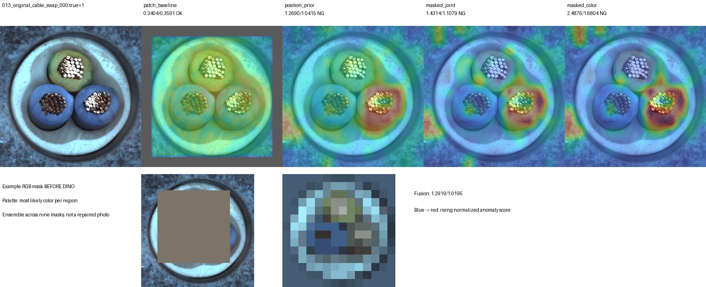
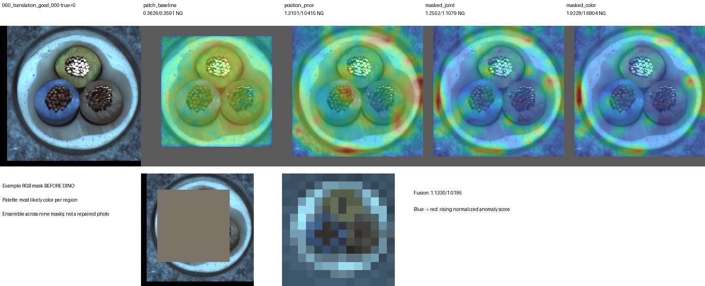
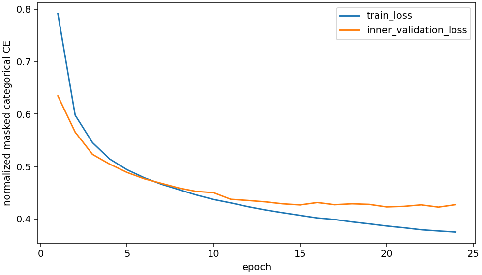

# 가려진 영역의 정상 특징·색상 예측

질문: 부분을 가리고 나머지 구성으로 무엇이 있어야 하는지 학습하면 구성 이상 검출이 개선되는가?

## 실행

정상 FIT179장 중154장 학습/25장 내부 검증, 별도 정상 CAL45장, Cable TEST150장.
RGB를 먼저 가린 뒤 고정 DINOv2 특징을 추출했다. 작은 Transformer가 가린 위치의
DINO 코드64종과 색상32종 분포를 예측한다.9개 사각 블록과 halo를 사용했고 SAM 부품 마스크는 아니다.
원본·회전±20도·이동(+3%,-2%)로 학습하고24epoch 중 내부 검증 손실이 가장 낮은23epoch를 선택했다.
임계값은 원본 CAL45의95백분위로 테스트 전에 고정했다. 원본 파일과 공개 API는 변경하지 않았다.

## 결과

| 원본150장 | 오탐 | 미탐 | 정확도 | swap검출 |
|---|---:|---:|---:|---:|
| 기존 증강12k 패치 | 2 | 8 | 93.33% | 7/12 |
| 위치별 분포 대조군 | 6 | 45 | 66.00% | 10/12 |
| 가림 특징+색상 | 11 | 19 | 80.00% | 12/12 |
| 패치+가림 결합 | 8 | 3 | 92.67% | 12/12 |

결합은 기존 swap 미탐5건을 모두 추가 검출했다. 남은 미탐은 missing_wire000, poke_insulation000·002.
그러나 정상 오탐이6건 추가되어 전체 정확도는 낮아졌다.

| 합성 조건 | 기존 패치 FP/FN | 결합 FP/FN |
|---|---:|---:|
| 회전15도 | 10/3 | 16/2 |
| 이동(+5%,-4%) | 6/7 | 58/0 |
| 회전+이동 | 13/3 | 58/0 |

**이동/조합은 정상·불량 모두 NG로 판단하는 실패였다. 이때 swap12/12는 성공으로 해석하지 않는다.**
회전에서는 결합 임계값 재보정으로 missing_wire000과 poke_insulation000을 새로 놓쳤다.

## 해석과 결정

정상 CAL의 같은 위치에서 맥락을 다른 정상 이미지로 교환하면 평균 예측NLL이0.379492→0.659721로 증가했다.
주변 내용을 활용한다는 근거지만, 사람처럼 의미 규칙을 이해한다는 증명은 아니다.
학습 가능한 영상 격자 위치 임베딩을 사용한다. 물체 기준 좌표계는 아니다.
위치별 분포 대조군도 이동 시 정상58/58을 NG로 판정했다.
변환 픽셀/유효 영역과 확률·점수 재계산이 일치하여 확인 범위에서 계산·변환 오류는 발견하지 못했다.
위치 의존성, 양자화, 가림 방식, 학습 이동 범위의 영향을 분리한 검증은 남아 있다.

**현재 구성은 채택하지 않는다.** 고정 자세의 구성 결함 보완 후보로 보관한다.
물체 기준 좌표계나 부품 단위 가림으로 정상 이동을 분리하는 후속 가설이 필요하다.
기존 단일 기준 정합도 실패했으므로 정합 추가만으로 해결된다고 가정하지 않는다.
이미 관찰한 Cable 개발 데이터이며, 다른 제품·새 촬영·조도 일반화는 미검증이다.

## 검증과 출처

전체 테스트127개,600입력/3600판정,HTTP이미지602개 검증.
모든 원본/변환 픽셀·valid mask 재현, 분할 hash 분리, 원본보존,
저장 확률에서맵·점수·CAL·판정·지표를 독립 재계산했다.

- [시각화 보고서](http://127.0.0.1:8765/output/comparisons/masked_context_20261002_150421/index.html)
- 실행: `E:/DH/Sandbox/Dinopatch/output/comparisons/masked_context_20261002_150421`
- 구현: `tools/experiment_masked_context.py`, 검증: `tools/audit_masked_context.py`
- 상세 조건/결과: `docs/MASKED_CONTEXT_PROTOCOL_20261002.md`, `docs/MASKED_CONTEXT_RESULTS_20261002.md`
- 수치 근거: 실행 폴더의 `predictions/metrics.json`, `logs/validation.json`, `logs/context_swap_probe.json`.
- 해시: [출처 기록](../첨부/150421/provenance.json).
- 로컬 연구 기록을 저장하며 GitHub 반영은 기존18:00 예약 작업에 맡긴다.
