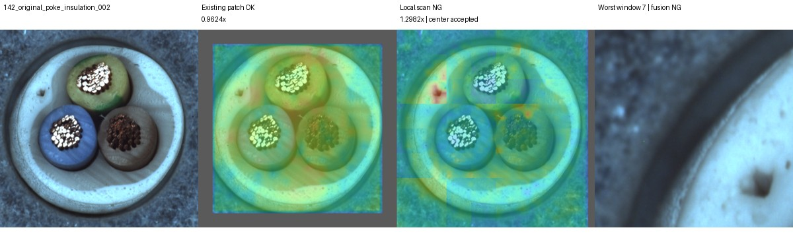
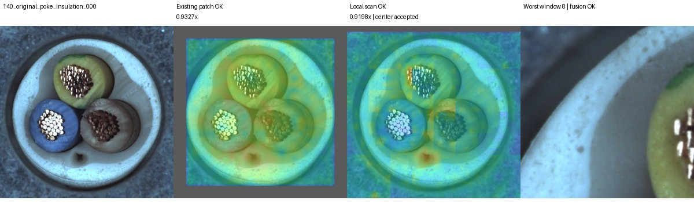
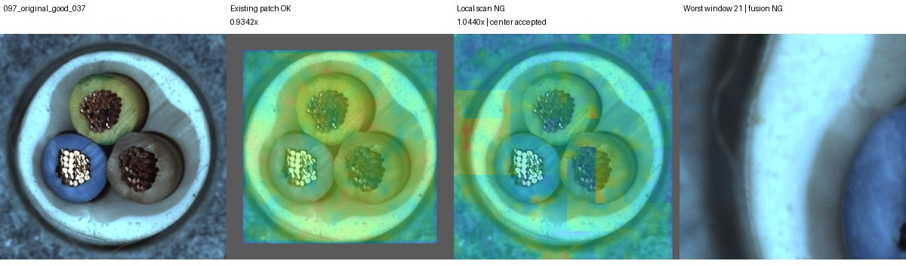

# 정답 위치 없는 국소 검사 결과

[시각화 대시보드](http://127.0.0.1:8765/output/comparisons/local_scan_20261004_211530/index.html)

실행: `output/comparisons/local_scan_20261004_211530`

## 구성과 평가 범위

정답 위치 없이 중심 보정된1024영상을256영역49개(간격128)로 나누고, 각crop을98입력으로 고정DINO에 넣었다.
영역별 정상패치6000개와 단일패치cosine최근접거리로 비교했다. 배경도 포함했고 회전은보정하지 않았다.
FIT179 중 중심추정성공178장을 사용, CAL45로영역별q95와전체최댓값q95임계값을고정했다.
같은CAL을두단계재사용하므로새영상오탐률5%보장아님. 정상원본만사용, 증강·가림모델·VLM·SAM없음.

원본TEST150(OK58/NG92)과회전15도,이동(+5%,-4%),조합각150.
기존에반복관찰한개발데이터이며합성변환은원본라벨을가정했다.
기존패치는이전증강12k결과를그대로재사용했다. 새국소와여러설정차이가있어단일요인효과로주장하지않는다.
OR결합은기존NG를보존한다. 중심실패는국소REVIEW이며기존NG가아닐때결합도REVIEW다.

## 결과

| 조건 | 기존 패치 FP/FN | 국소 결합 FP/FN/보류 | 정확도 기존→결합 | swap 기존→결합 |
|---|---:|---:|---:|---:|
|원본|2/8|3/3/0|93.33→96.00%|7→10/12|
|회전|10/3|21/1/0|91.33→85.33%|9→11/12|
|이동|6/7|10/3/1|91.33→90.67%|6→10/12|
|회전+이동|13/3|22/2/2|89.33→82.67%|9→10/12|

보류를전체150분모에포함하고정답으로세지않았다. 원본결합AUROC0.986882.
국소단독원본은FP1/FN8/REVIEW15(모두NG보류),정확도84.00%,swap9/12다.
단독으로기존검출기를대체할수없다.

이전중심보정가림결합의원본결과FP7/FN3/정확도93.33%/swap12와비교하면,
이번은FP3/FN3/정확도96%/swap10이다. 미탐수가같아도놓치는이미지는다르다.

## 무엇을 추가 검출했는가?

기존패치미탐8장중5장을추가검출했다:
- cable_swap/000,003,011
- missing_wire/000
- poke_insulation/002

원본최종미탐3장은cable_swap/004,006과poke_insulation/000이다.
원본추가오탐은good/037한장. 기존오탐good/036,051도OR규칙대로남았다.
good/037은왼쪽외곽주변영역반응이최종국소점수를주도했다.

이전진단대상3장중missing_wire/000과poke_insulation/002를정답위치없이추가검출했다.
각최고점검사영역에는GT의94.81%,100%가들어있었다. 다만겹침맵의전체최대픽셀은GT밖이었다.
따라서분류개선을정확한결함분할성능으로해석하지않는다.
poke_insulation/000은최고점영역에GT가없고최종국소점수/임계값0.9198로미탐했다.
정답중심으로잘랐던진단과달리,고정그리드crop구성·전체영역보정·정상기준차이가있다.

## 실패와 해석

전체600입력중중심실패62건(기존과동일)을제외하지않고집계했다.
결합NG를기존보다잃지는않지만, OR이므로새국소오탐이추가될수있다.
실제로회전시정상오탐이21/58,회전+이동22/58까지늘었다.
중심만맞춘같은위치의영역별정상기준이회전에서충분히안정적이지않다는관찰이다.
국소기준에회전증강이없다는차이도있어원인을절대위치하나로확정하지않는다.

**결정: 원본 자세의 보완 후보로 유지하되, 일반화된 기본 모델로 채택하지 않는다.**
정답위치없는국소검사의효과는일부확인했으나,자세변화에서정상오탐을억제하는과제가남았다.
다음가설은정상회전증강의효과분리또는상대위치/부품대응을고려한비교다.
이번결과로임계값·영역크기를다시맞추지는않았다.

## 검증과 기록

- 구현테스트132개통과. 새검증은화면끝포함영역커버리지,invalid제외,실패보류·기존NG보존.
- 1800판정/600입력의저장거리→점수→CAL임계값→판정재계산일치.
- 원본hash/분할분리,중심추정·변환RGB·validmask·역투영맵재현일치.
- FIT기준원점index가정상학습후보및seed42선택과일치,banknorm확인.
- 결함GT의평가맵포함률최소100%. GT는판정후감사에만사용.
- HTTP이미지602개확인,기존NG보존검증통과.
- 결과: `predictions/metrics.json`, `per_image.json`, `logs/validation.json`.
- 추가위치진단: `logs/original_gt_localization.json`.
- 구현: `tools/experiment_local_scan.py`, 보고·감사: `tools/report_local_scan.py`.
- 체크포인트는정상메모리bank,optimizer학습없음. 원본데이터와공개API변경없음.

## 핵심 그림

