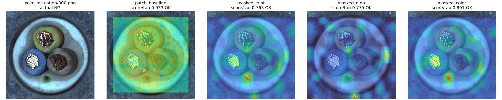
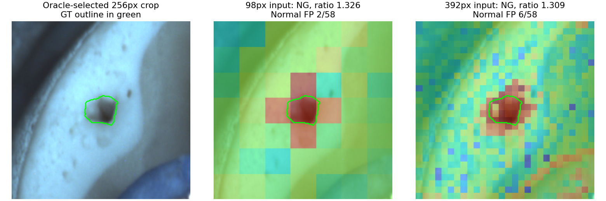
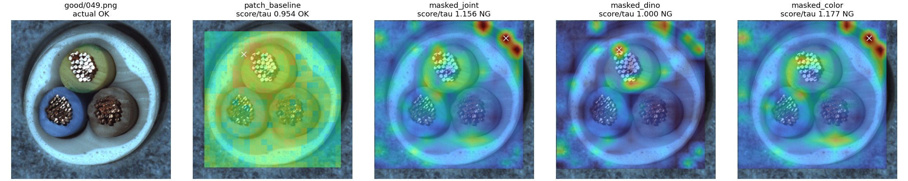

# Cable 오탐·미탐 진단

실행: `output/comparisons/error_diagnosis_20261004_204657`

[정답 위치와 이상맵·확대 진단 보기](http://127.0.0.1:8765/output/comparisons/error_diagnosis_20261004_204657/index.html)

## 범위

기존 중심 보정 결합 실행 `centered_context_20261004_195737`의 원본 오탐7장·미탐3장을
사후 분석했다. 기존 모델·임계값·판정과 데이터셋 원본은 변경하지 않았다.
정답 마스크는 위치 평가와 진단용 영역 선택에만 사용했다. 독립 성능 검증이 아니다.

## 오탐: 가림 예측 분기가 최종 점수를 주도

최종 오탐7장 모두 가림 분기의 정규화 점수가 패치 분기보다 높았다.
그중6장은 기존 패치 단독에서OK였고,051만 패치도NG였다.
색상 단독 분기도6/7장을NG로 판정했고, 특징 단독은3/7장이NG였다.
색상 분기의 과민 반응을 의심할 근거지만, 색상 제거가 전체 성능을 개선한다는 증거는 아니다.
부품 색상은 swap검출에도 필요한 정보다.

| 정상 파일 | 패치 점수/임계값 | 가림 결합 점수/임계값 | 맵에서 관찰한 주요 반응 위치 |
|---|---:|---:|---|
|030|0.904|1.036|윗부품 오른쪽 피복·외곽 근처|
|032|0.923|1.101|왼쪽 아래 도체·주변 피복|
|038|0.983|1.098|왼쪽 아래 부품 하단·내부 피복|
|041|0.999|1.050|부품 사이와 도체 주변|
|044|0.983|1.022|왼쪽 아래 도체 경계, 특징 분기 반응|
|049|0.954|1.156|오른쪽 위 외곽·배경 쪽|
|051|1.002|1.290|부품 사이·피복·외곽에 분산|

위치 설명은 저장 맵을 보고 기록한 관찰이며 원인에 대한 인과 실험은 아니다.
오탐이 모두 배경에서 생기는 것은 아니므로 배경 제거 하나로 해결된다고 결론내릴 수 없다.

## 미탐: 세 장의 실패 양상이 다름

| 파일 | 실제 결함의 영상 면적 | 패치 점수/임계값 | 가림 점수/임계값 | 관찰 |
|---|---:|---:|---:|---|
|missing_wire/000|2.380%|0.990|0.685|패치 최대 반응은 결함 안에 있지만 이미지 점수가 임계값 미달. 가림 특징 분기는 결함 반응이 약함.|
|poke_insulation/000|0.822%|0.933|0.763|가림·색상 맵 최대점이 실제 구멍 안. 위치는 잡았지만 최종 집계 점수는 낮음.|
|poke_insulation/002|0.144%|0.962|0.930|최대점이 결함 밖에 있으며 실제 작은 구멍의 반응은 약함.|

결함 마스크는 세 장 모두 기존 유효 평가영역에100% 포함됐다. 경계에서 제외되어 놓친 사례는 아니다.
poke000의 가림 맵 결함 최대값/이미지 임계값은1.263이나 상위5% 평균은0.763이다.
이 비율에서1은 이미지 판정 기준이며 픽셀별로 보정된 결함 임계값은 아니다.
단순히 지도에 빨간 점이 있다는 이유로NG로 판정해야 한다고 볼 수 없다.

## 집계만 바꾸면 해결되는가?

가림 맵만 대상으로, 정상 CAL45에서 각각 임계값을 새로 정하고 원본150장을 다시 계산했다.
중심 실패15장은 그대로 보류했다. 아래는 전체 결합 성능이 아닌 가림 단독 대조군이다.

| 집계 방식 | 정상 오탐 | 불량 미탐 | 보류 | 선택 미탐3장 검출 |
|---|---:|---:|---:|---:|
|상위5% 평균(기존)|7|18|15|0/3|
|상위1% 평균|4|26|15|0/3|
|최댓값|1|30|15|0/3|

정상 영상에도 높은 국소값이 있어 CAL 임계값도 함께 높아졌다.
따라서 단순 평균→최댓값 변경을 해결책으로 채택하지 않는다.

## 결함 주변만 비교하면?

GT 중심의256×256 영역을 선택하고 정상 FIT179/CAL45/정상 TEST58에서 같은 좌표를 잘랐다.
고정DINO의 단일패치 최근접 거리 검사로 해당 부위에 맞는 정상 기준6000개를 만들었다.
동일 crop을98px입력과392px입력으로 비교했다. 임계값은 각각 정상CAL q95 higher.
기존5×5검사·가림모델과 다른 **정답 위치를 알려준 진단용 검사**다.
crop에는 각 GT가100% 보존됐다.

| 선택된 결함 |98px 판정/점수비|392px 판정/점수비|정상58장 오탐 98→392|
|---|---:|---:|---:|
|missing_wire/000|NG /1.168|NG /1.446|5→9|
|poke_insulation/000|NG /1.342|NG /1.299|1→2|
|poke_insulation/002|NG /1.326|NG /1.309|2→6|

저해상도 crop에서도3장 모두검출되어 단순 입력 해상도만을 원인으로 확정할 수 없다.
고해상도에서 모든 결함의 분리도가 개선되지 않았고 정상 오탐은 세 영역 모두 증가했다.
국소 시야·정상 기준 범위·특징/집계 방식도 기존 모델과 달라, 어느 하나의 효과라고 단정하지 않는다.
진단 영역을 GT로 선택했기 때문에 실제 자동 검사에서 미탐3건을 해결했다는 결과가 아니다.

## 결론과 다음 가설

확인된 사실은 가림 분기의 추가 오탐, 사례마다 다른 국소 반응,
단순 최댓값 변경의 실패, 부위 제한 진단의 가능성이다.
해상도나모델크기를 무조건 키우는 방향보다 **정답 마스크 없이 부위를 선택하고,
부위에 맞는 정상 기준으로 비교하는 국소 검사**를 분리해 평가할 근거가 생겼다.
자동 부위 선택의 실패, 정상58장 오탐, 다른 결함과 회전·이동에서의 검증이 필요하다.
현재 가림 분기를 강한NG근거로 쓰는 결합도 별도로 재검토할 대상이다.

## 검증

저장된 crop맵에서 점수·정상CAL임계값·정상TEST오탐·대상판정을 다시 계산했다.
원본hash와 학습/CAL/TEST hash 분리, GT hash, 이미지13개 및HTTP연결을 확인했다.
원래 실험의 판정은 변경하지 않았다. 모델 학습optimizer나배포 변경은 없다.
수치 근거: `predictions/localization.json`, `crop_probe.json`, `aggregation_probe.json`.
검증: `logs/validation.json`. 구현: `tools/diagnose_centered_errors.py`.

## 핵심 그림

