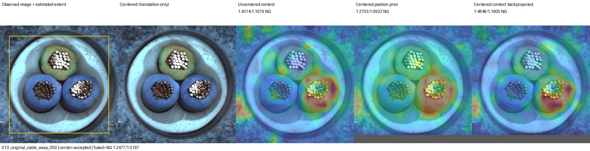
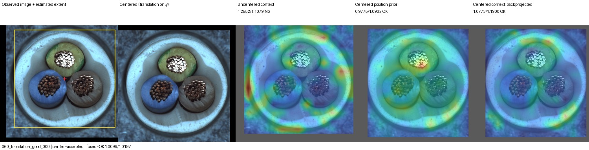
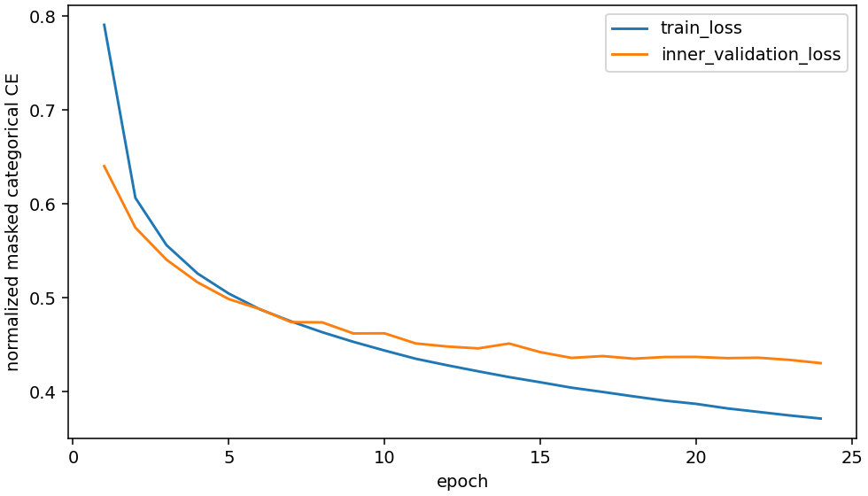
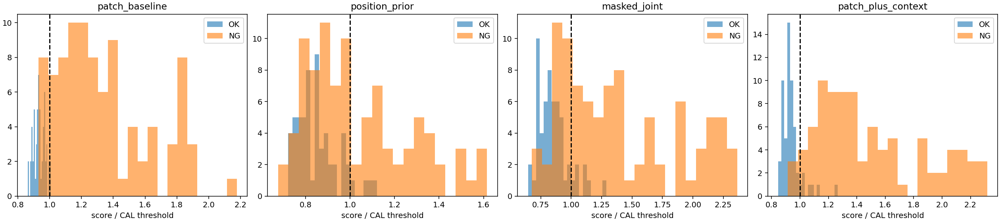

# 물체 중심 보정 + 가림 예측 결과

실행: `output/comparisons/centered_context_20261004_195737`

[시각화 대시보드](http://127.0.0.1:8765/output/comparisons/centered_context_20261004_195737/index.html)

## 질문과 구성

실제 RGB에서 물체 외곽의 중심을 추정하고 학습·검사 이미지를 중앙으로 평행 이동하면,
가림 예측의 swap 검출을 유지하면서 위치 이동 오탐을 줄일 수 있는지 검사했다.
명암 이진화와 가장 큰 외곽의 bbox 중심을 사용했다. SAM, LLM, 정답 마스크,
알려진 합성 변환량을 중심 추정에 사용하지 않았다. 회전·크기는 보정하지 않았다.

정상 FIT179장(내부 학습154/검증25), 별도 정상 CAL45장, Cable TEST150장(OK58/NG92).
원본·회전±20도·이동으로 만든 FIT716 view 중 중심 추정에 성공한715개를 사용했다.
실패한 학습 view는 train/good/023의 원본1개이며, 동일 source의 다른 view는 유지했다.
CAL45장은 모두 중심 추정에 성공했다. DINO 고정, 코드북64/32와2층 Transformer는
이전 설정 그대로 새로 학습했으며 정상 내부검증으로24epoch를 선택했다.
최종 내부검증 손실0.43059988. 분기별 임계값은 CAL q95 higher로 테스트 전에 고정했다.

## 기존 패치와 이번 결합의 비교

각 조건150장, 보류도 정확도 분모에 포함하며 정답으로 세지 않았다.
이동은 가로+5%·세로−4%, 회전은15도이며 모두 원본을 변환한 합성 조건이다.

| 조건 | 기존 패치 FP/FN | 이번 결합 FP/FN/보류 | 정확도 기존→결합 | swap 기존→결합 |
|---|---:|---:|---:|---:|
| 원본 | 2/8 | 7/3/0 | 93.33→93.33% | 7→12/12 |
| 회전 | 10/3 | 10/3/0 | 91.33→91.33% | 9→11/12 |
| 이동 | 6/7 | 8/2/1 | 91.33→92.67% | 6→12/12 |
| 회전+이동 | 13/3 | 14/1/2 | 89.33→88.67% | 9→11/12 |

원본 결합 AUROC는0.977699(기존0.970202)이지만, 고정 임계값 정확도는 같다.
보류가 있는 조건은 전체 AUROC를 표기하지 않았다.

## 중심 보정 효과와 남은 문제

이전 무보정 가림 단독은 이동/회전+이동에서 정상58장을 전부 NG로 판정했다.
이번 가림 단독은 이동에서 FP7·정상보류1, 회전+이동에서 FP9·정상보류2였다.
이전 결합 FP58은 이번 결합에서 각각 FP8·보류1, FP14·보류2로 줄었다.
따라서 **이 실험 범위에서는 중심 보정이 위치 변화 오탐을 완화했다.**
원본과 이동 조건의 swap12/12 검출도 유지했으나 회전 조건은11/12였다.

위치별 정상분포만 사용하는 대조군의 원본 결과는 FP4/FN45/보류15,
가림 단독은 FP7/FN18/보류15다. 맥락 모델이 위치분포보다 많은 NG를 검출하지만
단독 정확도는73.33%로 기존 패치93.33%를 대체하지 못한다.

중심 추정 실패는 원본15, 회전16, 이동15, 조합16로 총62/600입력이다.
이 중 NG59·OK3이며, solidity 조건 실패53건과 화면 경계 조건 실패9건이다.
실패가 NG에 집중되므로 실패를 평가에서 제외하면 성능이 왜곡된다.
가림 분기는 REVIEW로 처리했고, 결합은 기존 패치가NG인59건을 유지했다.
따라서 최종 결합 보류는 정상3건(이동1·조합2)이다.

결합 점수의 CAL 재보정은 기존 NG 보존을 보장하지 않는다. 실제로 회전에서
missing_wire/000·poke_insulation/000, 이동에서 poke_insulation/002,
조합에서 cable_swap/004를 새로 놓쳤다. 원본에서는 기존 NG 손실이 없었다.
원본 결합 미탐3건은 missing_wire/000·poke_insulation/000·002다.

## 결정

**중심 보정은 다음 실험의 후보로 유지하되, 이번 결합을 기본 모델로 채택하지 않는다.**
원본 정확도가 좋아지지 않았고 회전+이동은 정확도가 낮아졌다.
명암 외곽 추정은 Cable용 탐색이며 다른 물체·조명에서의 일반화는 검증하지 않았다.
모든 결과는 이미 반복 관찰한 개발 데이터다. 독립 제품600개가 아니라150개를4조건으로 평가했다.

후속으로는 정상 데이터만으로 정한 결합 규칙에서 기존 NG가 사라지는 문제를 분리하고,
회전·부품 대응을 고려한 좌표계가 추가 오탐 없이 도움이 되는지 검증할 필요가 있다.
현재 테스트 결과로 임계값이나 중심 추정 조건을 다시 맞추지 않았다.

## 산출물

독립 감사 통과: 4200판정/600입력, HTTP 이미지602개, 원본 hash·분할 분리,
변환 RGB·유효영역·중심 추정·확률→맵→점수·임계값·판정·지표 재계산 일치.
구현 테스트129개도 통과했다. 중심 이동 자체로 추가 소실된 GT 결함 픽셀은 없었다
(최근접 GT mask 기준 보존율100%). 합성 회전 단계까지 포함한 최소 보존율은99.936%다.
보수적인14×14 유효영역 때문에 실제 점수 계산 영역에 포함되는 결함 비율은 최소96.30%였다.
원본과 변환 양쪽에서 중심 추정에 성공한 이동133쌍의 중심 오차 중앙값은1.54px,
95백분위3.34px였다(1024×1024). 회전에서 중앙값4.47px로, 완전한 자세 정합은 아니다.

- `predictions/per_image.json`: 600입력×7비교분기=4200판정, 점수·임계값·보류 사유.
- `predictions/metrics.json`, `predictions/centering.json`: 전체 분모 지표와 중심 추정 기록.
- `maps/`: 확률·타깃·유효영역·수치 이상맵, 원본 좌표로 역투영한 맵.
- `cards/`: 원본/추정 중심/보정 이미지/보정 전후 맵600개.
- `model/`: 학습 체크포인트, 코드북, CAL, 임계값, 선택 epoch.
- `logs/validation.json`: 독립 재계산과 원본 보존 검증 결과.
- `logs/defect_coverage.json`, `logs/center_equivariance.json`: 사후 결함 보존율·중심 추정 오차.
- `artifact_manifest.json`: 산출물 SHA256.

원본 데이터와 공개 dinopatch API는 변경하지 않았다. 외부 API는 사용하지 않았다.

## 핵심 시각화

원본 실행 위치: `E:/DH/Sandbox/Dinopatch/output/comparisons/centered_context_20261004_195737`. 핵심 그림 SHA256은 첨부/195737/provenance.json에 기록했다. Git 반영은 기존 매일18시 동기화 대상이며 즉시 push하지 않았다.
