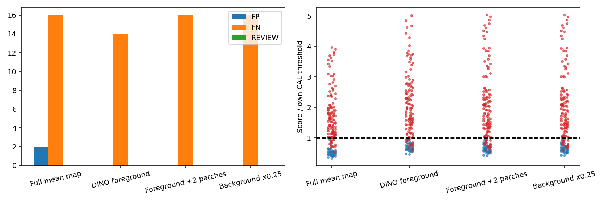
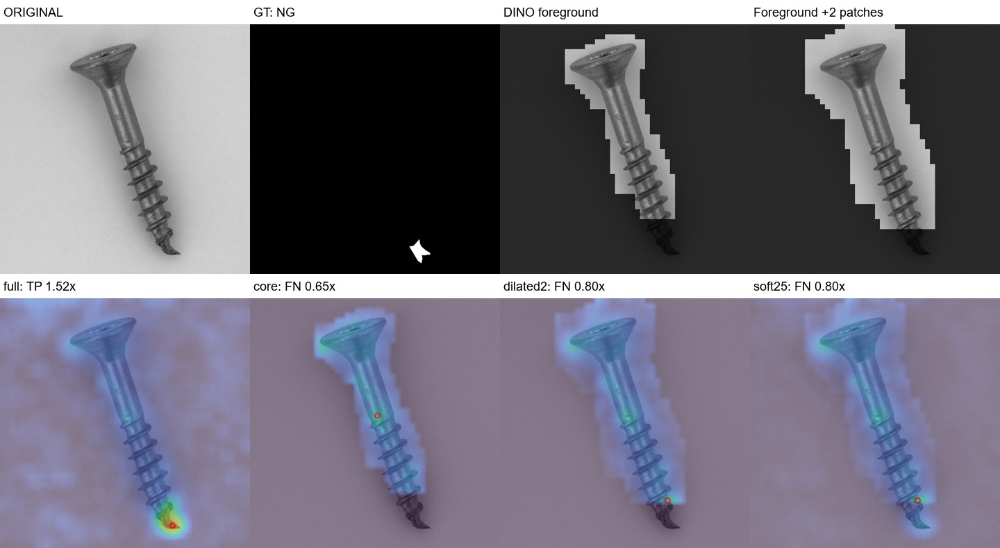
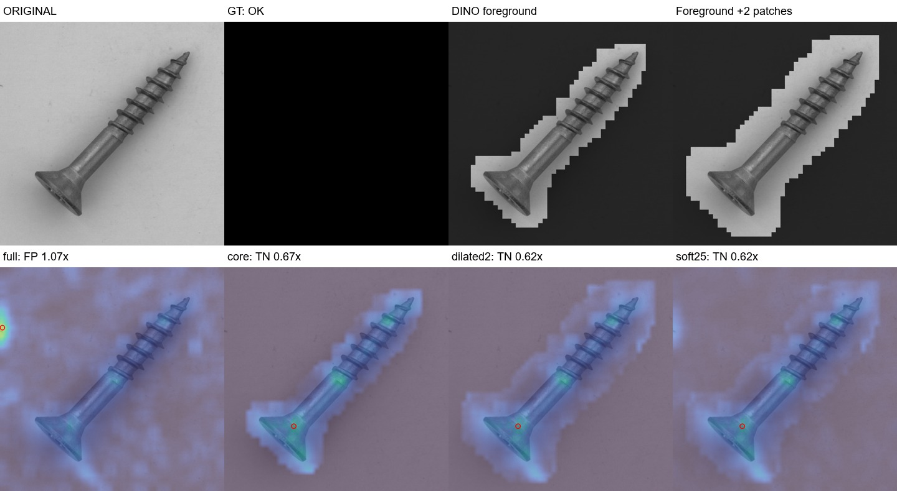

# DINO 물체분리 + VLM 없는 픽셀평균 — 20261007_232717

## 질문·변경·데이터
사용자가DINOv2배경분리로평균맵오탐을줄일수있는지확인요청. VLM없이기존세검출기평균맵에마스크를적용했다. 원본·기존체크포인트·프로덕션설정은변경하지않았다. MVTec screw정상FIT256/CAL64(seed20261007), 원본test160(OK41/NG119). 이미확인한screw개발평가이며독립일반화증거가아니다.

## 사전설계·실행조건
기존dinopatch.masks.ForegroundPCA를재사용했다. 이름과달리PCA축이아니라정상DINO특징의정규화centroid거리와Otsu기준으로분리하며, FIT앞8장의테두리로극성,앞32장의물체특징최대4096개로참조를만든다. sample200000,seed20261007,erode0. 정상FIT256에만맞추고CAL/test/NG정답으로마스크를학습·조정하지않았다. DINO700/50×50격자,원실험DINO가중치해시일치확인. 동일정상featurecache해시확인후사용. 다른검출기는재추론하지않고기존평균맵재사용.

ForegroundPCA는배경이대부분이고물체가테두리에거의닿지않는다는가정과정상전경참조유사도/연결성분처리를사용한다. class내부의씨앗erosion/성분선택/팽창은기존그대로다. 기본core도생패치분류가아니라기존알고리즘의후처리를거친결과이다.

비교: 전체맵, core영역만, core를3×3커널2회추가팽창한영역만, 팽창영역밖점수×0.25. 추가2패치는원본1024기준약41px여유다. 픽셀정규화와3×3평활을한기존평균맵에마스크를나중에곱하며이미지점수는최고점. 따라서마스크밖결함의신호일부가평활을통해안쪽에남을수있다. 각방식정상CAL점수95분위higher를임계값으로다시계산했고test정답으로고르지않았다.

마스크면적0.5%미만/95%초과(기존helper가작은마스크를전체True로대체한경우포함)는REVIEW로집계하고OK로넘기지않는다. 실패CAL은별도계수하고유효32장미만이면중단하도록설계했다. 이번에는CAL64/test160모두면적검사를통과했지만, 이것이분리성공판정은아니다. 실제면적은6.24~24.32%였다. 물체일부분만남기는실패가이검사를통과했다.

## 검증한결과
|방식|정확도%|오탐|미탐|보류|AUROC%|임계값|
|---|---:|---:|---:|---:|---:|---:|
|Full mean map|88.75|2|16|0|97.81|1.341569|
|DINO foreground|91.25|0|14|0|97.21|0.962923|
|Foreground +2 patches|90.00|0|16|0|97.62|1.056338|
|Background x0.25|90.00|0|16|0|98.07|1.056338|

DINO전경분리로 배경오탐2→0. 기본마스크 정확도91.25%/미탐14, 확장마스크90.00%/미탐16. 그러나 확장마스크가 결함GT14/119를 완전히 제외하고 기존검출6건을 새로 놓쳤다. 현재 마스크를 그대로 운영 적용하지 않음.

core는기존미탐9건추가검출/기존검출7건손실, 확장과soft는각6건추가검출/6건손실이다. 정상오탐Q120,Q129는세마스크조건모두OK로복구했다. 자세한ID/미탐유형: `{'core': {'rescued': ['Q016', 'Q019', 'Q031', 'Q065', 'Q082', 'Q094', 'Q112', 'Q128', 'Q136'], 'lost': ['Q048', 'Q110', 'Q130', 'Q135', 'Q142', 'Q150', 'Q155'], 'fn_types': {'thread_side': 5, 'manipulated_front': 6, 'scratch_neck': 1, 'thread_top': 2}}, 'dilated2': {'rescued': ['Q019', 'Q031', 'Q033', 'Q094', 'Q112', 'Q128'], 'lost': ['Q048', 'Q130', 'Q135', 'Q142', 'Q150', 'Q155'], 'fn_types': {'manipulated_front': 8, 'thread_side': 6, 'thread_top': 2}}, 'soft25': {'rescued': ['Q019', 'Q031', 'Q033', 'Q094', 'Q112', 'Q128'], 'lost': ['Q048', 'Q130', 'Q135', 'Q142', 'Q150', 'Q155'], 'fn_types': {'manipulated_front': 8, 'thread_side': 6, 'thread_top': 2}}}`.

원본결함GT와사후대조: core는90%이상포함55/119,완전누락15/119. 확장은90%이상포함87/119,완전누락14/119. 완전물체분할GT가아니라결함영역포함률이므로foreground IoU라고표기하지않는다. 이GT분석으로마스크설정이나판정을소급수정하지않았다.

## 직접확인한실패·해석
- Q120/Q129: 배경가장자리의높은평균점수를억제하여오탐제거. 정상나사영역은대체로남았다.
- Q048/Q130: 변형된나사끝단이전경에서빠졌다. 추가41px팽창해도GT가전혀포함되지않고기존TP→FN. 정상전경참조/연결성분처리가변형부를잘라낼수있다는직접관찰이다. 알고리즘내어느단계가원인인지별도ablation하지않았으므로정확한인과는확정하지않는다.
- Q110: 마스크가머리부분만남기는명백한부분분리실패. 기본마스크는미탐,확장/soft는NG지만실제GT는여전히마스크밖이다. 평활신호/다른부위고점으로NG를맞혀도결함위치까지맞힌것은아니다.
- core의정확도는가장높지만GT포함률은가장낮다. 정상배경고점을제거해CAL임계값도낮아진효과가함께있으므로정확도만보고분리품질이좋아졌다고할수없다. 확장/soft가미탐16으로기존과같아도실패이미지6건이교체됐다.

## 결정·다음
배경분리는오탐감소에유효한단서를줬지만현재정상참조유사도에기댄전경추정은결함을배경으로오인할수있다. 현재마스크를운영기본으로적용하지않고미탐16유지라는총계만으로안전하다고해석하지않는다. 다음에는이미지윤곽과DINO물체위치를함께활용하거나확실한배경만제외하는방식,부분물체절단을감지하는정상형상기반보류기준을별도검증해야한다. 이는제안이며추가알고리즘수정·다른카테고리실험은아직없다. 테스트별좌표예외와특정결함프롬프트힌트는넣지않는다. VLM/API호출0.

추가 사용자 제안: 물체 바운딩박스를 만든 뒤 MobileSAM으로 경계를 추출하는 방법. 기존코드에dino_prompt/otsu_prompt/SamBoundary/sam_patch_mask가있음을읽어서확인했다. 다만코드주석의과거수치는이번실험의측정으로재사용하지않는다. DINO가부분물체만찾으면그bbox도잘릴수있으므로전체물체를포함하는박스확보가핵심이다. 다음비교는박스영역그대로채점하는대조군과박스→MobileSAM→경계여유마스크를나누고,박스자체의GT포함률과SAM이추가로버린영역을분리점검하는것이좋다. 기존pixel/Otsu전경보조는단순배경가정이있어범용해법으로단정하지않는다. 이MobileSAM비교는아직실행하지않았으며현재결과는DINO전경분리만의결과다.

## 출처·검증
- [마스크·이상맵·점수·새미탐160장](http://127.0.0.1:8765/output/comparisons/dino_foreground_fusion_20261007_232717/index.html)
- 실행: `E:/DH/Sandbox/Dinopatch/output/comparisons/dino_foreground_fusion_20261007_232717`
- detector모델/normalfeatures: `E:/DH/Sandbox/Dinopatch/output/comparisons/qwen_screw_model_fusion_20261007_221248`
- 비교기준평균맵: `E:/DH/Sandbox/Dinopatch/output/comparisons/pixel_fusion_no_vlm_20261007_231904`
- 코드: tools/probe_dino_foreground_fusion.py, tools/finish_dino_foreground_fusion.py, dinopatch/masks.py. source복사본logs/, 전경기준model/foreground.pt, 정상CAL calibration.json, masks/224장각2종, maps/160장각4종, predictions.csv.
- 원본과원시맵해시/학습보정검사분리, baseline지표재현, 추가팽창224개·전경면적·640개가중맵/최고점/판정/혼동행렬·임계값과119개GT포함률재계산. 브라우저필터·이미지로딩및161페이지참조검증. 면적검사는부분절단을검출하지못했다는한계를별도로명시한다.
- 신규검출기학습/속도벤치마크/운영등록/프롬프트변경없음. 기존26.3ms에마스크시간이포함된다고주장하지않는다. 전경fit시간은기록했으나전체학습시간이아니다. 연구노트에는비교그림과핵심사례만복사,원본/모델/자격증명없음. 수동Gitcommit/push없음,18:00동기화대상.

