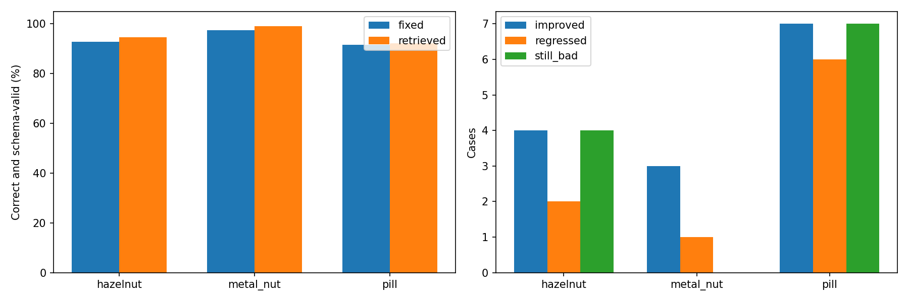

# DINO 정상 검색 + Qwen 비교 — 152235

## 질문·변경
매번 같은 정상 3장을 보여주는 대신 검사 이미지와 유사한 정상 3장을 보여주면 오탐·미탐이 개선되는가? 사용자 승인에 따라 hazelnut·metal_nut·pill 전체392장을 비교했다. 기존 결과는 보존했고 dinopatch 제품 기본값은 바꾸지 않았다.

## 데이터·설정
학습 정상 hazelnut391/metal_nut220/pill267, 합계878장만 검색 후보로 사용했다. 테스트 정상88/NG304, 합계392장과 순서·이미지 바이트·정답은 이전 실행과 동일하다. DINOv2 registers-base 동결, 전체 CLS 768차원 L2 정규화, cosine 상위3장, 동점은 학습 경로 정렬순이다. DINO 입력392 RGB bilinear/ImageNet 정규화, FP16 autocast 후 FP32 정규화. VLM은 이전 Qwen3-VL235B·프롬프트·temperature0·max_tokens3000·provider deny/zdr·기준/검사1024를 유지했다. 각 카테고리 처음10순차, 이후4병렬, 재시도0. GT·라벨을 검색이나 프롬프트에 쓰지 않았다. 기준의 중복은 파일과 해시 기준으로 검사했다. VLM에는 DINO 숫자 특징이나 유사도 점수를 보내지 않고 선택된 이미지3장만 전달했다.

## 검증한 측정
|카테고리|기준 선택|정답·형식 통과|오탐|미탐|오류|보류|평균 API 초|
|---|---|---|---|---|---|---|---|
|hazelnut|고정 3장|92.73%|5|1|2|0|7.74|
|hazelnut|DINO 검색 3장|94.55%|4|0|2|0|8.52|
|metal_nut|고정 3장|97.39%|3|0|0|0|6.44|
|metal_nut|DINO 검색 3장|99.13%|1|0|0|0|6.88|
|pill|고정 3장|91.62%|3|8|3|0|6.84|
|pill|DINO 검색 3장|92.22%|2|9|2|0|5.90|

hazelnut: 92.73% → 94.55%, 오탐 5→4, 미탐 1→0, 오류 2→2 / metal_nut: 97.39% → 99.13%, 오탐 3→1, 미탐 0→0, 오류 0→0 / pill: 91.62% → 92.22%, 오탐 3→2, 미탐 8→9, 오류 3→2

## 실패·한계·결정·다음 단계
미탐 유형별 변화: hazelnut cut 미탐 1→0 / pill color 미탐 1→3 / pill contamination 미탐 1→3 / pill crack 미탐 4→3 / pill scratch 미탐 2→0. 총 정답률 상승과 특정 불량 유형의 미탐 감소는 같은 결론이 아니므로 분리해서 판단한다.
미탐에서 NG로 바뀐 사례는 별도로 GT 포함률과 상자의 영상 면적을 계산해 recovered_miss_localization.json 및 보고서에 기록했다. 포함률은 IoU나 전체 위치 정확도가 아니다.
개선·악화·여전히 실패한 사례를 모두 표시했다. 상세 결함 유형별 변화와 쌍별 전이는 metrics.json 및 paired_decisions.csv에 저장했다. 판정·형식 통과와 위치·설명 정확도는 별개다. 오류를 정상으로 간주하거나 분모에서 제외하지 않는다. 전역 CLS 유사도는 결함 비교의 적절성을 보장하지 않고 cosine은 정상 확률이 아니다. 참조가 바뀌면 캐시 적중률도 바뀌므로 API 지연은 검색 효과와 별개다. 특징과 검색은 오프라인 일괄 계산했으며 API 시간에 포함되지 않는다. 실행 시점·공급자 차이와 VLM 변동성이 남아 있고 단일 반복이므로 인과적 개선 및 범용성을 확정하지 않는다. 현재는 개발 실험으로 유지하며, 다음은 새로 생긴 미탐과 정상 변화 오탐의 선택 기준을 육안 검토한 후 채택 여부를 결정한다. 추가 학습·다른 검색법 탐색은 하지 않았다.

## 출처·검증
- [비교 시각화](http://127.0.0.1:8765/output/comparisons/qwen_dino_reference_comparison_20261007_152235/index.html)
- 통합 결과 `E:/DH/Sandbox/Dinopatch/output/comparisons/qwen_dino_reference_comparison_20261007_152235`
- 특징·검색 `E:/DH/Sandbox/Dinopatch/output/comparisons/dino_reference_search_20261007_150417`: run.json에 실제 모델 가중치 해시, GPU, 전처리, 시간; 카테고리별 features.npz와 selection.json.
- VLM 실행: E:\DH\Sandbox\Dinopatch\output\comparisons\qwen_hazelnut_1024dino_top3_20261007_150523, E:\DH\Sandbox\Dinopatch\output\comparisons\qwen_metal_nut_1024dino_top3_20261007_151120, E:\DH\Sandbox\Dinopatch\output\comparisons\qwen_pill_1024dino_top3_20261007_151612
- 코드 tools/prepare_dino_references.py, tools/evaluate_qwen_cable.py --retrieval-plan, tools/report_dino_reference_vlm.py. 실행별 소스 사본 보존.
- 기존 실행 manifest,392장 입력 동일,878장 학습 정상/테스트 해시 분리,검색순위 재계산,기준 픽셀·원본·GT 보존,모델 설정·실응답 모델,HTTP 이미지 검증.

원본 이미지·특징 배열·모델·인증정보는 노트 저장소에 포함하지 않았다. 18:00 정기 동기화 대상이며 별도 commit/push하지 않았다.

## 종합 해석

전체 392장에서 오탐은 11→7, 미탐은 9→9, 출력 오류는 5→4였다. 정답·형식 통과는 367→372건(93.62%→94.90%)이다. pill은 crack 미탐 4→3, scratch 2→0으로 줄었지만 contamination 1→3, color 1→3으로 늘었다. 따라서 총 정확도 상승을 미탐 개선으로 해석하지 않는다. 기준 검색은 오탐 감소 가능성이 있으나 고정 기준을 전면 대체하지 않고 추가 검토 대상으로 유지한다. 공급자·실행 시점이 달라 단일 비교의 효과를 확정하지 않는다.

## 브라우저 검증

필터 16개 조합, 비교 카드 34건, 이미지 192개 로딩을 검증했고 JavaScript 오류는 0건이었다. 개선14건·악화9건·여전히 실패11건은 판정과 출력 형식까지 포함한 전이이며 모두 위치 정확도 개선을 뜻하지는 않는다.
