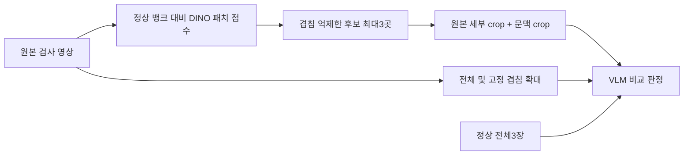

# DINO 패치 이상 점수를 이용한 VLM 확대 후보 제안

상태: 사용자 질문에 대한 설계 구체화. 실험·API 호출·학습·제품 코드 변경 없음. 새 성능 측정 없음.

## 질문·이전 제안과의 관계
사용자가 DINOv2에서 가장 높은 패치 영역을 VLM에 전달하면 어떨지, 검사 확대를 어떻게 구성할지 질문했다. v1의 전체+고정 겹침 확대에 대해 점수 기반 후보 확대를 추가 비교안으로 제안한다. 최고점 한 곳만 보는 것으로 v1을 대체하지 않는다. 후보 선택의 누락과 VLM 판독 실패를 분리하는 것이 목적이다.

## 코드에서 확인한 구분
- `tools/prepare_dino_references.py`는 동결 DINOv2의 최종 CLS로 정상 전체 이미지3장을 검색한다. 이것은 패치 이상맵이 아니다.
- `dinopatch/score.py`의 dist_map은 정상 패치 뱅크의 최근접 코사인 거리 `1-max(similarity)`로 (Hp,Wp) 이상 점수를 만든다. 점수가 높을수록 정상 뱅크와 멀다. 불량 확률은 아니다.
- `dinopatch/pipeline.py`의 score_one은 이미지 점수·패치맵·실제 채점한 영상을 반환한다. 이 경로를 쓰려면 학습 또는 로드된 정상 뱅크가 필요하다. 현재 전체15개 VLM 실행에서 이미 패치맵까지 생성했다고 주장하지 않는다.

## 확대 후보 설계
1. 정상 학습 데이터만 만든 뱅크의 원시 패치 점수로 후보를 고른다. 화면용 min-max 색상이나 빨간 픽셀 개수는 판정 기준으로 쓰지 않는다. 정상 영상에도 순위상 최고점은 반드시 존재한다.
2. 높은 점수의 후보를 순서대로 고르되, 이미 선택한 영역과 크게 겹치면 다음 공간적으로 다른 후보를 고른다. 초깃값은 최대3곳이라는 실험 가설이다. 인접한 고점 패치 여러 개를 서로 다른 후보로 중복 전달하지 않는다. 최고점이 결함이라는 이름을 붙이지 않는다.
3. 후보마다 세부·문맥 두 크기의 원본 crop을 제공한다. 1024 정사각 원본의 예시 시작값은256 정사각(세부)·512 정사각(문맥), 표시 입력은각768 정도다. 고정 최적값이 아니라 비교 시작점이며 다른 원본 크기는 비율로 계산한다. 긴 흠집·큰 변형에는 후보 영역의 경계 상자+여백으로 크기를 조정할 수 있다.
4. crop은 패치 격자 이미지나 색칠한 이상맵이 아니라 원본 RGB에서 자른다. 원본에 없는 질감을 만드는 생성형 확대는 하지 않는다. 영상 끝에서는 crop 범위를 안쪽으로 이동하여 동일 크기를 유지하고, 좌표 이동·리사이즈·정합·ROI 전처리의 역변환을 기록한다.
5. 검사 전체와 정상 전체3장을 함께 유지한다. 리드-기판 구멍 같은 상대배치 결함은 좁은 crop만으로 판단하지 않는다. 정상 대응 crop은 위치 대응이 확인될 때 후속 비교하며, 가장 비슷한 임의의 정상 패치를 가져와 위치·관계 차이를 지우지 않는다.
6. VLM에는 후보 ID, 원본상의 영역, 확대 크기를 명시한다. 'DINO가 찾은 확정 결함'이 아니라 '추가 확인 영역'으로 전달한다. crop의 좌표는 원본으로 변환해 표시한다. 형식 오류는 별도 집계한다.

## 왜 최고점 하나만 쓰지 않는가
최고점이 배경·반사·정상 자세 차이일 수 있으며 실제 결함이 낮은 점수에 놓일 수 있다. 따라서 점수 기반 후보만 전달하면 첫 검출기의 누락이 그대로 최종 시스템의 누락으로 이어질 수 있다. 전체 영상 유지와 고정 겹침 확대는 서로 다르다. 전체만으로 작은 결함을 충분히 볼 수 있다고 가정하지 않으며, 첫 비교에서는 고정 겹침 확대 대조군을 유지한다.

## 비교 및 평가 제안
- A: 정상3장+검사 전체.
- B: A+원본 전체를 덮는 겹침 확대.
- C: A+DINO 후보 확대.
- D: 필요 시 B+C. 이미지·토큰 예산이 다르면 효과와 비용을 함께 보고, 동일 확대 예산 비교도 고려한다.
- 후보 생성·크기·임계값을 테스트 GT에 맞춰 고르지 않는다. GT는 추론 이후에만 이용한다.
- 후보 박스 안에 GT 결함이 얼마나 포함됐는지(픽셀 포함률 및 결함별 포함 여부)와, 포함됐는데도 VLM이 놓쳤는지를 구분한다. 조금만 겹친 경우와 충분히 포함된 경우를 혼동하지 않는다.
- 정상 오탐·NG 미탐·보류·출력 오류·응답 시간·비용을 전체 분모에 유지한다. 기존 실패만 골라 평가한 결과를 전체 성능으로 표시하지 않는다.

## 근거·한계·다음
이번 제안의 성능은 미검증이다. 기존 전체15개 결과 및 직접 확인한 미탐 관찰은 `E:/DH/Sandbox/Dinopatch/output/comparisons/qwen_mvtec_all_20261007_164317/`에 있다. 현재 코드 경로는 `E:/DH/Sandbox/Dinopatch/` 아래 위 세 파일이다.

[AnomalyGPT](https://arxiv.org/abs/2308.15366)는 국소 세부 정보 제공을 위한 별도 decoder와 prompt 학습을 사용한다. 국소 정보를 보완한다는 관련 맥락이며, 이번 학습 없는 DINO 후보 crop 전달의 성능을 입증한 연구는 아니다. [Qwen 공식 다중 이미지·확대 예제](https://github.com/QwenLM/Qwen3-VL)는 입력 구성의 구현 참고다.

결정: DINO 최고점은 추가 관찰 위치를 고르는 근거로 쓰고 최종 불량 확정으로 쓰지 않는다. 다음 실험은 고정 겹침 확대와 DINO 후보 확대를 비교해 후보 누락과 판독 실패를 분리한다. 아직 실행하지 않았고 기존 결과와 기본값은 유지한다.
