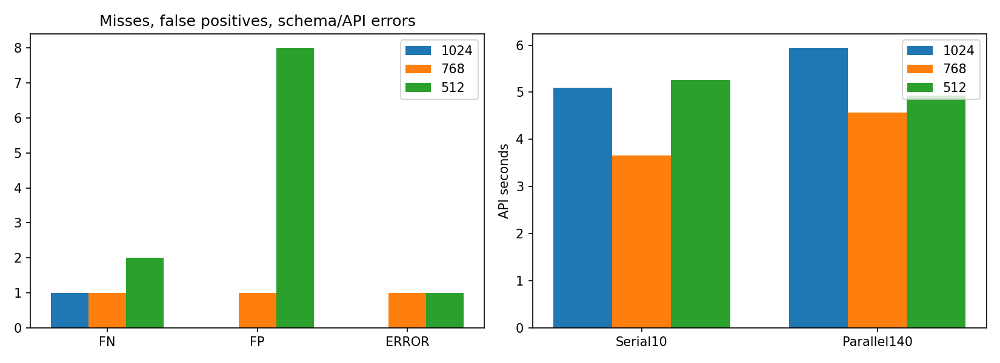

# Qwen cable 입력512 축소 — qwen_cable_512_20261007_125524

## 질문·변경·데이터
768보다 더 줄인512 입력으로 속도와 검출 성능을 확인했다. 기준3장과 원본 test150장(정상58/NG92)을 RGB/LANCZOS로512×512 축소했다. 원본·GT·이전 실행은 보존했다. 고정모델 Qwen3-VL235B, temperature0,max_tokens3000, 같은 프롬프트/순서/순차10장+4병렬140장/data_collection deny/zdr true, 재시도0. GT는 전송하지 않았다. 전수 새 호출이며 기존 모델선택 표본을 포함한 개발 비교이다.

## 측정
|지표|1024|768|512|
|---|---:|---:|---:|
|유효 NG 검출|91.00|90.00|89.00|
|미탐 (NG→OK)|1.00|1.00|2.00|
|정상 판정|58.00|57.00|50.00|
|정상 오탐|0.00|1.00|8.00|
|형식/API 오류|0.00|1.00|1.00|
|보류|0.00|0.00|0.00|
|정답·형식 통과 비율(%)|99.33|98.00|92.67|
|평균 입력 토큰|4241.00|2449.00|1169.00|
|평균 출력 토큰|93.17|95.81|101.03|
|평균 캐시 토큰|3010.56|1681.92|752.64|
|serial 평균초|5.10|3.66|5.26|
|serial 중앙값초|4.93|3.70|4.09|
|serial P95초|6.92|4.49|10.68|
|parallel4 평균초|5.94|4.58|4.93|
|parallel4 중앙값초|5.25|4.29|4.43|
|parallel4 P95초|9.90|7.36|8.26|
|all 평균초|5.89|4.51|4.96|
|all 중앙값초|5.21|4.24|4.40|
|all P95초|9.79|7.20|8.57|

공급자: {'Parasail': 150}. 과거 조건과 시점이 달라 서버부하·캐시·출력길이 등 혼재요인이 있다. 평균시간은 네트워크/대기/추론/응답수신 포함이며GPU시간이 아니다. 수신된 응답이면좌표형식오류도시간집계에포함했다. 형식오류는미탐과별도이며전체정답·형식통과비율분모에남겼다. 원문NG를성공적인위치검사로승격시키지않았다.

## 사례·한계·결정
Q045의 작은 구멍은512에서 NG로 바뀌었습니다. 하지만 제안 상자가 실제 GT 결함 픽셀을 포함한 비율은 0.00%입니다. 판정이 맞았다는 사실과 위치가 맞았다는 사실은 다릅니다. 이 한 사례의 상자 포함률이며 전체 분할 성능 지표가 아닙니다.
Q103 내부 피복 절단은512에서도 상단 피복의 벌어짐이 육안으로 보이지만 모델은OK로 판단했다. 단순한 픽셀소실만으로 원인을 단정하지 않는다. 추가원인분리실험은미실행이다.
512 오답/오류/보류 11건: Q001 bent_wire ERROR, Q010 good NG, Q028 good NG, Q054 good NG, Q080 good NG, Q088 cut_inner_insulation OK, Q101 good NG, Q103 cut_inner_insulation OK, Q106 good NG, Q110 good NG, Q126 good NG.
해상도3조건 사이 판정변경 12건. 세부는 resolution_comparison.json. 모든 조건에서 설명·위치 정확도가 검증됐다는 뜻은 아니다. 프롬프트나좌표규칙을결과에맞춰변경하지않았다. 256이나 기준만축소하는조건은미실행이다. 속도만으로512를채택하지않고오탐·미탐·형식안정성을함께평가한다.

## 검증·출처
150장 ID/원본SHA/정답/요청방식일치,512입력·기준3장픽셀재계산일치,원본해시및과거manifest유지,설정일치,집계재계산,HTML이미지HTTP접근확인.
- 실행 `E:/DH/Sandbox/Dinopatch/output/comparisons/qwen_cable_512_20261007_125524`
- 코드 `tools/evaluate_qwen_cable.py --size 512`, `tools/report_qwen_resolution_sweep.py`; 실행 logs/source.py 및 logs/report_source.py.
- 비교기준 `output\comparisons\qwen_cable_full_20261007_112918` / `output\comparisons\qwen_cable_768_20261007_121648`.
- [해상도3종 비교화면](http://127.0.0.1:8765/output/comparisons/qwen_cable_512_20261007_125524/comparison.html)

원본·자격증명·전체대화는연구저장소에서제외.18:00정기동기화대상이며별도commit/push하지않았다.
