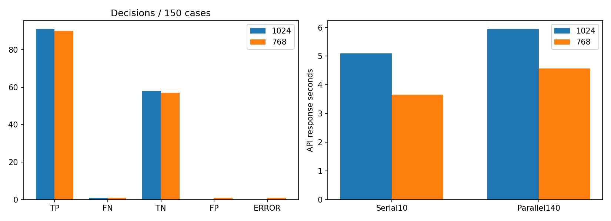

# Qwen cable 입력768 축소 비교 — 20261007_121648

## 질문·변경
같은 Qwen3-VL235B의 이미지 입력을1024에서768로 축소하면 응답이 빨라지며 판정이 유지되는가? OK기준3장과 검사150장을 모두 RGB/LANCZOS로768×768 변환했다. 모델/프롬프트/출력설정/요청순서/순차10장+4병렬140장 조건은 동일하다. 원본 데이터·기존 실행은 보존했다. GT는1024 그대로이며 모델에 보내지 않았다.

## 결과
|지표|1024|768|
|---|---:|---:|
|NG 검출|91.00|90.00|
|미탐|1.00|1.00|
|정상 판정|58.00|57.00|
|오탐|0.00|1.00|
|형식/API 오류|0.00|1.00|
|보류|0.00|0.00|
|전수 정답률(%)|99.33|98.00|
|평균 입력 토큰|4241.00|2449.00|
|평균 출력 토큰|93.17|95.81|
|평균 캐시 토큰|3010.56|1681.92|
|serial 평균초|5.10|3.66|
|serial 중앙값초|4.93|3.70|
|serial P95초|6.92|4.49|
|parallel4 평균초|5.94|4.58|
|parallel4 중앙값초|5.25|4.29|
|parallel4 P95초|9.90|7.36|
|all 평균초|5.89|4.51|
|all 중앙값초|5.21|4.24|
|all P95초|9.79|7.20|

응답시간 표는 공급자 응답을 수신한 사례를 포함하므로 좌표형식 오류도 분모에 들어간다. 기본 metrics.json의 valid-only시간과 분모가 다를 수 있다. 오류는 정상으로 간주하지 않으며 전수 정답률 분모150에 남긴다.

판정 변경 2건. 자세한 목록은 comparison.json. 형식오류 원문은 format_errors.json에 따로 보존했다. 원문의 decision이 NG여도 잘못된 좌표를 임의로 보정하거나 성공적인 위치검사로 집계하지 않는다. 프롬프트 조정·재시도 없음.

## 한계·해석
과거1024실행과 현재768실행은 시점이 다르며 서버부하·캐시상태·출력길이·공급자라우팅이 지연에 영향을 준다. 순차10장은 동일 이미지지만1회씩이며 순수GPU추론속도나 인과적 개선율을 입증하지 않는다. 공급자 보고 입력토큰 감소와 관측 응답시간을 구분한다. 위치상자는 정답마스크가 아니며 설명·위치정확도는 분류정답률과 별도다. 이전 모델선택에 사용한 예비10장을 포함한 개발 비교이므로 독립평가가 아니다.512조건은 실행하지 않았다.

## 결정·다음 단계
속도만으로768을 채택하지 않는다. 변경된 판정과 오류부터 확인하고 작은 결함/형식 안정성 손실 여부를 검토한다. 추가 조건은 한 번에 하나만 비교한다. 정답에 맞춰 임계값·프롬프트·좌표규칙을 바꾸지 않았다.

## 검증·출처
150장 ID/원본SHA/정답/순차병렬역할 일치, 실제 입력 및 기준3장의LANCZOS 픽셀 재계산 일치, 원본해시 유지, 설정일치, 집계 재계산 확인.
- 실행 `E:/DH/Sandbox/Dinopatch/output/comparisons/qwen_cable_768_20261007_121648`
- 기준 `E:/DH/Sandbox/Dinopatch/output/comparisons/qwen_cable_full_20261007_112918`
- 코드 `tools/evaluate_qwen_cable.py --size 768`, 실행 logs/source.py 및 logs/compare.py.
- [비교 시각화](http://127.0.0.1:8765/output/comparisons/qwen_cable_768_20261007_121648/comparison.html)

원본데이터·자격증명·전체대화는 기록저장소에서 제외. 별도commit/push 없이18:00 정기동기화 대상.
