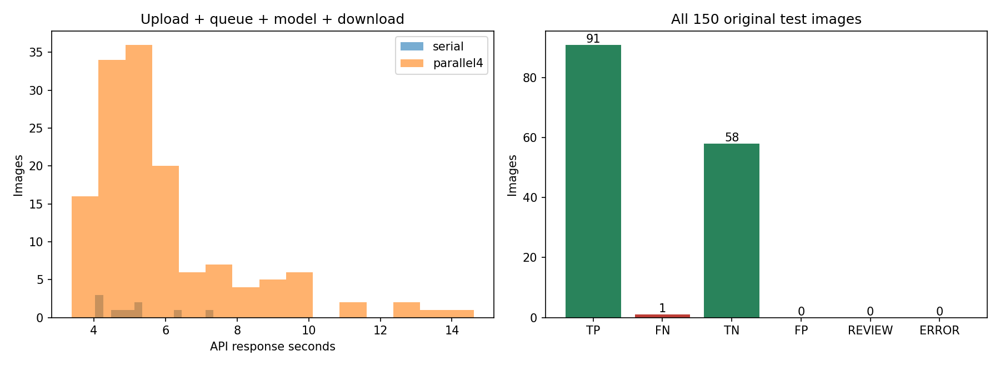

# Qwen3-VL 235B cable 전체 테스트 — 20261007_112918

## 질문과 변경
앞선10장 예비 비교에서 좋은 결과였던 Qwen을 cable 공식 test 전수에 적용하고 이미지당 응답시간을 측정했다. 기존 OK 기준3장과 간단한 이미지 비교 프롬프트를 그대로 유지했다. 제품 설명이나 이전 정상 규칙을 추가하지 않았다. 모델 학습·임계값 변경 없음.

## 데이터·조건
원본150장: 정상58/NG92. train/good 000/112/223은 고정 기준이며 성능집계에서 제외했다. 기준/test 해시 분리 확인. 모든150장을 새로 호출했다. 과거 예비10장을 포함하며 model 선택에 사용했으므로 독립 확인평가는 아니다. prior10/remaining140 집계도 metrics.json에 분리했다. GT는 추론에 전달하지 않았다.
모델 `qwen/qwen3-vl-235b-a22b-instruct`, OpenRouter, temperature0, max_tokens3000, data_collection=deny/zdr=true. seed20261007로 순서를 섞어 처음10장은 순차, 나머지140장은 최대4개 동시 요청. 재시도0. API 응답 모델/제공자/비용은 저장했다. 제공자 집계: {'Parasail': 150}.

## 판정 결과
NG 검출 91/92, NG를 OK로 미탐 1. 정상 판정 58/58, 정상 오탐 0. 보류 0, 오류 0.
전체150장 기준 정답률 99.33%, NG 재현율 98.91%, 정상 오탐률 0.00%. REVIEW/오류는 전체 정답률 분모에 남기며 정상으로 취급하지 않았다. 순위 점수가 없으므로 AUROC는 산출하지 않았다.

|유형|NG 검출|미탐|정상판정|오탐|보류|오류|
|---|---:|---:|---:|---:|---:|---:|
|bent_wire|13|0|0|0|0|0|
|cable_swap|12|0|0|0|0|0|
|combined|11|0|0|0|0|0|
|cut_inner_insulation|14|0|0|0|0|0|
|cut_outer_insulation|10|0|0|0|0|0|
|good|0|0|58|0|0|0|
|missing_cable|12|0|0|0|0|0|
|missing_wire|10|0|0|0|0|0|
|poke_insulation|9|1|0|0|0|0|

## 이미지당 응답시간
|조건|장수|평균 초|중앙값 초|P95 초|최소~최대 초|
|---|---:|---:|---:|---:|---|
|all|150|5.89|5.21|9.79|3.38~14.61|
|serial|10|5.10|4.93|6.92|4.04~7.34|
|parallel4|140|5.94|5.25|9.90|3.38~14.61|

시간은 네트워크 업로드·API 대기·추론·전체 응답 수신을 포함한다. 로컬 GPU 순수 추론 시간이나 첫 토큰 시간은 아니다. api_seconds는 요청 직전부터 전체 JSON 수신까지, total_seconds는 로컬 이미지 인코딩·요청준비·파싱을 추가하며 파일저장·시각화는 제외한다. 순차10장과 병렬140장은 표본·시점이 달라 병렬화의 인과효과 비교가 아니다. api시간 통계는 정상 응답만 포함하며 오류시간은 개별 CSV에 남겼다. 첫 요청도 제외하지 않았다.
전체 요청 구간 벽시계 267.21초. 병렬 벽시계를 장수로 나눈 값을 단일 이미지 지연시간이라고 부르지 않는다. API 보고 비용 $0.1104717, 비용 누락 0건.

## 실패·한계·결정
Q045 (`poke_insulation/002.png`)은 OK로 미탐했다. Codex가 원본과 GT를 대조해 왼쪽 위 흰 절연부의 작은 구멍을 확인했다. 모델은 구체적인 해당 부위를 언급하지 않고 정상 기준과 같다고 설명했다. 이 사례만으로 원인이 해상도 때문이라고 단정하지 않는다.
이전10장100%는 그 소규모 표본 결과였다. 이번에는 전체 테스트로 범위를 넓혔으며 이전 결론을 덮어쓰지 않는다. 오류이미지 목록은 errors.json, 화면은 오탐/미탐부터 배치했다. 분류 정답만으로 설명·위치까지 정확하다고 간주하지 않는다. 상자는 의심 위치 제안이며 이상맵/픽셀 마스크가 아니다. 위치 IoU·설명 정답률은 측정하지 않았다. 사용자 검토가 필요하다.
현재 측정은 API 기준이며 현장100ms 요구 충족 여부를 로컬 추론 속도로 환산하지 않는다. 다음은 오탐·미탐 사례에서 작은 결함 누락과 허용 정상차이를 구분해 원인을 확인하는 단계다. 이 결과에 맞춘 프롬프트나 샘플 수정은 하지 않았다.

## 검증과 출처
- 전수150장/고유ID/정상58/NG92, 기준분리, 원본·GT 해시 보존, 응답 스키마, 집계·시간통계 재계산, 이미지 HTTP 접근 확인.
- 실행 `E:/DH/Sandbox/Dinopatch/output/comparisons/qwen_cable_full_20261007_112918`
- 코드 `tools/evaluate_qwen_cable.py`, `tools/probe_vlm_image_only.py`의 PROMPT; 고정 복사 logs/source.py, logs/prompt_source.py 및 logs/finalize.py.
- data/selection.json / responses/ / predictions.json / predictions.csv / metrics.json / errors.json / logs/validation.json.
- [전체 예측과 시간 보기](http://127.0.0.1:8765/output/comparisons/qwen_cable_full_20261007_112918/index.html)

원본데이터·인증정보·전체대화는 연구저장소에서 제외. 정기18:00 동기화 대상으로 기록하며 별도commit/push하지 않았다.
