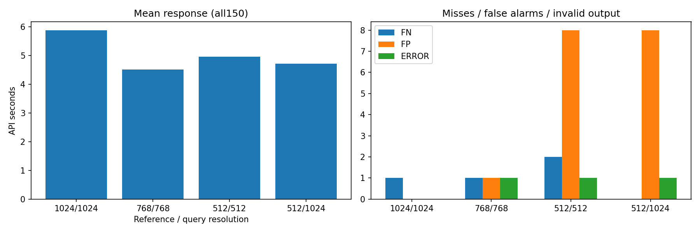

# Qwen 기준 이미지만512 / 검사1024 — 130150

## 질문과 변경
검사 이미지의 정보를 유지하면서 기준이미지만 줄이면 속도와 판정 품질이 유지되는가? 기존3장 기준을 RGB/LANCZOS512로 축소하고 원본 검사150장은1024바이트 그대로 유지했다. 원본데이터와과거실행은보존했다.

## 데이터·설정
cable 공식test150장(정상58/NG92), 동일train/good기준000/112/223. 같은Qwen3-VL235B, 동일프롬프트/temperature0/max_tokens3000/data_collection deny/zdr true. 정답·유형·GT는전송하지않았다. 동일seed20261007순서, 처음10순차/나머지140최대4병렬. 모든150장새호출,재시도0. 이전10장으로모델을선택했으므로독립확인평가가아닌개발비교이다.

## 측정
|기준/검사 크기|1024/1024|768/768|512/512|512/1024|
|---|---:|---:|---:|---:|
|유효 NG 검출|91.00|90.00|89.00|91.00|
|미탐|1.00|1.00|2.00|0.00|
|정상 판정|58.00|57.00|50.00|50.00|
|정상 오탐|0.00|1.00|8.00|8.00|
|출력/API 오류|0.00|1.00|1.00|1.00|
|보류|0.00|0.00|0.00|0.00|
|정답·형식 통과 비율(%)|99.33|98.00|92.67|94.00|
|평균 입력 토큰|4241.00|2449.00|1169.00|1937.00|
|평균 출력 토큰|93.17|95.81|101.03|103.26|
|평균 캐시 토큰|3010.56|1681.92|752.64|757.76|
|serial 평균초|5.10|3.66|5.26|3.57|
|serial 중앙값초|4.93|3.70|4.09|3.28|
|serial P95초|6.92|4.49|10.68|5.60|
|parallel4 평균초|5.94|4.58|4.93|4.80|
|parallel4 중앙값초|5.25|4.29|4.43|4.11|
|parallel4 P95초|9.90|7.36|8.26|10.08|
|all 평균초|5.89|4.51|4.96|4.72|
|all 중앙값초|5.21|4.24|4.40|4.04|
|all P95초|9.79|7.20|8.57|9.60|

새조건 공급자: {'Parasail': 149, 'Venice': 1}. API시간은 업로드·서버대기·추론·응답수신을 포함하고 순수GPU시간이 아니다. 형식오류도수신응답이면시간통계에포함했다.시점·캐시·서버부하·출력길이차이가있어인과적속도효과를확정하지않는다.

## 사례·한계·결정
정상 58장 중 8장을 NG로 오탐했다. 모델은 일부 정상의 조명·반사·구리 가닥 배열 차이를 불량 근거로 사용했다. Q111은 원문 판정은 NG이지만 [418,320,894,748] 픽셀 좌표를 반환해 정규화 좌표 규약을 위반했다. 이를 미탐이나 정상으로 바꾸지 않고 오류로 집계했다.
Q045의 작은 구멍은 이번에 NG로 검출했고 예측 상자가 GT 결함 픽셀의 100.0%를 포함했다. 한 사례의 포함률이며 IoU 또는 전체 위치 정확도가 아니다. 검사 해상도를 유지해도 기준 축소에 따른 오탐 증가가 관찰되어 기존 1024 조건을 대체하지 않는다. 다음 단계에서는 오탐 사례의 기준·검사 영상 간 반사와 질감 차이를 우선 검토하고, 속도 개선은 반복 측정으로 확인하는 것이 필요하다.
기존1024대비판정변경10건. 새조건오답/오류/보류: Q010 good NG, Q028 good NG, Q061 good NG, Q101 good NG, Q110 good NG, Q111 bent_wire ERROR, Q122 good NG, Q144 good NG, Q147 good NG.
판정 정답과 이유·위치정확도는별도이다. 수치상변화만으로기본모델을교체하지않고바뀐이미지의근거를검토한다. 추가해상도/기준장수/프롬프트변경은실행하지않았다. API오류나형식오류를정상으로처리하지않는다. 기록된상자는정답마스크가아니다.

## 검증·출처
150장ID/정답/원본해시/순차병렬역할동일,검사입력원본바이트동일,기준3장의512리사이즈픽셀동일,과거manifest보존,설정일치,집계재계산,이미지HTTP확인.
- 실행 `E:/DH/Sandbox/Dinopatch/output/comparisons/qwen_cable_ref512_query1024_20261007_130150`
- 코드 `tools/evaluate_qwen_cable.py --size 1024 --reference-size 512`, `tools/report_qwen_reference_resize.py`; 실행 logs/source.py 및 logs/report_source.py.
- reference_comparison.json / paired_decisions.csv / predictions.json / responses/ / logs/validation.json.
- [기준만 축소 비교](http://127.0.0.1:8765/output/comparisons/qwen_cable_ref512_query1024_20261007_130150/comparison.html)

원본데이터·자격증명·전체대화는연구저장소에서제외.18:00정기동기화대상이며별도commit/push하지않았다.
