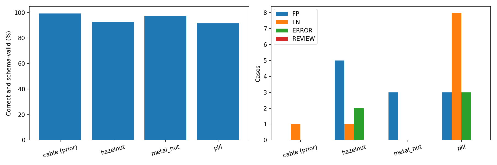

# Qwen 고해상도 MVTec 3개 카테고리 — 20261007_132449

## 질문·변경
cable에서 사용한 기준/검사 1024 조건이 hazelnut·metal_nut·pill에서도 유효한가? 동일 모델·프롬프트와 정상 기준 3장을 사용해 전체 공식 테스트 392장을 새로 예측했다. dinopatch 모델에는 적용하지 않은 독립 실험이다.

## 데이터·설정
정상 기준은 카테고리별 train/good 정렬 목록의 첫·중간·마지막이다. 테스트는 정상 88장, NG 304장이다. hazelnut 원본은 1024, metal_nut 700, pill 800이며 후자 둘은 RGB/LANCZOS 1024 확대했다. 원본 데이터는 보존했다. 정답·결함 종류·GT는 모델에 전송하지 않았다. temperature 0, max_tokens 3000, data_collection deny, zdr true, 재시도 0. 카테고리별 첫 10장 순차, 나머지 최대 4병렬. 모델 선택과 해상도 결정은 이전 cable 실험을 참고했다. 모델의 MVTec 사전학습 노출 여부는 알 수 없으며 독립 산업 데이터의 일반화 증거는 아니다.

## 검증한 측정
|카테고리|정상 / NG|정답·형식 통과|오탐|미탐|오류|보류|평균 응답(초)|
|---|---|---|---|---|---|---|---|
|cable (prior)|58 / 92|99.33%|0|1|0|0|5.89|
|hazelnut|40 / 70|92.73%|5|1|2|0|7.74|
|metal_nut|22 / 93|97.39%|3|0|0|0|6.44|
|pill|26 / 141|91.62%|3|8|3|0|6.84|

시간은 업로드·서버 대기·추론·응답 수신을 포함한다. 수신된 형식 오류도 포함한 평균이다. 카테고리·공급자·시간대·캐시 조건이 달라 인과적인 속도 비교는 아니다. 상세 순차/병렬/P95, 공급자, 결함 유형별 측정은 metrics.json에 저장했다.

## 실패·한계·결정·다음 단계
hazelnut에서는 정상 껍질의 매끈함·질감 차이를 NG 근거로 든 오탐과 cut 결함 미탐이 확인됐다. metal_nut에서는 정상 가장자리의 모양·어두운 흔적을 불량으로 판단한 사례가 있었다. pill의 일부 crack·scratch 미탐에서는 모델이 흰 타원형, FF 각인, 붉은 반점이 기준과 비슷하다는 이유로 OK를 반환했다. 이는 관찰한 응답 양상이며 모델 내부의 실제 사고과정을 입증하지는 않는다.

오탐·미탐·오류·보류 25건을 시각화했다. 오류/보류는 분모에서 제외하거나 정상으로 간주하지 않는다. 응답은 이산 판정과 상자이며 AUROC·이상 점수·이상맵은 제공되지 않는다. 모델 설명이 맞는지는 분류 정답과 별도 검토해야 한다. 기준 3장의 대표성을 보장하지 않으며 기준 선택 반복 실험은 하지 않았다. 카테고리별 실패 유형을 먼저 검토하고, 현재 결과만으로 모든 물체에 동일 성능이 나온다고 결론내리지 않는다. 다음은 미탐 및 정상 변화 오탐을 육안으로 확인해 기준 부족과 미세 결함 누락을 구분하는 것이다.

## 출처·검증
- [시각화 보고서](http://127.0.0.1:8765/output/comparisons/qwen_mvtec_categories_20261007_132449/index.html)
- 통합 실행: `E:/DH/Sandbox/Dinopatch/output/comparisons/qwen_mvtec_categories_20261007_132449`
- 소스 실행: E:\DH\Sandbox\Dinopatch\output\comparisons\qwen_hazelnut_1024_20261007_130844, E:\DH\Sandbox\Dinopatch\output\comparisons\qwen_metal_nut_1024_20261007_131328, E:\DH\Sandbox\Dinopatch\output\comparisons\qwen_pill_1024_20261007_131807
- 코드: tools/evaluate_qwen_cable.py --category CATEGORY --size 1024; tools/report_qwen_categories.py. 실행별 logs/source.py 보존.
- 모든 테스트 경로 포함, 기준/검사 해시 분리, 원본·GT 해시 보존, 1024 입력 픽셀 검증, 기존 cable manifest 보존, 보고서 HTTP 자산 확인.

원본 이미지·모델·인증정보는 연구노트에 포함하지 않았다. 정기 18:00 동기화 대상이며 이번 실험에서 commit/push하지 않았다.

## 추가 검증

브라우저에서 필터 20개 조합, 오류·오답 카드 25건, 이미지 74개 로딩을 검증했고 JavaScript 오류는 0건이었다. 개별 보고서의 이전 cable 전용 표기(prior10/remaining140)를 제거하고, 시간 집계는 통합 보고서와 동일하게 좌표 형식 오류를 포함한 수신 API 응답 기준으로 통일했다. 이미지 재예측은 하지 않았다. 원 실행 소스는 보존하고 보고서 갱신 소스는 각 실행의 logs/report_refresh_source.py에 저장했다.

pill 미탐 8건의 유형은 crack 4건, scratch 2건, contamination 1건, color 1건이다.
