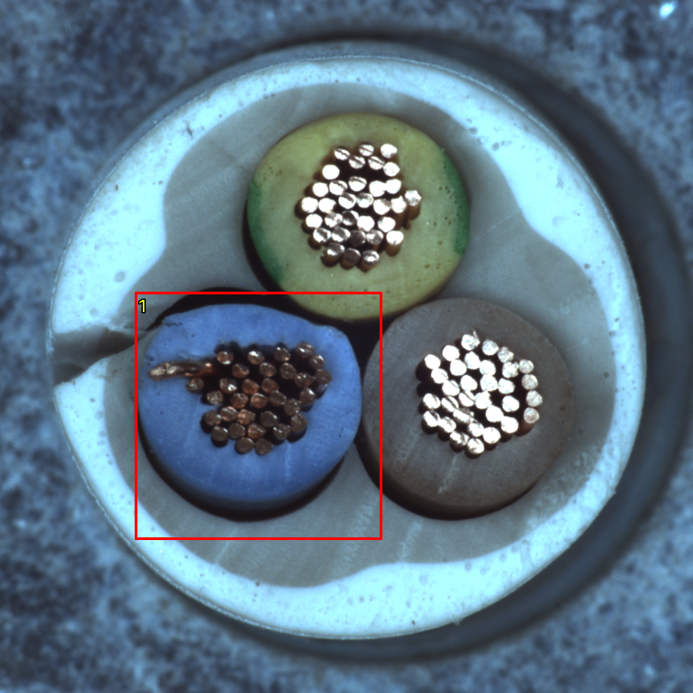
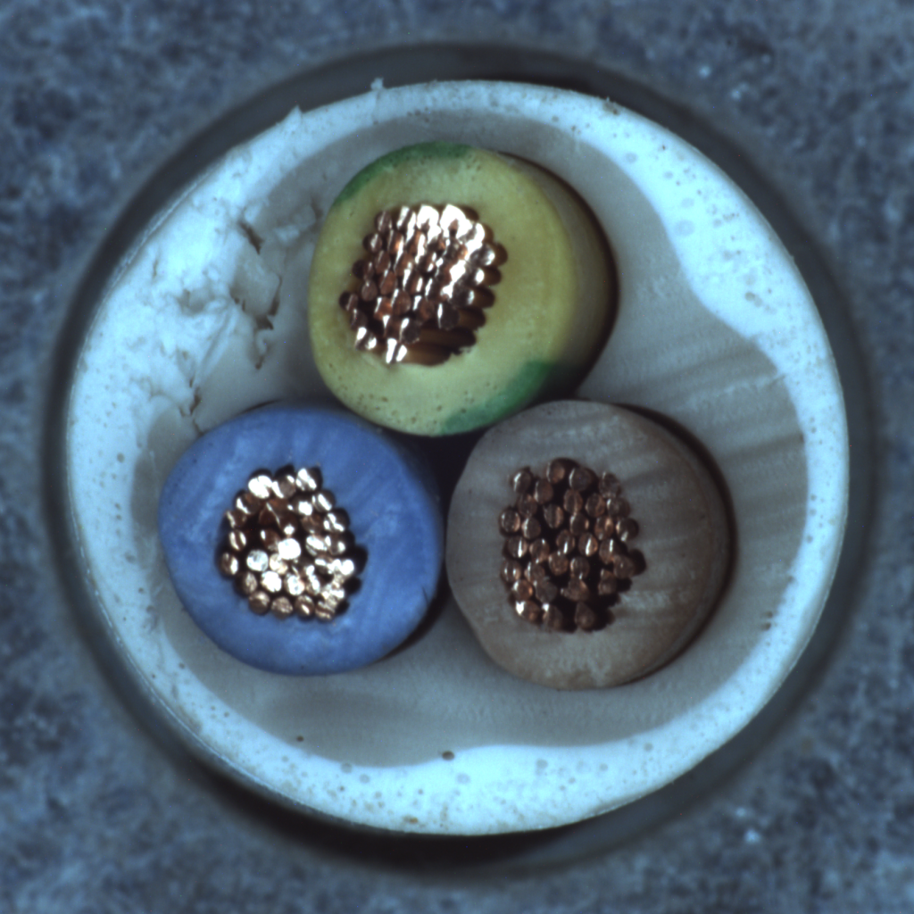

# 정상 기준 VLM — NG 샘플 예측 20261007_111220

## 질문과 변경
이전 OK 구조 설명을 기준으로 cable NG를 판별하고 이유·위치를 제시할 수 있는가? 정상 이해에서 소규모 NG 예측으로 한 단계 확장했다. dinopatch 검출기는 수정하지 않았다.

## 데이터·분할·설정
MVTec cable 원본 test에서 8종 NG 각1장, good2장. 정렬된 유형별 목록에서 Python random seed20261007로 추출 후 섞었다. 결과 확인 전 고정했다. 이전에 탐색한 데이터셋의 소규모 개발 표본이며 독립 성능 검증이 아니다. 정상 기준은 이전 실험의 train/good 000/112/223 그대로다. 기준/질의 해시 분리 및 원본 보존을 확인했다. 선택 전체와 GT 출처는 data/selection.json.
Gemini 2.5 Pro / OpenRouter, temperature0, max_tokens1800, reasoning512, 10회. 각 요청은 독립이며 이전 질의 결과를 넘기지 않았다. OK기준 이미지3장+고정된 기존 JSON 설명+질의1장. 질의 라벨·유형·파일명·GT는 전송하지 않았다. 이전 실험과 달리 기준 이미지도 함께 주고 판정을 요청했으므로 단일요인 비교실험은 아니다.
앞서 미확인으로 판단한 충전재/N5·산화 추정·화면 절대방향을 단독 결함 근거로 삼지 않도록 예측 전에 명시했다. 원문 설명 자체는 보존했다. 프롬프트 재조정·재시도·재학습·임계값 변경 없음.

## 결과
NG8장: 검출 7, OK로 미탐 1. 정상2장: 정상 판정 2, 오탐 0. 전체 REVIEW 0, API/형식 오류0. 이 표본의 판정 정답 9/10이며 전체 cable 정확도로 일반화하지 않는다. API 보고 비용 $0.1212575. 누락 비용 0건.

|ID|정답 유형|예측|
|---|---|---|
|Q01|missing_cable|NG|
|Q02|cut_outer_insulation|NG|
|Q03|poke_insulation|OK|
|Q04|good|OK|
|Q05|cut_inner_insulation|NG|
|Q06|bent_wire|NG|
|Q07|good|OK|
|Q08|cable_swap|NG|
|Q09|missing_wire|NG|
|Q10|combined|NG|

## 설명 검토와 한계
Q02 외피 절단은 NG 판정 자체는 맞았지만, 이유는 외피 절단이 아닌 파란 전선 내부 가닥의 변색·산화 추정이었다. 원본 및 GT 마스크의 왼쪽 외피 절단과 설명이 일치하지 않는다. 상자가 정답 영역 일부와 겹치더라도 올바른 이유를 증명하지 않는다. 프롬프트에서 원인 추정을 경계했지만 실제 출력은 이를 지키지 못했다.
정답 유형과 설명·위치의 일치는 판정 정답 여부와 따로 봐야 한다. VLM 상자는 의심 위치이며 픽셀 이상맵이 아니다. 위치 IoU/결함분할 성능·AUROC·회전/조도 강건성은 측정하지 않았다. REVIEW를 정상으로 간주하지 않는다. 시각적 검토는 Codex의 정성 검토이며 사용자 승인된 부품/결함 정답을 새로 만들지 않았다.

## 결정과 다음 단계
일괄 판정을 곧바로 채택하지 않는다. 이번 오답 및 잘못된 이유 사례를 먼저 검토하고, 다음 실험은 같은 조건에서 전체 이미지와 부위 확대 관찰의 차이를 분리하는 정도로 한정하는 것이 후보이다. 확대 실험은 아직 실행하지 않았다. 기존 결과·기준은 덮어쓰지 않았다.

## 검증·출처
- 원본 이미지·GT 해시 보존, 기준/질의 분리, 응답/좌표 스키마, HTML 이미지 HTTP 접근 확인.
- 코드: `tools/probe_normal_ng.py`, 실행 내 `logs/probe_source.py`, `logs/record_results.py`.
- 실행: `E:/DH/Sandbox/Dinopatch/output/comparisons/normal_ng_20261007_111220`
- 기준: `output/comparisons/normal_understanding_20261007_105018`; 고정 해시는 run.json.
- 원문 응답: responses/, 예측: predictions.json, 집계: metrics.json, 검증: logs/validation.json.
- [예측·이유·위치 보기](http://127.0.0.1:8765/output/comparisons/normal_ng_20261007_111220/index.html)

원본 데이터·인증정보·전체 대화는 기록 저장소에서 제외했다. 별도 commit/push 없이 정기18:00 동기화 대상으로 저장했다.
