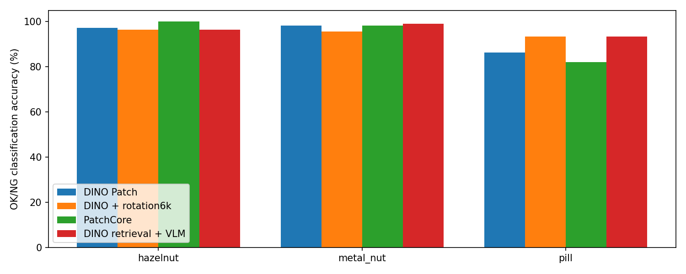

# 저장된 기존 검출기와 DINO 검색 VLM 비교

## 질문·변경
같은 hazelnut·metal_nut·pill에서 기존 검출기보다 VLM이 좋은가? 새 학습/API 호출 없이 저장된 원본 조건 392장의 경로·원본 해시·라벨을 대조하고 점수·판정에서 지표를 재계산했다.

## 측정
|모델|hazelnut|metal_nut|pill|
|---|---:|---:|---:|
|DINO Patch|97.27%|98.26%|86.23%|
|DINO Patch + 회전6k|96.36%|95.65%|93.41%|
|PatchCore|100.00%|98.26%|82.04%|
|DINO 검색 + VLM (OK/NG만)|96.36%|99.13%|93.41%|
|DINO 검색 + VLM (형식 포함)|94.55%|99.13%|92.22%|

VLM OK/NG만: 좌표 형식 오류 4건도 원문 JSON의 NG 판정이 맞으면 분류 정답으로 센다. 기존 VLM 보고서의 형식 포함 수치는 그대로 유지하며 잘못된 좌표를 보정하거나 사용 가능한 위치로 간주하지 않았다. 따라서 이전 결론을 바꾼 것이 아니라 분류와 응답 유효성을 분리한 추가 집계다.

## 해석·실패·한계
hazelnut은 PatchCore 100%가 높다. metal_nut은 VLM 99.13%로 PatchCore·DINO Patch 98.26%보다 정확한 사례가 1장 많다. pill은 VLM의 분류 정확도 93.41%가 회전6k 결합과 같지만 오탐/미탐은 VLM 2/9, 회전6k 5/6으로 다르다. 형식까지 포함하면 VLM 92.22%다. 현재 결과로 VLM이 전반적으로 우월하다고 결론내리지 않는다.

PatchCore pill 82.04%는 이번 정상 CAL q95higher 고정 임계값에서의 결과이며 모델의 일반적 성능 상한이 아니다. AUROC는 96.73%로 정확도와 다른 지표다. 테스트로 임계값을 재조정하지 않았다.

테스트 원본은 같지만 통제된 동일 학습·전처리 비교는 아니다. 기존 DINO/PatchCore는 FIT/CAL 분리, VLM 검색은 학습 정상 전체878장이다. 기존 canonical 리사이즈는 bilinear, VLM의 metal_nut·pill 확대는 LANCZOS다. PatchCore는 Resize256→Crop224이고 VLM은1024 전체 영상이다. 모델별 시야·증강·정상 학습량·판정 방식이 다르다. 상세 분할은 conditions.json.

EfficientAD/Dinomaly는 과거 SAME_AS_TEST 검증 체크포인트이며 공정한 별도 CAL 임계값이 없다. AUROC만 참고값으로 보존하고 정확도를 만들지 않는다. EfficientAD 참고 AUROC는 hazelnut95.43 / metal_nut98.88 / pill98.47%다. VLM에는 연속 이상 점수가 없어 비교 가능한 AUROC를 계산하지 않았다.

## 결정·다음 단계
VLM의 설명 기능과 분류 성능은 별개로 평가한다. 기존 모델을 대체할 근거는 아직 부족하고, 공정한 우열 비교에는 동일한 정상 데이터 예산·전처리 조건과 독립 CAL을 설계해야 한다. 이번에는 재학습·재예측·임계값 튜닝하지 않았다.

## 출처·검증
- 기존 실행: E:\DH\Sandbox\Dinopatch\output\comparisons\model_scores_20261007_102016
- VLM 실행: E:\DH\Sandbox\Dinopatch\output\comparisons\qwen_dino_reference_comparison_20261007_152235
- 사용한 JSON은 원 실행 manifest와 해시를 대조했다. 원본392장 경로/해시/라벨 일치, 기존 판정·혼동행렬·AUROC 재계산, VLM 원문4건 확인. 전체 모델 파일이나 모든 이상맵을 재검증한 것은 아니다.
- [이번 비교](http://127.0.0.1:8765/output/comparisons/vlm_vs_detectors_20261007_163058/index.html)
- [기존 점수·이상맵](http://127.0.0.1:8765/output/comparisons/model_scores_20261007_102016/index.html)
- [VLM 선택 기준·결과](http://127.0.0.1:8765/output/comparisons/qwen_dino_reference_comparison_20261007_152235/index.html)

원본·모델·인증정보 미포함. 18:00 정기 동기화 대상이며 별도 commit/push하지 않았다.
