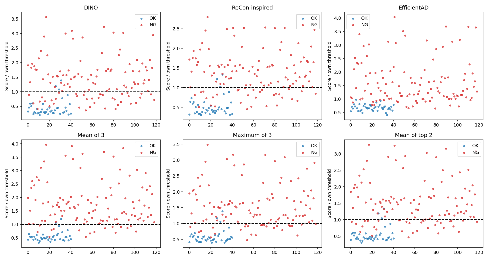
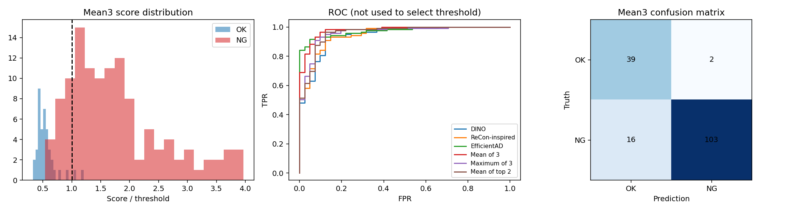
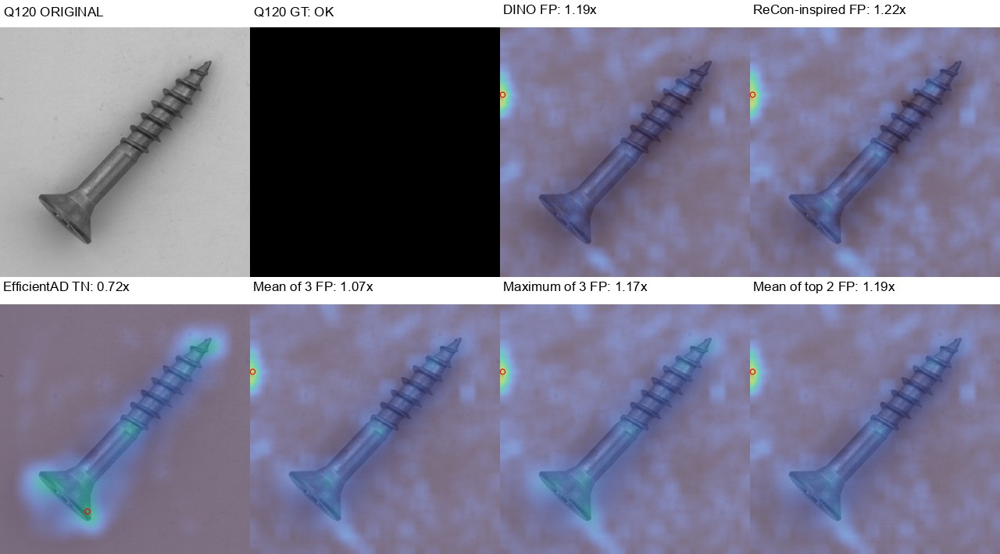

# VLM 없이 픽셀별 이상점수 평균 — 20261007_231904

## 질문·변경
사용자가 세검출기 이상점수를 정규화해 픽셀별로 평균한 뒤 VLM없이 OK/NG 구분과 시각화를 요청했다. 기존 최고crop좌표 통합 대신 전체맵을 결합했다. 재학습·신규원본추론·VLM/API 호출은 없으며 기존검출기 저장맵을 사용했다. 프로덕션모델·원본데이터·프롬프트 변경없음.

## 데이터·조건·사전결정
MVTec screw 정상FIT256/CAL64(seed20261007), 원본test160(OK41/NG119), 같은 분할·체크포인트. 이전대화에서본screw의개발평가로새독립일반화증거가아니다. 모델별맵을공통50×50좌표로PILbilinear보간한다. CAL64 모든픽셀의median과q99.5로 z=max(0,(raw-median)/(q99.5-median))를계산한다. 상한클리핑없음. 이미지별min-max정규화없음. 동일모델의모든test이미지에고정척도적용. 3개동일가중평균·최댓값·픽셀별상위2개평균·단일3모델을비교한다. 각맵3×3평균필터(nearest경계)의최고점을이미지점수로쓴다.

각방식의CAL이미지점수95분위(higher)를임계값으로미리저장하고, test점수>임계값이면NG이다. CAL은모든방식에서3/64=4.6875%가NG이며95%정상수용은test오탐률보장이아니다. 정규화와임계값에CAL을공유했고FIT과분리했다. NG라벨·testROC로임계값을튜닝하지않았다. 평균임계값은1.341569424; score/threshold>1이면NG이며불량확률이아니다.

DINO700/frozen/정상뱅크30000, ReConPatch-inspired는동일DINO백본의학습adapter/Euclidean뱅크30000, EfficientAD256은새student·AE 10k탐색학습. 원논문WRN ReConPatch와구분하며독립3모델의합의가아니다. 정합·전경마스크없음. 배경을포함한전체맵의최고점을사용한다. 모든방식의학습세부사항은출처run을따른다.

## 검증한 측정
|方式|Accuracy %|F1 %|AUROC %|FP|FN|threshold|
|---|---:|---:|---:|---:|---:|---:|
|DINO|73.75|79.21|94.40|3|39|1.9909|
|ReCon-inspired|78.75|83.81|94.84|3|31|1.5868|
|EfficientAD|86.25|89.81|97.21|0|22|1.4631|
|Mean of 3|88.75|91.96|97.81|2|16|1.3416|
|Maximum of 3|81.88|86.51|96.00|3|26|2.0357|
|Mean of top 2|78.12|83.25|95.92|3|32|1.8110|

VLM 없이 정상보정 픽셀평균: 정확도88.75%, F191.96%, AUROC97.81%, 오탐2/41, 미탐16/119. EfficientAD단독 대비 추가검출12·검출손실6·추가오탐2. 정상CAL만으로 임계값 고정.

평균의정상통과39/41,결함검출103/119. 평균미탐유형: {'manipulated_front': 5, 'thread_side': 10, 'thread_top': 1}. 오탐ID: ['Q120', 'Q129']. 미탐ID: ['Q016', 'Q019', 'Q028', 'Q031', 'Q033', 'Q065', 'Q071', 'Q077', 'Q082', 'Q094', 'Q103', 'Q106', 'Q112', 'Q121', 'Q128', 'Q136'].

EfficientAD단독미탐중평균이잡은12건: ['Q006', 'Q029', 'Q037', 'Q043', 'Q059', 'Q060', 'Q069', 'Q081', 'Q090', 'Q092', 'Q097', 'Q151']. 단독이잡고평균이놓친6건: ['Q019', 'Q065', 'Q094', 'Q106', 'Q112', 'Q128']. 여기서잡았다는뜻은이미지단위분류이며정확한결함위치까지보장하지않는다. 평균의AUROC97.81%와현재정상기반고정임계값정확도88.75%는서로다른지표이다. 테스트최적임계값을탐색·적용하지않았다.

## 직접본사례·한계
- Q120/Q129(정상): 두오탐모두DINO와ReCon이이미지배경가장자리에서고점을내며평균에도남았다. EfficientAD단독은두이미지를OK로판정했다. 서로상관된두출력의잡음이평균으로사라진다고보장할수없다.
- Q112(thread_top): EfficientAD단독은score/threshold1.11로NG,평균은0.91로OK. 단독이상증거가평균에서약해질수있다. 그러나EfficientAD의최고점은머리쪽이며GT는나사산이므로단독TP도위치정확성의증거는아니다.
- Q029(thread_side): 평균은NG를맞혔지만최고점은GT나사산보다목쪽에있다. 분류와위치검출은구분해야한다.
- 평균미탐16건은thread_side10,manipulated_front5,thread_top1. 이번에는단순평균이최댓값·상위2평균보다좋았지만단일카테고리결과로범용우위를확정하지않는다. 모델마다CAL기준임계값이다르므로원시맵의크기비교만으로검출순서를예상할수없다.

## 결정·다음
사용자제안은실행가능하고이번개발평가에서는단일모델대비정확도가높아졌지만, 오탐도추가됐다. 현재방식을운영기본으로바꾸거나테스트정답에맞춰임계값·배경좌표예외를추가하지않는다. 다음에는정상참조만으로정의되는전경/검사영역의효과와별도카테고리에서동일고정정책의효과를검증하는것이타당하다. 이는제안이며추가실험은아직하지않았다. VLM프롬프트에사례를넣는변경은없다.

이전GPU측정26.30ms는세검출기계산만이고이번픽셀통합·시각화의추가시간을포함하지않는다. 이번실행은캐시맵재사용이므로새로운GPU추론지연을주장하지않는다.

## 출처·산출물·검증
- [시각화160장·점수·오탐미탐](http://127.0.0.1:8765/output/comparisons/pixel_fusion_no_vlm_20261007_231904/index.html)
- 실행: `E:/DH/Sandbox/Dinopatch/output/comparisons/pixel_fusion_no_vlm_20261007_231904`
- 모델/분할/원시맵: `E:\DH\Sandbox\Dinopatch\output\comparisons\qwen_screw_model_fusion_20261007_221248`
- 코드: `tools/probe_pixel_fusion_no_vlm.py`, `tools/finish_pixel_fusion_no_vlm.py`; 실행복사본logs/.
- source맵672개해시,분할분리,정규화affine불변성/단독고점희석의분석예제,raw맵960개최고점·임계값판정·혼동행렬재계산검증. 브라우저필터10조합·160카드·162이미지정상,JS오류0. 로컬페이지161개모든참조파일존재확인.
- 원본이미지와GT복사,data/split.json,정상보정점수,data/calibration_scores.json,정규화상수run.json,raw50×50maps/,상세점수predictions.csv,metrics.json. 이미지맵은고정score/threshold0~2색상이며빨간원은최고점,GT는별도패널.
- 자동학습손실·AUROC가없는상황을꾸미지않음: 신규학습없음,MLflow/ONNX/운영등록없음. API비용0. 연구노트에는핵심그림만복사,모델·원본·자격증명없음. Git수동commit/push없음,18:00예약동기화대상이며원격동기화완료를주장하지않음.

