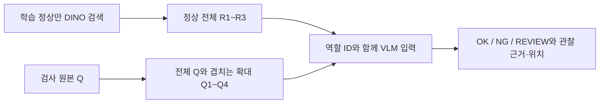

# VLM 입력 구성 제안: 전체 문맥과 확대 관찰

상태: 설계 제안. 새 추론·학습·API 호출 및 제품 코드 변경 없음. 성능 개선은 아직 측정하지 않았다.

## 질문과 근거
사용자 질문: VLM에 어떻게 전달하면 결과가 좋아질 수 있는가?
기존 구성은 DINO CLS로 검색한 정상 전체 이미지3장과 검사 전체 이미지1장을 1024로 보낸다. 프롬프트는 first three / last image로 역할을 정의하고 마지막 이미지의0~1 좌표를 요구한다.
검증된 기존 전체 결과는1,725장, 분류 정확도93.91%, FP26/FN79. screw 미탐30, zipper18, capsule13. grid의 밝기·대비 관련 오탐 설명, transistor의 리드-기판 정렬 미탐도 관찰했다. 이 관찰은 VLM의 실제 내부 사고과정을 입증하지 않는다.

## 우선 제안
정상3장과 검사 전체1장을 유지하고 검사 영상의 겹치는 확대4장을 추가한다. 전체 문맥과 국소 세부를 함께 제시한다. 확대는 원본의 crop/resize이며 원본에 없는 정보를 복원하는 생성형 보정을 사용하지 않는다. 성능 향상은 가설이다.

확대4장은 예를 들어 정규화 축의[0,0.6]·[0.4,1] 조합으로 원본 전체를 덮는다. GT나 미탐 위치를 이용해 crop을 고르지 않는다. 각 이미지는 독립 이미지 입력으로 전달한다. 한1024짜리 콜라주에 모두 축소해 넣는 것은 확대 목적과 맞지 않는다. 업스케일 자체로 정보가 새로 생기는 것은 아니며 모델에 세부 관찰 기회를 주려는 것이다.

R1~R3=검증된 정상 전체, Q=검사 전체, Q1~Q4=Q의 확대이며 다른 제품이 아님을 명시한다. 현재 '마지막 이미지' 프롬프트는 확대 입력에 그대로 쓰면 안 된다. 반환 위치에는 view_id를 붙이고 해당 뷰의 좌표를 반환하게 한 뒤 원본 좌표로 코드를 통해 변환하는 방식이 후속 구현안이다. 출력 형식 변경 효과는 분류 효과와 분리 평가한다.

## 이후 비교할 두 요소
1. 정상의 대응 영역을 확대해서 검사 영역과 나란히 제공. 같은 픽셀 좌표가 반드시 같은 부품은 아니므로 자세·대응 신뢰도를 확인한다. 정합이 불확실하면 보류하고, 기판과 부품의 실제 상대위치 이상을 정렬 과정으로 지워서는 안 된다. 전체 영상은 계속 제공한다.
2. 짧은 관찰 기준: 표면, 윤곽, 부품 간 상대배치를 구분해 확인하고 최종 판정에 관찰된 근거만 남긴다. 전체 색·형태가 비슷하다는 이유만으로 OK를 선택하지 않도록 한다. 조도·시점 차이는 따로 설명하되 국소 변색이나 부품 위치 이상을 무조건 무시하게 하지 않는다. 정상 예시를 먼저 관찰해 공통점과 정상 변이를 기술하게 하는 방법도 별도 비교 대상으로 남긴다.

이상맵이나 검출기 후보 영역은 후속 실험이다. 후보가 빠지면 검사 기회 자체를 놓칠 수 있어 첫 실험은 전체를 덮는 crop을 사용한다. 후보를 쓰더라도 확정 불량이라는 이름으로 전달하지 않고 참고 후보로 표시한다.

## 최소 비교 실험안
- A: 정상3장+검사 전체1장, 명시적 이미지ID 프롬프트.
- B: A와 같은 조건+겹침 확대4장. 확대효과를 먼저 비교.
- C: 필요 시 B에서 정상 대응 확대 또는 검사 항목 프롬프트 중 하나만 추가.
- 기존 저장 결과는 참고 기준. 엄밀한 A/B에는 역할ID를 동일하게 한 A도 다시 실행해야 하므로, 기존 프롬프트와 B를 비교해 crop 단독 효과라고 단정하지 않는다.
- 초기 개발 카테고리 제안: screw·zipper·capsule(미탐), grid(오탐), transistor(배치). 정상과 전체 결함 종류를 포함하고 기존 미탐만 선택해 정확도를 계산하지 않는다. 선택된 소규모 표본은 개발용이며 전체 대표 성능으로 주장하지 않는다.
- 동일 모델·정상 검색 결과·원본·생성 설정 유지. 공급자와 시각을 기록하고 가능하면 반복 비교한다. 지표: FP/FN, OK/NG 분류, 출력 오류, 보류/미처리 전체 분모, 결함 종류별 검출, 응답 시간·토큰·비용. 미탐 감소가 오탐 증가와 맞바뀌는지 확인한다.
- 아직 실행하지 않음. 기본 모델·프롬프트·운영 경로 유지.

## 외부 근거와 적용 한계
- [Qwen3-VL 공식 문서](https://github.com/QwenLM/Qwen3-VL): 다중 이미지 입력, 시각 토큰 예산 제어, Thinking with Images 확대 도구 예시가 있다. 해당 기능이 우리 이상탐지 성능을 개선한다는 증거는 아니다.
- [공식 확대 관찰 예제](https://github.com/QwenLM/Qwen3-VL/blob/main/cookbooks/think_with_images.ipynb): 별도 도구 예제이며 현재 OpenRouter Instruct 호출에서 자동으로 실행된다고 가정하지 않는다.
- [AnomalyGPT](https://arxiv.org/abs/2308.15366): 세밀한 위치 정보를 위한 decoder와 prompt 학습을 사용하는 별도 방법이다. 범용 VLM에 프롬프트만 바꿔 동일 성능을 얻는다는 근거로 사용하지 않는다.
- 로컬 HF의 min/max pixel 설정을 원격 OpenRouter 공급자에도 동일하게 적용할 수 있다고 가정하지 않는다. 실제 전송 이미지 크기와 사용량을 기록한다.

## 내부 출처
- `E:/DH/Sandbox/Dinopatch/tools/probe_vlm_image_only.py`: 현재 PROMPT.
- `E:/DH/Sandbox/Dinopatch/tools/evaluate_qwen_cable.py`: 이미지 순서와 payload 구성.
- `E:/DH/Sandbox/Dinopatch/output/comparisons/qwen_mvtec_all_20261007_164317/metrics.json`
- 같은 실행의 `visual_observations.md`, `predictions.json`, `artifact_manifest.json`.
- `E:/DH/Sandbox/Dinopatch/output/comparisons/all_saved_comparison_20261007_182151/`: 기존 모델 및 고정/검색 기준 비교.

결정: 첫 검증 후보는 전체+겹침 확대 입력이다. 다음 단계는 사용자가 실험을 요청하면 위 최소 A/B를 구체화해 실행하는 것이다. 새 측정 결과가 없으므로 기존 성능 결론을 변경하지 않는다.
