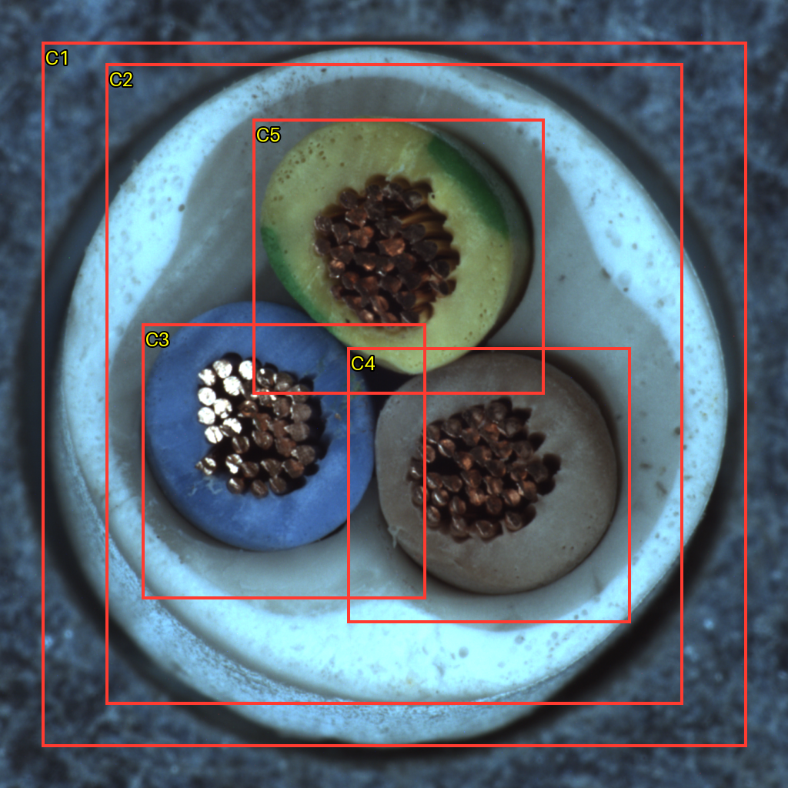

# VLM 정상 이해 소규모 실험 — 20261007_105018

## 질문과 변경
OK 이미지들에서 부품·관계 기준을 만들고 다른 OK 이미지에 대응할 수 있는가? 기존 검출기에는 연결하지 않은 일회성 탐색이다. 단계별 연구로 범위를 줄여 정상 이해만 확인했다.

## 데이터와 설정
MVTec cable train/good 정렬 224장 중 등간격 5장. 기준 000/112/223, 별도 질의 056/167. 원본 보존, 최대1024 입력, 증강 없음. 이번 기준/질의 SHA는 겹치지 않지만 과거 연구에서 전혀 보지 않은 독립 평가셋이라는 뜻은 아니다. NG와 공식 test는 사용하지 않았다.
Gemini 2.5 Pro / OpenRouter, temperature0, max_tokens5000, reasoning1024, data_collection=deny/zdr=true. 3회 호출. 질의에는 정상 라벨을 주지 않았고, 기준 이미지 대신 첫 응답의 고정 JSON 설명과 질의 이미지만 전달했다. 프롬프트 수정·재시도 없음. 모델 가중치 학습 없음.

## 확인된 결과
기준에서 5개 구성 요소와 5개 규칙 후보를 제안했다. 두 질의에서 각 5개 규칙을 모두 supported라고 응답했다(10/10). 이는 모델 응답 개수이며 검증 정확도가 아니다. 총25개 상자의 좌표 형식은 유효했다. API 보고 비용 $0.0946775, 호출 시간 31.71s, 20.80s, 20.86s (네트워크 포함, 현장 추론속도 아님).

## 결과 검토 — Codex 시각 검토, 사용자 승인 전
- **관찰과 대체로 일치**: 서로 다른 색의 전선 3개, 내부 가닥 묶음, 삼각형 배치와 바깥 원형 구조를 설명했다. Q1/Q2의 C3~C5 상자는 각 전선의 대략적인 위치를 짚는다. 정밀 경계 정확도는 측정하지 않았다.
- **추정이 규칙으로 이어짐**: 흰색 구조를 별도의 내부 충전재 C2로 명명하고 전선 사이 공간이 채워져 있어야 한다는 N5를 만들었다. 사진에는 전선 사이 어두운 영역도 보이며 별도 충전재의 존재·재질·공간 충전 여부는 확정할 수 없다. 이 규칙은 채택하지 않는다.
- **기준 설명을 그대로 따를 위험**: 두 질의 모두 N5까지 supported라고 답했다. 잘못되거나 미확인된 기준이 후속 관찰에도 이어질 가능성을 보여준다. 기준 없이 관찰한 대조군이 없으므로 기준 설명이 원인이라고 확정하지 않는다.
- **회전 대응은 미확립**: N3은 위/왼쪽 아래/오른쪽 아래라는 화면 좌표 표현을 사용했다. 물체 고유 방향이나 회전 불변 순서를 정의하지 않았으므로 이 규칙을 회전 대응 기준으로 사용할 수 없다.
- **설명과 위치의 한계**: 기준 응답은 R1과 R3의 5개 상자를 모두 똑같이 반환했다. 이미지가 유사하지만 실제 위치는 조금 다르므로 정밀 측정을 했다고 볼 수 없다. 산화라는 원인 추정과 사람 확인 불필요라는 응답도 근거로 채택하지 않는다.

## 결론과 다음 단계
VLM은 정상 구조의 설명 초안을 만드는 데 활용 가능성이 있다. 생성한 규칙을 자동 확정하는 것은 보류한다. 다음 한 단계는 부품 이름·색·대략적 영역만 검토하여 미확인 충전재/원인/절대 방향 규칙을 제외한 기준을 만드는 것이다. NG 검출과 회전/조도 일반화는 아직 실험하지 않았다. 추가 모델·자동 판정은 도입하지 않는다.

## 실패·한계·검증
API/JSON/좌표 형식 오류 없음. 추정 원인과 미확인 구성 요소, 화면 방향 의존성, 정밀하지 않은 상자가 의미적 실패 후보다. 정답 부품 마스크가 없어 위치 IoU나 부품 인식 정확도는 측정하지 않았다. 두 정상 질의만으로 이해·일반화 능력을 입증하지 않는다. 최종 판정·임계값·AUROC·이상맵은 과제에 해당하지 않아 생성하지 않았다. 상자는 VLM 위치 제안이다.

## 출처
- 실행: `E:/DH/Sandbox/Dinopatch/output/comparisons/normal_understanding_20261007_105018`
- 코드: `tools/probe_normal_understanding.py`, 실행 내 `logs/probe_source.py`, `logs/finish_report.py`
- 원본 선택/해시: `data/selection.json`; 프롬프트: `run.json`; 원문 응답: `responses/`; 측정: `logs/calls.json`, `logs/validation.json`
- [시각화 열기](http://127.0.0.1:8765/output/comparisons/normal_understanding_20261007_105018/index.html)

원본·자격증명·전체 대화는 기록 저장소에 넣지 않았다. 정기18:00 동기화 대상이며 별도 commit/push하지 않았다.
