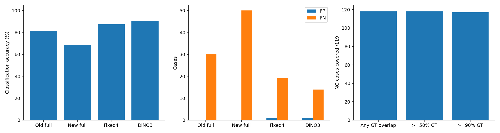

# screw DINO 후보 확대3장 — 20261007_192430

## 질문·변경
DINOv2 패치 이상 점수가 높은 위치를 확대해 VLM에 전달하면 고정 확대4장보다 검출이 좋아지는가? 이전에 합의한 후보 선택 실험을 실행했다. dinopatch 운영 기본값은 변경하지 않았다.

## 데이터·설정
공식 MVTec screw test 전체160장(정상41/NG119), 학습 정상 train/good320장. 원본 보존 및 해시 분리 확인. 정상 기준3장은 이전 CLS 검색의 각 검사별 선택·순서를 그대로 사용했다. 정상 패치 뱅크는 320장에서 frozen DINOv2 with registers base, 입력700, 50×50패치, greedy coreset30000, seed20261007로 새로 구축했다. 역전파·회전 정합·배경 제거·조도 전처리·증강·테스트 임계값 보정 없음. 뱅크 구축 105.60초.

원시 점수는 정상 뱅크 최근접 코사인 거리이다. 3×3 패치 평균 점수 내림차순으로 원본40%(410×410) crop3장을 선택하며 crop끼리 IoU≤0.2, 동점은 고정 순서다. 각 crop은1024로 확대했다. 선택에 GT·라벨·결함 유형을 쓰지 않았고, 선택 후 별도 평가에서 GT 포함률을 계산했다. 정상에도 같은 규칙으로3장을 선택했다.

VLM qwen/qwen3-vl-235b-a22b-instruct: 기존과 같은 프롬프트·정상3장·전체1024 검사, 후보확대3장을 더해 총7장 입력. 후보를 확정 불량이라고 표현하거나 점수·GT를 전달하지 않았다. temperature0, max_tokens3000, 재시도0. 신규160요청, 첫10순차·나머지150최대동시4. 이전 고정4장 및 전체 대조군은 재실행 없이 원본 저장 결과를 사용했다. 이전고정은614×614crop4장이므로 배율·영역 총량·이미지 수까지 다르다.

## 검증한 측정
|조건|정확도|F1|오탐|미탐|오류/보류|형식 포함|평균 API초|
|---|---|---|---|---|---|---|---|
|이전 전체|81.25%|85.58%|0|30|0|81.25%|6.18|
|새 프롬프트 전체|68.75%|73.40%|0|50|0|68.75%|5.22|
|고정 확대4장|87.50%|90.91%|1|19|0|87.50%|8.83|
|DINO 후보 확대3장|90.62%|93.33%|1|14|0|90.62%|11.64|

고정 확대4장 대비 DINO 후보3장의 정확도가 높아졌다: 87.50%→90.62%, 오탐 1→1, 미탐 19→14. GT 일부 포함 118/119, 90% 이상 포함 117/119. 입력 장수·crop 크기·시점 차이가 있어 위치 선택만의 효과로 단정하지 않는다. 대응 비교에서 개선 10, 악화 5, 둘 다 정답 135, 둘 다 실패 10장이다.

후보가 GT를 일부라도 포함 118/119, 절반 이상 포함 118/119, 90% 이상 포함 117/119, 완전 누락 1/119. GT 픽셀 전체에 대한 세 crop 합집합의 포함률이며 GT 일부 접촉은 정밀한 위치 검출을 뜻하지 않는다. 미탐 중 GT 완전 누락 0, 일부 포함했지만 OK 14, 90% 이상 포함했지만 OK 13장이다. 검사 전체도 입력하므로 crop 누락만으로 최종 실패 원인을 확정하지 않는다.

API 평균 11.64초, 입력 평균 7557.73125, 비용 $0.288118, 공급자 {'Venice': 63, 'Parasail': 84, 'DeepInfra': 12, 'Novita': 1}. API 시간은 업로드·대기·응답 포함, DINO 검색/점수/crop준비 제외다. 각 검사 dino_seconds와 API total_seconds를 따로 저장했다. 오프라인 실행을 현장 종단 지연으로 해석하지 않는다.

## 실패·한계·결정·다음
# 육안 검토

## Q028 · thread_side/000.png · 미탐 유지

실제 전달한 Q1과 Q3 확대, 원본 및 GT 위치를 확인했다. 상위 Q1은 대부분 배경이다. Q2도 원본 왼쪽 위 배경 영역을 선택했다. Q3은 손상된 나사산을 일부 포함한다. 세 crop 합집합의 GT 포함률은69.30%이며 VLM은 기준과 동일하다며 OK를 반환했다. 고정4장에서도 놓쳤던 사례다. 후보 일부가 배경에 배정되고, 남은 후보에 손상이 보여도 판독하지 못하는 문제가 함께 있다. 단순 GT 겹침 유무만으로 후보 품질을 충분히 설명할 수 없다.

후보 선정 후의 사후 관찰이며 이를 보고 파라미터를 바꾸거나 재추론하지 않았다. 모델의 실제 내부 사고과정을 확인한 것은 아니다.

## Q015 · thread_top · 검출 개선

실제 Q1 확대와 GT를 확인했다. 나사 끝 근처의 손상된 나사산이 확대 중심부에 보인다. 고정 확대4장에서는 OK였으나 이번에는 끝 근처 나사산의 변형·손상을 이유로 NG를 반환했다. 응답 박스는 GT보다 넓고 일부 위치 차이가 있어 결함 경계를 정확히 복원했다고 주장하지 않는다.

## Q069 · thread_side/019.png · 판정 정답과 근거 불일치

원본·GT·응답을 직접 확인했다. GT는 왼쪽 위쪽 나사산 손상이며 세 후보 crop이 GT를 모두 누락했다. VLM은 NG지만 이유와 두 박스는 오른쪽 아래 나사 머리의 균열/결함을 지목한다. 공식 GT 결함 위치와 다르므로 이 사례를 '전체 이미지로 실제 결함을 찾아 보완했다'고 해석할 수 없다. 이미지 수준 TP로는 집계하되 위치·설명 성공으로 간주하지 않는다. 머리에 보이는 흔적의 실제 불량 여부는 이 라벨만으로 추가 확정하지 않는다.

## Q002 · good/022.png · 새 오탐

정상 라벨 원본과 후보·위치 비교 그림을 확인했다. DINO 상위 crop은 머리와 몸통이 만나는 부위를 확대한다. VLM은 머리 아래 몸통의 균열/결함을 이유로 NG라고 답했다. 고정4장에서는 OK였던 정상이다. 정상의 표면 흔적을 확대했을 때 오탐이 생길 수 있음을 보여주며 데이터 라벨을 임의로 변경하지 않았다.

## 집계 후 해석

정확도는145/160=90.625%, F1=93.3333%. 고정4장과 비교해 NG9건을 새로 검출했지만 NG4건을 새로 놓쳤다. 정상에서는 기존 오탐1건(Q126)을 바로잡고 다른 정상1건(Q002)을 새로 오탐했다. 따라서 오탐 개수가 같아도 같은 이미지가 아니다.

남은 미탐14건: thread_side5, thread_top5, manipulated_front2, scratch_head1, scratch_neck1. 전부 후보가 GT 일부를 포함했고13건은90% 이상 포함했다. 후보 범위 누락만으로 남은 미탐을 설명할 수 없다. 원시 거리의 상위 후보가 배경인 사례도 있어 전경/배경 후보 품질과 정상 대응 부위 비교를 후속 검증 대상으로 남긴다.

이미 본 약한 카테고리에서 정한 단일 개발 실행이다. 독립 일반화 실험이 아니며 테스트 결과로 파라미터를 재튜닝하지 않았다. 고정4장과 이미지 수·crop크기·API시점·공급자 분포가 달라 DINO 위치 선택 하나의 인과효과는 미확정이다. DINO 이상맵의 색은 이미지별 상대 정규화이며 불량 확률이 아니다. VLM의 NG 분류와 박스/설명 정확도를 구분한다. 연속 VLM 점수·AUROC·학습 loss는 해당 없음. 형식 오류는 원문 JSON의 유효 OK/NG에 한해 분류만 분리 집계하고, 오류·보류는 전체 분모에 유지한다.

다음 결정은 이번 후보 포함률과 판독 오류를 근거로 한다. 후보가 결함을 포함했는데 놓치는 경우는 위치 제안만으로 해결되지 않는다. 범위를 넓히기 전 입력 이미지 수·crop 크기를 맞춘 대조군과 독립 데이터 재현이 필요하다. 이전 결론을 덮어쓰지 않고 새 기록으로 보완한다.

## 출처·검증
- [시각화 보고서](http://127.0.0.1:8765/output/comparisons/qwen_screw_dino_crops_20261007_192430/index.html) —160장 전체, 이상맵·후보·GT·VLM 위치·정상 기준·이유.
- 실행: `E:/DH/Sandbox/Dinopatch/output/comparisons/qwen_screw_dino_crops_20261007_192430`
- 비교 원본: `E:/DH/Sandbox/Dinopatch/output/comparisons/qwen_screw_four_crops_20261007_184410`
- 코드: tools/probe_dino_candidate_crops.py, tools/test_dino_candidate_crops.py, tools/report_dino_candidate_crops.py, tools/finish_dino_candidate_crops.py. logs 실행본·해시 보존.
- DINO 가중치 SHA256: `1d50e937cdb086ee72bfd0bc903ec2377ffd7f66fcc49e8a55157e03f2fa1ea4`. 뱅크: model/detector.pt. 원본·학습·기준·GT 해시,160맵과480crop 픽셀,候補좌표 재계산, 응답좌표 변환, 전체160 test포함, 브라우저 로딩/필터 확인.
- 후보 선택·포함률 단위 테스트4개 통과. 원본 수정 없음. API credential과 원본 데이터는 노트에 포함하지 않았다.

연구노트와 핵심 차트만 보관했다.18:00 정기 Git 동기화 대상이며 수동 commit/push하지 않았다. 원격 동기화 완료를 주장하지 않는다.

