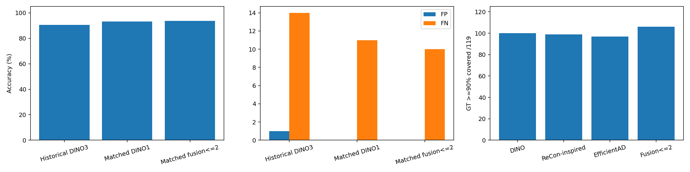

# screw 모델 최고 후보 통합 — 20261007_221248

## 질문·변경
후보를 과하게 주지 않고 모델별 최고 영역을 합쳐 최대2장으로 전달하면 미탐·오탐이 줄어드는가? 사용자가 승인한 실험이다. 기존 준비 기록을 실제 결과로 보완하며 과거 결론을 덮어쓰지 않는다. 운영 모델 활성화·기본값 변경 없음.

## 데이터·학습·설정
MVTec screw train/good320장을 seed20261007로 FIT256/CAL64 분리. test160(정상41/NG119) 원본 보존. 세 모델의 학습과 보정에 테스트 이미지·라벨을 사용하지 않았다. VLM 정상 기준3장은 이전 검색 결과를 유지하므로 일부 CAL 정상도 VLM 참조에 포함될 수 있지만 local detector 학습에는 포함하지 않는다.

EfficientAD는 anomalib EfficientAdModel small, 공식 사전학습 teacher만 불러와 고정하고 student/AE를 새로 초기화했다. FIT256만으로 Adam lr1e-4/wd1e-5, 고정10000스텝,9500에서lr×0.1, ImageNette train penalty. CAL64로 ST/AE q90/q99.5 보정. 입력RGB PILbilinear256, 내부ImageNet정규화. 과거 SAME_AS_TEST 검증 체크포인트는 사용하지 않았다.10k 탐색 일정이며 원논문70k 또는 기존100epoch와 동일하지 않다.

DINOv2 with registers base frozen,700입력50×50패치, FIT256 greedy coreset30000. ReConPatch-inspired는 동일 DINO 특징의 linear768→512 및 projection128, 기존 relaxed contrastive/EMA 함수로 고정120epoch×32step,batch512 학습 후 Euclidean coreset30000. 원논문 WRN ReConPatch 재현이 아니다. 두 모델의 특징이 상관되어 두 표를 독립적 합의로 볼 수 없다. 정합·배경 분리·DINO 증강 없음.

모든 맵을50×50으로 맞춘 뒤3×3평균 최고영역 하나씩 제안. 크기는 원본410×410, 출력1024. 모델별 CAL64 최고점의 median과q95higher로 strength=(peak−median)/(q95−median) 보정(fallback 표준편차1%/1e-8). 불량 확률이 아니다. IoU≥0.3 후보는 최고strength 대표crop 하나로 묶고 모델 수 우선, 그다음strength로 정렬한다. 대표와IoU≤0.2인 다른 후보가strength≥1일 때만 두 번째 전달. 테스트결과를 보고 규칙을 바꾸지 않았다.

VLM Qwen3-VL235B, 정상3장＋검사전체1024＋DINO1 또는 통합1~2장. 이전과 같은 프롬프트, temperature0,max_tokens3000,retries0. 각160장 신규총320요청. 조건별 첫10순차·이후최대동시4, DINO1 먼저/통합 다음 실행. 시간대·공급자 차이가 남는다. 이미지와역할/좌표만 보내고 모델점수·GT·결함명·모델의 불량 판정은 전달하지 않았다. 역사적 DINO3는FIT320이라 장수만의 공정 대조가 아니며 참고용으로 분리했다.

## 검증한 측정
|조건|정확도|F1|오탐|미탐|오류/보류|형식 포함|평균 API초|평균 입력토큰|
|---|---|---|---|---|---|---|---|---|
|이전 DINO3 (학습320)|90.625%|93.33|1|14|0|90.625%|11.64|7558|
|DINO 최고1 (학습256)|93.125%|95.15|0|11|0|93.125%|16.23|5421|
|세 모델 통합≤2 (학습256)|93.750%|95.61|0|10|0|93.750%|14.42|5542|

DINO 최고1장 대비 모델 통합≤2장의 정확도가 높았다: 93.125%→93.750%, 오탐 0→0, 미탐 11→10. FIT256/CAL64, test160. ReConPatch-inspired DINO 변형·EfficientAD10k 탐색 조건이며 독립3모델 합의로 해석하지 않는다. DINO1→통합 대응 결과: 개선1,악화0,둘다정답149,둘다실패10.

동일 입력 비교: 두 조건의 원본·정상 참조·crop·프롬프트·요청 설정이 같은 86건 중 판정 변화는 0건이었다. 그중 개선 0건, 악화 0건이다. 이 부분은 후보 통합 효과로 볼 수 없고 API 반복 변동으로 분리해야 한다. temperature=0이어도 동일 출력이 보장되지 않으며 공급자와 시간대가 달라질 수 있다.

|유형|DINO1 검출/전체|통합 검출/전체|
|---|---:|---:|
|manipulated_front|23/24|23/24|
|scratch_head|23/24|24/24|
|scratch_neck|24/25|24/25|
|thread_side|17/23|17/23|
|thread_top|21/23|21/23|

|후보|GT 일부 포함/119|GT90% 포함/119|
|---|---:|---:|
|dino|105|100|
|recon|104|99|
|efficientad|105|97|
|dino1|105|100|
|fusion2|112|106|

통합 확대 장수:1장 142,2장 18. DINO1 미탐 중 후보GT완전누락 3,GT90%포함 8; 통합 미탐 중 후보GT완전누락 3,GT90%포함 7. 전체 검사도 입력하므로 후보누락만으로 최종 실패 원인을 확정하지 않는다.

API 비용 DINO1 $0.214448,통합 $0.220772. 공급자 DINO1 {'Venice': 120, 'Parasail': 27, 'DeepInfra': 12, 'Novita': 1},통합 {'DeepInfra': 6, 'Venice': 111, 'Parasail': 40, 'Novita': 3}. API시간은 업로드·대기·응답 포함, 오프라인 학습·맵·crop 제외. 학습loss 이력은 저장했으며 loss감소를 검출 성능 향상으로 간주하지 않는다.

## 실패·한계·결정·다음
# 후보 통합·실패 분석

## 프롬프트 일반화 원칙 — 사용자 확인

Q069 등 테스트 사례는 보고서의 실패 분석에만 사용한다. 테스트 이미지의 정답·결함명·위치를 프롬프트 힌트로 추가하지 않는다. 사용자는 특정 카테고리에 맞춘 문구보다 일반화할 수 있는 지침을 요구했다. 이번 실험은 기존 프롬프트를 고정하고 후보 선택만 비교했으며, 추후 프롬프트 변경은 카테고리·결함 종류에 독립적인 근거 확인 지침으로 설계하고 별도 평가 데이터에서 검증해야 한다. 사례별 예외 규칙을 운영 프롬프트에 넣지 않는다.

공급자 설명: 모델ID는 Qwen3-VL235B로 고정했지만 실제 실행 업체는 OpenRouter 자동 라우팅에 맡겼다. Q021은 Parasail→Venice였으며 업체가 판정 차이를 일으켰다고 확인한 것은 아니다. 다음 비교 실험은 동일 공급자/가능하면 동일 endpoint를 명시하고 자동 fallback을 비활성화하는 것을 통제 기준으로 삼는다. 기존 요청·결과는 소급 변경하지 않는다. 설정 근거: [OpenRouter Provider Routing](https://openrouter.ai/docs/guides/routing/provider-selection), `provider.only`와 `allow_fallbacks`. 이번 실험은 이 통제가 빠진 탐색 결과임을 유지한다.

## 후보를 줄이며 버린 정보 — VLM 결과와 별도

모든 모델의 최고 영역3개 합집합은 GT일부116/119,90%이상113/119를 포함한다. 통합최대2장은 일부112/119,90%이상106/119다. GT일부라도 있던 후보를 전부 잃은 사례는 Q029,Q069,Q136,Q151이다. 이것은 선택 완료 후 GT와 대조한 분석이며 규칙을 바꾸지 않았다.

Q029,Q069,Q151에서는 DINO와 ReConPatch-inspired 최고crop 좌표가 정확히 같았다. EfficientAD는 다른 곳을 제안했고 그 후보에는 GT가 포함되지만, strength가 각각0.6777,0.0729,0.8598로 두 번째 후보 채택 기준1보다 낮아 제외됐다. 이 결과는 상관된 두 모델의 합의와 단독 후보 점수 필터가 유용한 위치를 버릴 수 있음을 보여준다. 정상 분포상 낮은 점수가 결함 부재를 보장하지는 않는다. VLM에는 검사 전체도 주므로 후보 누락만으로 최종 미탐을 확정하지 않는다.

자세한 수치와 모든사례 포함률은 `logs/all_three_candidate_coverage.json`, 후보 좌표·보정 점수·선택 결과는 `candidates.json`에 있다.

## 학습 상태

EfficientAD는10000스텝의 고정 탐색 일정으로 학습했다. ReConPatch-inspired는120epoch 완료, loss0.11167→0.23383, projection_std0.05194→0.08102다. EMA의사라벨도 바뀌는 과정이므로 손실 증가만으로 코드 오류를 확정하거나 학습 성공/수렴을 주장하지 않는다. 실제 후보와 판정 결과를 평가한다. 원논문 ReConPatch의 성능으로 표기하지 않는다.

## 최종 판정과 직접 확인한 사례

DINO1: 정확도93.125%, F1 95.1542%, TP108/TN41/FP0/FN11. 통합최대2: 정확도93.75%, F1 95.6140%, TP109/TN41/FP0/FN10. 오류·보류는 모두0. 160건 중 개선1·악화0·둘 다 정답149·둘 다 미탐10이다. 동일 입력86건의 판정 변화는0이었다. 후보 GT90% 포함은100→106/119로 늘었지만 실제 분류 개선은1건에 그쳤다.

- **Q021 scratch_head:** 머리 가장자리의 작은 손상이 있다. DINO1과 통합 모두 GT를100% 포함했으며 crop이 `[153,614,563,1024]`에서 `[174,614,584,1024]`로 수평21px 이동했을 뿐이다. DINO1은OK, 통합은NG. 통합은 머리 가장자리 chip/burr를 설명했지만 박스는 머리 전체를 넓게 감쌌다. 공급자도 Parasail→Venice로 달라졌으므로, 개선을 정확한 위치 발견이나 통합 자체의 확정 효과라고 주장할 수 없다. 이 한 건으로 추가 학습 비용의 이득이나 일반화를 입증하지 않는다.
- **Q069 thread_side:** GT는 나사산 측면인데 DINO/ReCon은 머리를 확대했고, 통합 VLM도 머리 균열을 이유로NG라고 답했다. 실제 GT와 VLM 박스가 겹치지 않는다. 이미지 단위TP라고 결함 원인·위치까지 맞힌 것은 아니다. EfficientAD의 나사산 후보는 두 번째 선택 기준 때문에 제외됐다. Q029도 Q1 안의 결함을 근거로 답했지만 GT가 그crop 밖이므로 위치 설명이 GT를 짚지 못했다.
- **남은 미탐10건:** thread_side6건(Q028,Q060,Q094,Q103,Q121,Q136), thread_top2건(Q010,Q112), scratch_neck1건(Q109), manipulated_front1건(Q062). Q028/Q094/Q136은 통합 확대에GT가 전혀 없으며, 나머지7건은GT90%이상 포함해도OK로 답했다. Q103의 나사산 손상, Q109의 목 부분 흠집은 원본·GT·확대 위치를 직접 확인했다.

확대는142건에서1장,18건에서2장(평균1.1125장)이다. 정상참조3장과 검사전체1장은 유지했다. 평균 입력토큰 DINO1 5421.43, 통합5541.69; 평균API시간16.23초,14.42초. API 공급자·시간대가 다르고 반복 측정이 아니므로 속도 우위를 보장하지 않는다. 과거DINO3의7557.73토큰·11.64초와도 시간 절감 효과를 단정할 수 없다.

**판단:** 희소 후보 통합은 입력 수를 줄여도 이번screw에서 성능을 유지할 가능성은 보였지만 DINO1 대비 추가 이득은 작았다. 현재 통합을 일반화된 개선으로 확정하거나 운영 기본으로 바꾸지 않는다. 다음은 카테고리·결함 힌트를 넣지 않고, 정상 참조의 대응 부위를 검사crop과 같은 배율로 비교하는 방법을 별도 개발/평가 분할에서 검토할 수 있다. 후보 수·공급자를 고정한 반복 비교와, 이미 본screw 밖의 평가가 필요하다. 현재 결과를 본 뒤 이 테스트셋에 맞춰 규칙·프롬프트를 변경하지 않았다.

시각화: `cases/Q021.html`, `cases/Q069.html`, `cases/Q103.html`, `cases/Q109.html`; 미탐모음 `visualizations/dino1_false_negatives.jpg`. 빨간 테두리는 해당 모음에서GT, 파란 테두리는DINO1확대영역이다. 다른 사례 비교판의 빨간 박스는VLM 예측, GT는 별도 흑백패널이다.

이미 본 screw에서 수행한 단일 개발 실험이며 독립 일반화 증거가 아니다. 모델학습예산·입력장수·공급자 차이, DINO/ReCon의 상관성이 있다. 합의하는 후보라도 잘못된 위치일 수 있다. 맵 색상은 모델·이미지별 상대 정규화이며 서로 색 강도를 직접 비교하지 않는다. VLM 이산 판정과 좌표스키마/실제위치 정확도는 분리한다. 오류·보류를 전체분모에 남기고 원문유효OK/NG만 분류에 분리 반영한다. VLM 연속점수/AUROC는 해당 없음.

이번 결과를 기반으로 후보 포함률과 판독 미탐을 나눠 후속 단계를 결정한다. 모든 카테고리에 일괄 적용하지 않으며 독립 특징을 쓰는 원논문ReConPatch 재현은 별도 과제다. 필요하면 동일FIT256의DINO3 재실행과 공급자 고정·반복으로 입력 수 효과를 분리해야 한다.

## 출처·검증
- [전체 시각화](http://127.0.0.1:8765/output/comparisons/qwen_screw_model_fusion_20261007_221248/index.html) — 원본·GT·세모델맵·선택후보·실제확대·정상기준·VLM위치/이유160장.
- 실행: `E:/DH/Sandbox/Dinopatch/output/comparisons/qwen_screw_model_fusion_20261007_221248`
- 이전DINO3: `E:/DH/Sandbox/Dinopatch/output/comparisons/qwen_screw_dino_crops_20261007_192430`
- 코드: tools/prepare_model_candidate_fusion.py, audit_model_candidate_fusion.py, report_model_candidate_fusion.py, finish_model_candidate_fusion.py; VLM tools/probe_dino_candidate_crops.py. logs 실행본 보존.
- 원본/학습/보정/검사 해시 분리,3모델×224맵,모든 후보점수/좌표 재계산,crop픽셀,응답좌표,checkpoint9맵 재실행,teacher/DINO 가중치해시 검증. 브라우저 필터·160카드와이미지로딩 확인.
- 모델별 메타데이터/학습history 및 checkpoint는 model/, split은split.json, 보정값calibration.json, rawmaps는maps/.

원본·모델·인증정보는 연구노트 저장소에 넣지 않고 핵심 차트만 복사했다.18:00 정기동기화 대상이며 수동commit/push 없음. 원격동기화 완료를 주장하지 않는다.

