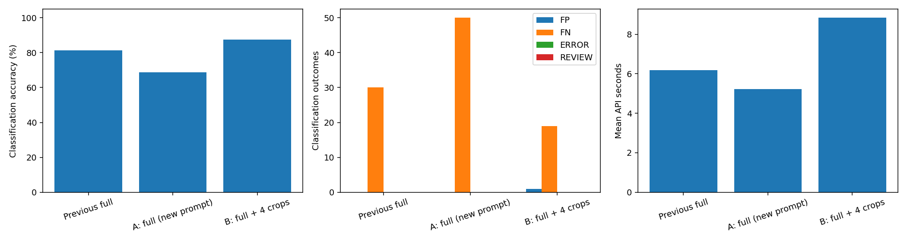

# screw 고정 확대 4장 A/B — 20261007_184410

## 질문·변경
기존 VLM에서 미탐이 많았던 screw에 검사 확대 4장을 추가하면 미탐이 줄어드는가? 앞선 미실험 제안(v1)을 실제 실행했다. DINO 최고 이상 점수 위치를 고르는 v2 방식은 이번에 실행하지 않았다. dinopatch 제품 모델 변경 없이 별도 API 실험이다.

## 데이터·설정
MVTec screw 공식 test 전체 160장: 정상 41, NG 119. 검사 원본 1024×1024를 보존했다. DINOv2 CLS 검색으로 이전에 선택한 동일 train/good 정상 3장을 각 검사에 사용했다. 정상 학습 풀 320장과 test는 분리되어 있다. 추가 학습·임계값 튜닝은 없다.

A는 정상 3장 + 검사 전체 1장, B는 같은 4장 + 검사 고정 확대 4장이다. 네 모서리에서 원본 가로·세로 60%(614×614)를 잘라 각각 1024로 확대했다. 이웃 영역이 204픽셀 겹쳐 전체 영역을 덮으며 새 세부 정보를 생성하지 않는다. 정답·결함 유형·GT·이상 점수는 영역 선택이나 API 입력에 사용하지 않았다.

모델 qwen/qwen3-vl-235b-a22b-instruct, temperature 0, max_tokens 3000, 재시도 0, 정상/검사 입력 1024. 같은 역할 ID 프롬프트를 사용하고 B에만 Q1–Q4를 추가했다. 160×2=320 신규 API 요청. 첫 10쌍(20요청)은 순차, 이후 최대 동시4요청. A/B 선행 순서는 seed20261007로 균형화했다. 요청별 실제 공급자·모델·토큰·응답 시간·원문을 저장했다.

## 확인한 결과
|조건|분류 정확도|형식 포함|오탐|미탐|미확정|형식 오류|평균 API초|평균 입력 토큰|
|---|---|---|---|---|---|---|---|---|
|이전 전체 입력|81.25%|81.25%|0|30|0|0|6.18|4241|
|A: 전체 (새 프롬프트)|68.75%|68.75%|0|50|0|0|5.22|4353|
|B: 전체 + 확대4장|87.50%|87.50%|1|19|0|0|8.83|8625|

|유형|A 검출 / 전체|B 검출 / 전체|
|---|---|---|
|manipulated_front|15/24|21/24|
|scratch_head|13/24|22/24|
|scratch_neck|22/25|24/25|
|thread_side|8/23|15/23|
|thread_top|11/23|18/23|

이번 screw 실행에서는 확대 입력의 분류 정확도가 높았다. A→B 정확도 차이는 +18.75%p, 개선 31건, 악화 1건, 둘 다 정답 109건, 둘 다 실패 19건이다. 이전 전체 입력은 81.25%, 오탐0·미탐30이지만 프롬프트와 출력 형식이 달라 주 비교는 새 A/B이다.

평균 API 시간 A 5.22초, B 8.83초. API 보고 비용 A $0.155639, B $0.302818. 시간에는 업로드·대기·응답이 포함되고 오프라인 DINO 검색·crop 준비는 제외된다. 요청별 total_seconds는 인코딩·파싱도 포함한다. 순차/병렬 구분과 P95는 metrics.json에 있다.

## 실패·한계·결정
형식이 잘못되어도 원문 JSON의 OK/NG가 유효하면 분류에만 반영하고 형식 통과율은 별도로 계산했다. API 오류·파싱 실패·보류는 160장 분모에 남긴다. 미확정 불량을 정상 또는 검출 성공으로 간주하지 않는다. 좌표는 응답의 view_id를 따라 원본으로 변환하며 잘못된 좌표를 임의 보정하지 않는다.

이미 본 약한 카테고리를 골라 개발한 단일 실행이다. 다른 카테고리와 독립 산업 데이터 일반화, 공급자·시간·API 변동을 통제한 반복 검증은 아직 없다. 입력 이미지 수와 시각 토큰이 증가하므로 효과가 있더라도 효율 개선을 뜻하지 않는다. 분류 정답이 위치·설명 정확도를 보장하지 않는다. 모델은 이산 판정과 박스를 반환하므로 연속 점수·AUROC·픽셀 이상맵·학습 loss·체크포인트는 해당 없음이다.

이번 결과로 모든 카테고리에 일괄 적용하지 않는다. 새 A가 이전 전체 입력보다 낮은 현상도 확인했으며 프롬프트만의 인과효과로 단정하지 않는다. 실제 공급자는 A {'DeepInfra': 10, 'Parasail': 147, 'Venice': 3}, B {'DeepInfra': 13, 'Parasail': 136, 'Venice': 11}로 분포가 다르다. 개선·악화 및 남은 미탐을 대응 비교하고, 다음에는 다른 약한 카테고리 재현과 정상 기준 대응 확대 또는 DINO 후보 crop을 각각 별도 실험으로 검증한다. 본 기록은 앞선 미실험 가설을 실행 결과로 보완하며 이전 기록을 덮어쓰지 않는다.

## 출처·검증
- [시각화 보고서](http://127.0.0.1:8765/output/comparisons/qwen_screw_four_crops_20261007_184410/index.html) — 모든 160장, 원본·GT·입력 확대4장·정상3장·판정·변환 위치, 개선/악화/미탐/오탐 필터.
- 실행: `E:/DH/Sandbox/Dinopatch/output/comparisons/qwen_screw_four_crops_20261007_184410`
- 이전 실행: `E:/DH/Sandbox/Dinopatch/output/comparisons/qwen_screw_1024dino_top3_20261007_171254`
- 코드: tools/probe_qwen_four_crops.py, tools/test_qwen_four_crops.py, tools/report_qwen_four_crops.py, tools/finish_qwen_four_crops.py. 실행본 logs 보존.
- 640crop 픽셀 일치, 원본·GT·reference·crop 해시, 정상 기준 동일성, 좌표 응답 재계산 확인. 좌표·덮임·오류 거절 테스트4개 통과. index 및 160사례 페이지의 모든 로컬 링크·이미지 경로 확인, 브라우저 필터·이미지 로딩 검증.
- # 육안 검토 — 분류와 위치를 구분

## Q006 · scratch_head/014.png

원본과 GT를 직접 확인했다. 나사 머리 왼쪽 표면에 밝게 드러난 긁힘이 있고 GT도 해당 부위를 표시한다. A는 기준과 시각적으로 동일하다며 OK, B는 머리 가장자리 손상이라고 설명하며 NG를 반환했다. B의 Q1 좌표를 원본으로 환산한 박스와 Q 전체 좌표 박스가 모두 머리 부근을 가리키지만, 실제 작은 긁힘보다 넓고 GT 일부가 박스 끝에 걸린다. 이 사례는 분류 개선이지만 정확한 결함 경계 복원을 입증하지는 않는다. 모델 설명의 'chip'은 원본 scratch_head 라벨과 동일한 결함명으로 간주하지 않는다.

위 관찰은 응답과 이미지의 사후 비교이며 모델 내부 사고과정에 대한 설명이 아니다.

## Q028 · thread_side/000.png

원본·GT·실제로 입력한 Q2 확대를 직접 확인했다. 오른쪽 나사산 세 곳의 가장자리 손상이 GT에 표시되어 있고 Q2에도 해당 부분이 포함되어 있다. A와 B 모두 OK이며 B는 나사 형상·나사산·머리가 기준과 일치한다고 설명했다. 이 사례는 crop 범위가 결함을 누락한 것은 아니지만, 확대 전달만으로 NG 판독이 해결되지 않았다. 원인을 모델 내부의 특정 능력 부족으로 확정할 수는 없다.

## Q126 · good/011.png · 확대 후 유일한 오탐

원본 위 예측 박스를 직접 확인했다. 공식 정상 이미지인데 B는 나사 끝이 휘거나 손상되었다며 NG로 판단했다. 반환된 Q 전체 좌표 박스와 Q4→원본 환산 박스는 모두 실제 나사 끝 아래의 배경을 가리킨다. 이는 정상 여부 오판과 위치 불일치가 함께 나타난 사례다. 박스 변환은 저장된 응답에서 재계산해 확인했고 임의로 물체 쪽으로 옮기지 않았다. 좌표 스키마가 유효해도 시각적 위치 정확성이 보장되지 않는다는 한계가 드러난다.

## 전체 결과와 해석

A 68.75%·미탐50·오탐0, B 87.50%·미탐19·오탐1이다. 남은 미탐19건은 thread_side8, thread_top5, manipulated_front3, scratch_head2, scratch_neck1이다. 이전 전체 입력 81.25%보다 B가 높지만, 새 A가 이전 전체보다 낮아 프롬프트·출력 역할 구성 및 API 공급자·시점 변화에 대한 민감성이 남는다. 성능 변화를 프롬프트 하나만의 인과효과로 확정하지 않는다.

## 보관
실험 핵심 차트만 Obsidian에 복사한다. 원본 데이터·모델·인증정보·전체 대화는 노트 저장소에 넣지 않는다. 18:00 정기 동기화 대상이며 이번 작업에서는 commit/push하지 않았다. 원격 반영 완료를 주장하지 않는다.

