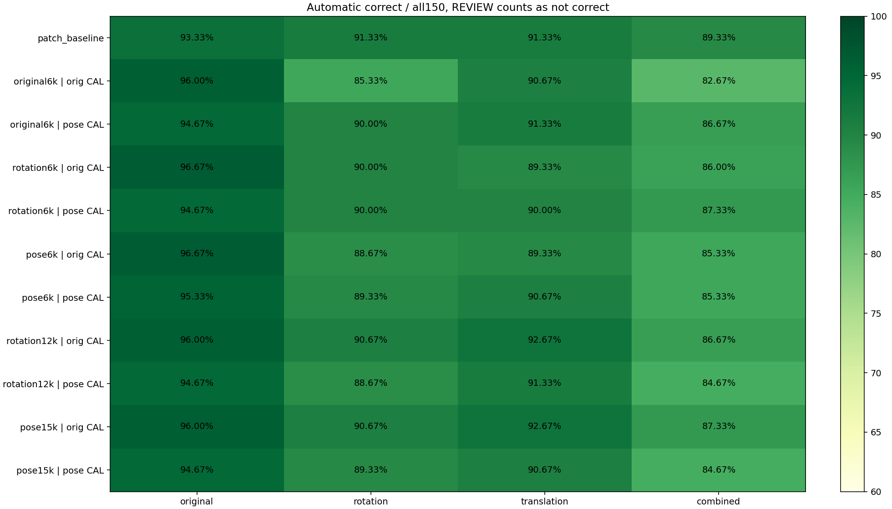
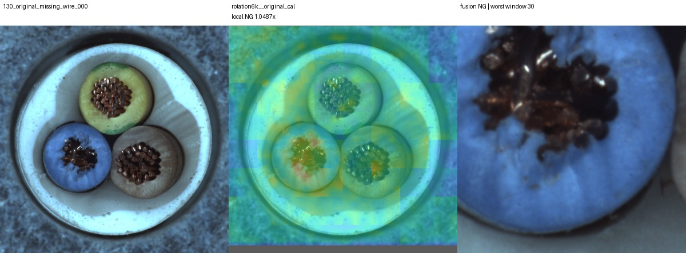
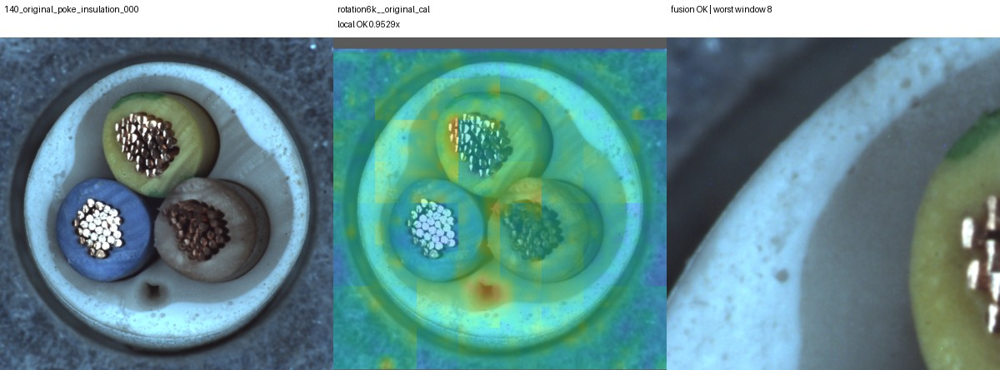

# 국소 검사 자세 증강 10설정 비교 결과

[시각화 대시보드](http://127.0.0.1:8765/output/comparisons/local_pose_suite_20261007_091807/index.html)

실행: `output/comparisons/local_pose_suite_20261007_091807`

## 질문과 범위

정상 자세 다양성, 영역별 메모리 크기, 정상 CAL 구성의 효과를 분리해 비교했다.
메모리5종과 CAL2종의10설정을 각각 국소단독 및 기존패치 OR결합으로 평가했다.
고정 DINOv2 registers base, 입력98, 영역256/간격128/49개, 중심 평행이동은 유지했다.
GT는 학습·영역선택·임계값에 사용하지 않고 마지막 유효영역 감사에만 사용했다.
원본데이터·기존모델·공개API·배포 설정을 변경하지 않았다. 외부 API와 optimizer 학습은 없다.

정상FIT179/CAL45/TEST150(OK58/NG92) 분할을 유지했다. TEST는 원본,15도회전,
이동(+5%,-4%),조합의600관측이며 독립600제품이 아니다. 이미 반복관찰한 개발셋이다.

## 비교 설정

| 메모리 | 원본 | 회전 | 이동 | 영역당 총수 |
|---|---:|---:|---:|---:|
|original6k|6000|0|0|6000|
|rotation6k|3000|3000|0|6000|
|pose6k|3000|2000|1000|6000|
|rotation12k|6000|6000|0|12000|
|pose15k|6000|6000|3000|15000|

회전은 전체정상영상±10/±20도, 이동은(+3%,-2%)/(-3%,+2%).
공유 패치 집합에서 부분집합을 사용하여 비교했다. 원본6000기준은 이전메모리를 그대로 재사용했다.
원본과 증강 혼합은 원본기준 수가6000→3000으로 줄어드는 차이도 있으므로 그 한계를 유지한다.
증강FIT1074view 중1073개가 중심추정에 성공했다. 원본메모리는 이전 성공178source에서 왔다.

original_cal은 정상원본45장. pose_cal은 같은45장의 원본+6변환315view 중314개를 사용했다.
나머지1개는 화면경계 조건 실패다. 315view를315독립표본으로 취급하지 않는다.
영역별q95와 전체검사최댓값q95에 같은CAL을 사용하므로 새로운 환경의 오탐률5%보장은 아니다.
각 임계값은 TEST 전에 고정했다. 두검사 OR결합은 기존NG를 보존하고 추가재보정은 없다.

## 전체 결합 정확도

보류도 각조건150분모에 포함하고 정답으로 세지 않았다. 아래는 결합 결과이며 단독 결과도대시보드에 있다.

| 설정 | 원본 | 회전 | 이동 | 회전+이동 | 원본 FP/FN | 원본 swap |
|---|---:|---:|---:|---:|---:|---:|
|patch_baseline|93.33%|91.33%|91.33%|89.33%|2/8|7/12|
|original6k__original_cal|96.00%|85.33%|90.67%|82.67%|3/3|10/12|
|original6k__pose_cal|94.67%|90.00%|91.33%|86.67%|2/6|8/12|
|rotation6k__original_cal|96.67%|90.00%|89.33%|86.00%|3/2|11/12|
|rotation6k__pose_cal|94.67%|90.00%|90.00%|87.33%|3/5|9/12|
|pose6k__original_cal|96.67%|88.67%|89.33%|85.33%|3/2|11/12|
|pose6k__pose_cal|95.33%|89.33%|90.67%|85.33%|3/4|10/12|
|rotation12k__original_cal|96.00%|90.67%|92.67%|86.67%|2/4|10/12|
|rotation12k__pose_cal|94.67%|88.67%|91.33%|84.67%|3/5|9/12|
|pose15k__original_cal|96.00%|90.67%|92.67%|87.33%|2/4|10/12|
|pose15k__pose_cal|94.67%|89.33%|90.67%|84.67%|3/5|9/12|

## 확인한 변화

1. 같은6000메모리의 회전 증강은 원본정확도96.00→96.67%, 원본미탐3→2,
   swap10→11로 개선했다. 회전조건 오탐21→15, 미탐1→0, 정확도85.33→90.00%다.
   회전증강 부족이 문제의 일부였다는 근거지만 원본에서는 한장 차이이며 유의한 일반화 개선으로 확정하지 않는다.
2. 원본 최고정확도96.67%는 rotation6k/pose6k의original_cal이 공동으로 달성했다.
   rotation6k의 원본미탐은 cable_swap/006과 poke_insulation/000이다.
   missing_wire/000과 poke_insulation/002의 추가 검출은 유지했다.
3. 확장메모리는 자세조건 오탐을 더 낮추기도 했지만 원본결함을 다시 놓쳤다.
   rotation12k와pose15k의original_cal은 원본FP2/FN4이고 missing_wire/000이 다시미탐이다.
   두 설정의 원본미탐은 swap004·006, missing_wire000, poke000이다.
4. pose15k+original_cal은 원본96.00%,회전90.67%,이동92.67%,조합87.33%다.
   이전국소결합보다 네조건이 개선되지만, 기존패치단독의회전91.33%·조합89.33%에는 못미친다.
5. 자세CAL만 넓힌original6k는 회전오탐21→13으로 줄지만 원본미탐3→6으로 늘었다.
   다른메모리에서도 자세CAL이 항상 개선하지 않았다. 임계값보정만으로 해결되지 않는다.

전체600입력 중심추정실패62건은 모든설정에서 동일하다. OR결합은 실패한NG를 기존검사로 유지한다.
결합보류는 원본0·회전0·이동1·조합2이며 모두정상이다. 이들을 제외하지 않았다.

## 결정

모든조건에서 기존패치를 이기는 설정은 없다. 범용기본모델로 교체하지 않는다.
원본결함 검출 우선 후보로 rotation6k+original_cal을, 자세조건 절충 후보로 pose15k+original_cal을 남긴다.
후보 선택은 이 개발셋 결과를 본 사후 선택이다. 독립검증이 필요하다.
증강과 메모리를 무작정 늘리기보다 부위 대응·회전정규화와 미세결함 검출의 상충을 다음가설로 분리할 근거가 생겼다.
이번 범위는10설정이며, 새 SAM/VLM/정합모델까지 모두 실험한 것은 아니다.

## 시각화와 검증

대시보드에서 설정·조건·FP/FN/REVIEW를 선택하면600입력 모두 원본/기존맵/국소맵/최고점영역을 비교할 수 있다.
저장수치와뷰어수치의일치를확인했다. 지도는축소블록형표현으로 원본좌표에 되돌리며 정확한결함분할 마스크나확률이 아니다.
기존진단4사례×10설정의정적이미지40개도제공한다.
브라우저 실제클릭 자동화는수행하지않았고,JS구문·HTTP응답·뷰어데이터와정적이미지를검증했다.

- 구현테스트134개 통과.
-12600판정=600입력×21분기(기존패치1+국소10+결합10) 독립재계산.
- 학습기준 원점/seed샘플링, 정상CAL임계값, 픽셀변환·중심추정·유효영역·판정·지표를재현.
- 원본hash·학습/CAL/TEST분할분리, 기존NG보존 확인.
- 원본대조군 맵 최대오차1.4305e-6이며 판정은 기존과일치.
- HTTP자산1245개, 정적카드40개, 뷰어용600개수치파일검증.
- 중심보정 후 GT보존율과 유효영역포함률 최소100%. 합성변환자체의원본GT보존율과는 구분한다.
- 근거: predictions/metrics.json, per_image.json, model/thresholds.json, logs/validation.json.
- 코드: tools/experiment_local_pose_suite.py, report_local_pose_suite.py, audit_local_pose_suite.py, local_pose_viewer.js.

## 핵심 그림

