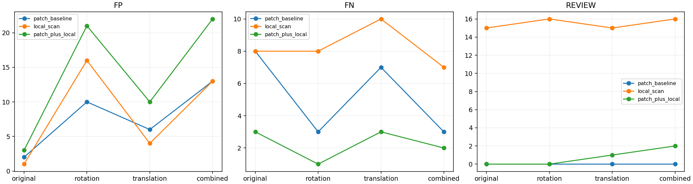

# 국소 검사 회전 증강 비교 제안

상태: 제안, 미실행. 연구방향 기록이며 새 성능 결과가 아니다.

## 근거

local_scan_20261004_211530의 metrics.json을 재확인했다. 기존 패치와 국소 OR결합은
원본 FP3/FN3/정확도96.00%지만 회전 FP21/FN1/85.33%, 회전과 이동 조합 FP22/FN2/82.67%였다.
국소 기준은 정상 원본만 사용했고 기존 패치에는 회전 증강이 있었다.
회전 오탐의 원인을 절대좌표 문제로 확정하기 전에 국소 정상 기준의 자세 다양성 효과를 분리한다.

## 다음 질문과 비교

질문: 정상 전체 영상을 회전해 국소 기준에 포함하면, 원본의 국소 결함 검출을 유지하면서 회전 오탐을 줄일 수 있는가?

- A: 기존 정상 원본 기준, 영역당6000패치.
- B: 정상 원본과 회전 ±10도·±20도 기준 혼합, 영역당 총6000패치로 고정.
- 원본패치3000과 회전패치3000(각각750) 배분을 첫 비교안으로 한다. 기존 A와 달리 원본 기준 비중이 줄어드는 한계도 보고한다.
- 정상 원본 전체 영상을 먼저 회전하고 실제RGB에서 중심을 재추정한 뒤49개 영역을 추출한다.
  개별부품을 뒤섞거나, 검사 이미지의 알려진 합성 변환량으로 정합하지 않는다.
- DINO, 입력98, 영역256/간격128, 거리·점수 집계·OR결합·실패REVIEW 규칙은 유지한다.
- 같은 FIT179/CAL45/TEST150을 사용하고 학습source를 TEST에 넣지 않는다.
- 임계값은 각 비교군에서 같은 정상 원본CAL과 같은q95절차로 다시 산출한다. TEST를 보고 임계값을 조정하지 않는다.
- 테스트는 기존 원본/15도회전/이동/조합으로 동일하게 평가한다. 이미 관찰한 개발셋이라는 한계를 유지한다.
- 학습실패view와 테스트보류를 보고하고 평가에서 제외하지 않는다.

## 성공 여부를 판단할 항목

회전 오탐21건과 조합 오탐22건 감소, 원본 정확도96%와 추가 검출된missing_wire000·poke002 유지,
swap10/12의 검출 손실 여부, 보류 증가 여부를 함께 본다. 한 지표만 좋아졌다고 채택하지 않는다.
정상 회전 다양성을 넓히면서 swap도 정상처럼 취급할 수 있으므로 구성 이상 검출을 반드시 확인한다.

개선이 부족하면 다음 단계에서 회전 정규화 또는 부품 대응 좌표계를 별도 가설로 검증한다.
증강과 정합·분할을 한꺼번에 바꾸지 않는다. 독립 데이터나 새 촬영에서의 일반화는 이후 별도 검증 대상이다.

## 출처와 시각화

- 실행: E:/DH/Sandbox/Dinopatch/output/comparisons/local_scan_20261004_211530
- 수치: predictions/metrics.json
- 코드: tools/experiment_local_scan.py
- 기존 결과: docs/LOCAL_SCAN_RESULTS_20261004_211530.md
- [기존 시각화](http://127.0.0.1:8765/output/comparisons/local_scan_20261004_211530/index.html)

