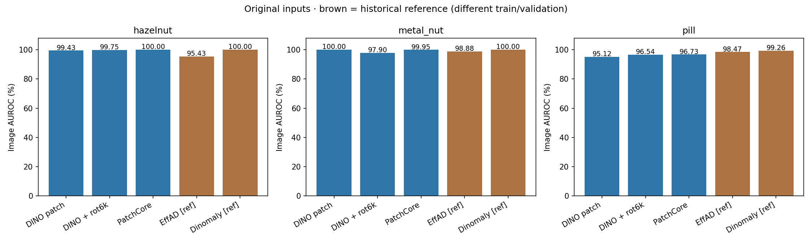
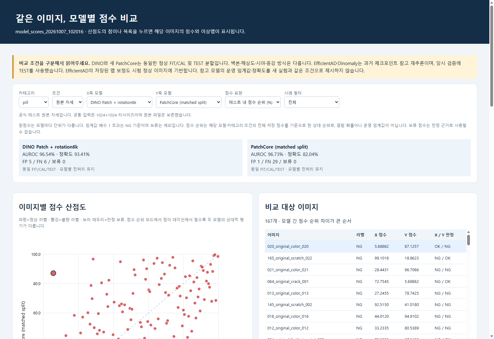

# 기존 모델과 이미지별 점수 비교 — 완료

질문: hazelnut·metal_nut·pill의 같은 이미지에서 기존 모델과 현재 DINO 구성이 무엇을 다르게 평가하는가?

실행: `E:/DH/Sandbox/Dinopatch/output/comparisons/model_scores_20261007_102016`.
설계: `E:/DH/Sandbox/Dinopatch/docs/MODEL_SCORE_COMPARISON_PROTOCOL_20261007.md`.

기존 DINO5구성의 점수를 보존하고 같은 정상 FIT/CAL로 공식 PatchCore를 새로 구성한다.
과거 EfficientAD·Dinomaly 체크포인트도 같은 입력으로 재추론하되, 당시 SAME_AS_TEST 검증과
EfficientAD의 시험 정상 맵 보정 때문에 참고 구역으로 분리한다. 참고 모델의 임계값·정확도는 제시하지 않는다.
과거 폐기된 PatchCore 체크포인트는 재사용하지 않는다.

원본 점수, 검증된 임계값 대비 배수, 라벨 독립적인 테스트 내 점수 순위를 산점도와 이미지별 표로 제공할 예정이다.
순위는 확률이 아니며, 참고 모델과 새 모델의 수치를 동일 조건의 성능 순위로 합치지 않는다.

139개 단위 테스트 통과. PatchCore 재로딩 검증은 batch8/1 차이로4.20e-5 차이가 발생했으나,
동일 batch8에서는 첫8장 점수·맵 차이가0이었다. 동일 배치 검증으로 수정하고 중간 결과를 재사용했다.
아직 전체 모델의 추론 결과는 확정하지 않았다. 다음은 전수 재추론·결과 감사·시각화 검증이다.

코드: `tools/compare_model_scores.py`, `tools/report_model_scores.py`, `tools/model_scores_viewer.html`, `tools/model_scores_viewer.js`.
원본과 기존 연구 결과는 보존한다. Git 커밋·push는 기존18:00 예약 정책을 따른다.

## 최종 결과 102016

실행 ID: `model_scores_20261007_102016`. 3카테고리·392원본·4조건·8구성, 총12544개 이미지별 점수.

### 동일 분할 비교 — 원본 조건

| 카테고리 | 모델 | AUROC | 정확도 | FP/FN/보류 |
|---|---|---:|---:|---|
|hazelnut|DINO Patch|99.43%|97.27%|2/1/0|
|hazelnut|DINO Patch + rotation6k|99.75%|96.36%|3/1/0|
|hazelnut|PatchCore (matched split)|100.00%|100.00%|0/0/0|
|metal_nut|DINO Patch|100.00%|98.26%|2/0/0|
|metal_nut|DINO Patch + rotation6k|97.90%|95.65%|5/0/0|
|metal_nut|PatchCore (matched split)|99.95%|98.26%|2/0/0|
|pill|DINO Patch|95.12%|86.23%|0/23/0|
|pill|DINO Patch + rotation6k|96.54%|93.41%|5/6/0|
|pill|PatchCore (matched split)|96.73%|82.04%|1/29/0|

### 과거 모델 참고 — 원본 조건

| 카테고리 | 모델 | AUROC | 학습 체크포인트 epoch |
|---|---|---:|---:|
|hazelnut|EfficientAD (legacy reference)|95.43%|99 (0부터 시작)|
|hazelnut|Dinomaly (legacy reference)|100.00%|99 (0부터 시작)|
|metal_nut|EfficientAD (legacy reference)|98.88%|99 (0부터 시작)|
|metal_nut|Dinomaly (legacy reference)|100.00%|99 (0부터 시작)|
|pill|EfficientAD (legacy reference)|98.47%|99 (0부터 시작)|
|pill|Dinomaly (legacy reference)|99.26%|99 (0부터 시작)|

### 관찰과 결정

- hazelnut 새 PatchCore는 원본110장 정확도100%(FP0/FN0), 회전6k 결합은96.36%(FP3/FN1)였다. 이 표본의 결과이며 일반적인100% 성능 보장이 아니다.
- metal_nut 새 PatchCore는98.26%(FP2/FN0)로 기존 DINO Patch와 같았고 회전6k 결합95.65%보다 높았다.
- pill은 PatchCore AUROC96.73%가 회전6k 결합96.54%보다 조금 높지만, 고정 정상CAL 임계값에서는 정확도82.04%(FP1/FN29) 대93.41%(FP5/FN6)로 달랐다. 순위 구분 능력만으로 운영 모델을 선택하지 않는다.
- 같은 이미지에서 보이는 오탐·미탐 차이를 다음 오류 분석에 사용한다. 이번 결과를 보고 임계값을 다시 조정하거나 두 모델의 결합을 새로 채택하지 않았다.

### 조건과 한계

- DINO5구성은 직전 실행의 점수·임계값·판정을 그대로 보존했다. 새 PatchCore는 동일 정상 FIT/CAL로 공식 소스에서 새로 구성하고 정상 CALq95higher로 임계값을 고정했다.
- PatchCore는 WR50 ImageNetV1/layer2·3/3×3/1024차원/coreset10%/NN1, Resize256→Crop224, 증강 없음이다. DINO와 분할은 같지만 해상도·백본·시야·증강은 다르다.
- EfficientAD와 Dinomaly는 옛 v0 체크포인트를 재추론했다. 당시 SAME_AS_TEST 검증을 사용했고 EfficientAD의 내부 맵 보정도 시험 정상에 기반했다. 별도 CAL 운영 임계값·정확도·FP/FN를 제시하지 않는다.
- 과거 이미지 postprocessor를 우회한 native 점수와 이번 canonical 입력으로 계산했으므로, 과거 요약표와 소수점 수치가 다를 수 있다. 이는 과거 요약값을 덮어쓴 기록이 아니다.
- 원점수는 모델 고유 단위이다. 임계값 배수는 별도 정상 CAL이 있는 모델만 표시한다. 테스트 내 순위는 동점 평균순위를 사용한 상대 서열로 결함 확률이 아니다. 보류 점수도 전체 저장 점수 분포에 포함되므로 정상 판정으로 읽지 않는다.
- 공식 TEST 전수의 원본/회전/이동/조합을 비교한다. 변형 라벨은 원본에서 가정하며 원본과 독립된 표본이 아니다. 이전 실험의 잘림·유효 패치 영역 제한도 유지된다.
- 외부 이상맵 색은 각 이미지의 min/max로 표시한다. 모델 간 색 세기로 성능을 비교하지 않는다. Crop 모델의 중앙896×896밖은 미관찰 영역이다.
- 동일분할 PatchCore와 DINO의 이미지별 차이를 먼저 분석하고, EfficientAD/Dinomaly의 공정한 운영 정확도 비교에는 같은 FIT/CAL에서의 재학습이 별도로 필요하다. 이번에 두 모델을 새로 학습했다고 주장하지 않는다.

### 화면과 검증

- X/Y모델 선택 → 원점수/임계값 배수/순위 전환 → 산점도 점 클릭 → 전체 모델 점수·원본·이상맵 확인. 오류·판정불일치·정상/불량 필터 및 CSV 다운로드를 제공한다.
- 단위 테스트139개, 수치 감사 12544행·4704개 맵·4709개 HTTP 자산. 기존 DINO 수치 무변경, 원본/과거 원본 해시 일치, CAL 임계값/판정/순위/지표 재계산, 과거 체크포인트 해시 유지 확인.
- 실제 headless 브라우저에서 36개 카테고리·조건·점수표현 조합, 클릭/이전다음/오류필터/참고모델 임계값 미표시를 검증했다. Runtime 오류 0건.
- 첫 PatchCore 재로딩 검증에서 batch8/1 차이로 약4.20e-5 오차가 발생했다. 같은 batch8에서는 첫8장의 점수·맵 차이가0이었다. 허용치를 키우지 않고 동일 배치 검증으로 수정했다. 재시작 디렉터리 처리 오류도 수정했으며 원본은 유지했다.

### 출처

- 실행: `E:/DH/Sandbox/Dinopatch/output/comparisons/model_scores_20261007_102016`
- 코드: `tools/compare_model_scores.py`, `tools/report_model_scores.py`, `tools/model_scores_viewer.html`, `tools/model_scores_viewer.js`, `tools/audit_model_scores.py`.
- 이전 DINO: `output/comparisons/cross_category_rotation_20261007_094003`. 원본 manifest SHA-256을 이번 protocol.json에 고정했다.
- 과거 모델 출처·파일 해시: 이번 `metadata.json`. 옛 `07_anomaly_dino/output/anomalib_bench/runs/`의 v0 모델이다.
- 논문 수치 출처: `results/efficientad_paper_per_scenario_results.json` 및 파생CSV. 개별 점수가 없어 논문 수치를 산점도에 만들지 않았다.
- [점수 비교 대시보드](http://127.0.0.1:8765/output/comparisons/model_scores_20261007_102016/index.html)

원본 데이터·모델·전체 대화는 Obsidian에 넣지 않았다. Git 반영은 기존18:00 예약을 따르며 이번에 별도 커밋·push하지 않았다.
