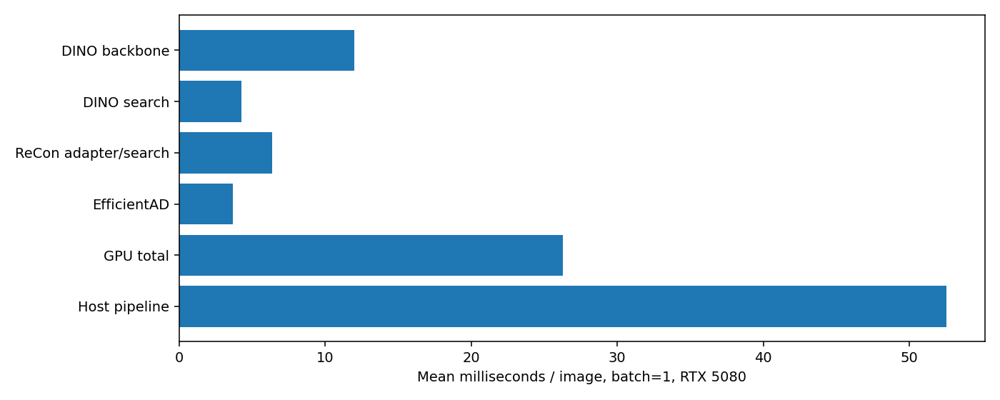

# 세 검출기 GPU 지연 측정 — 20261007_231552

질문: 이미지 한 장에서 EfficientAD·DINO·ReConPatch-inspired를 실행하는 데 GPU 기준 얼마나 걸리는가?

기존 실행에는 검출기별 추론 시간이 없었다. 새 학습·API 호출 없이 기존 체크포인트로 별도 측정했다. RTX5080, batch1, 워밍업10회, screw160의 순서상 매5번째32장 ×2회=64측정. 모델과 뱅크는GPU상주, 한CUDA스트림 순차실행. 입력DINO700/EfficientAD256, 뱅크각30000, CPU4threads. DINO는FP16 autocast, 나머지는기존FP32 경로. DINO특징을ReConPatch-inspired가 공유하므로 큰백본을3번 실행하지 않는다. 원논문WRN ReConPatch 결과가 아니다.

|단계|평균 ms|중앙값 ms|p95 ms|
|---|---:|---:|---:|
|DINO backbone|11.97|11.95|12.52|
|DINO search|4.26|4.14|4.56|
|ReCon adapter/search|6.38|6.38|6.72|
|EfficientAD|3.68|3.63|4.15|
|GPU total|26.30|26.32|26.97|
|Host pipeline|52.55|52.32|55.32|

GPU시간은 이미GPU에 올라간 텐서부터 세GPU이상맵까지 CUDAEvent로 측정했다. Host pipeline은기존Python경로의파일읽기·resize/정규화·전송·추론·CPU맵반환을포함한다. 모델초기로딩/학습, 후보통합/crop, 정상참조검색, VLM/API, UI/저장은제외했다. GPU최적화나실시간배포벤치마크가아니며, 디스크는반복접근으로캐시될수있고GPU는디스플레이와공유한다. 3장×3모델의저장맵9개를atol/rtol1e-5로재현확인했다. 정확도·프롬프트·공급자설정은변경하지않았다.

이전VLM통합API평균14.42초는별도실행의네트워크응답시간이며, 이번GPU합계와합산해직접측정한전체지연이라고표기하지않는다. 앞으로전체배포지연과모델추론지연을분리하고동일하드웨어·입력·정밀도·batch조건으로비교한다. CUDA그래프/TensorRT/병렬화효과는측정하지않았다.

실행: `E:/DH/Sandbox/Dinopatch/output/comparisons/fusion_gpu_latency_20261007_231552`
체크포인트/분할 출처: `E:/DH/Sandbox/Dinopatch/output/comparisons/qwen_screw_model_fusion_20261007_221248`
코드: `tools/benchmark_fusion_latency.py` 및 실행폴더 `benchmark_source.py`. 측정원본 `measurements.csv`, 환경·통계 `run.json`. 원본데이터·모델은수정하지않았다. Git수동commit/push없음.

