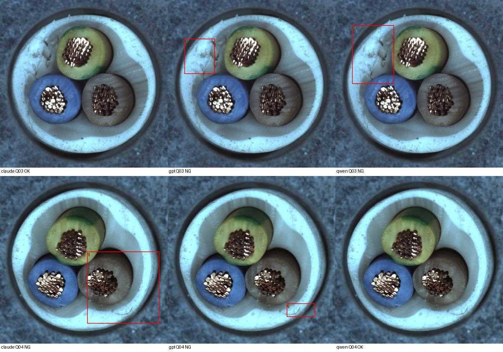

# 이미지 기준만 사용한 VLM3종 비교 — 20261007_112108

## 질문과 변경
제품 설명·정상 규칙을 제거하고 OK 이미지와 검사 이미지만 주었을 때 Claude/GPT/Qwen이 결함을 찾는가? 앞선 상세 설명 프롬프트 대신 짧은 공통 프롬프트를 사용했다. 기존 dinopatch 모델은 수정하지 않았다.

## 데이터·조건
직전 NG 샘플실험과 완전히 같은 원본 검사10장: NG8종 각1장, 정상2장. 기준은 train/good 000/112/223 세 장. seed20261007의 기존 선택을 그대로 재사용했다. 모든 모델에 같은 바이트·같은 순서·같은 프롬프트를 보냈다. 제품명, 결함 유형, 질의 정답, 원본 경로, 이전 설명, GT 마스크는 입력에 없다. 매 요청은 독립이다.
OpenRouter 모델 ID는 표 참조. 모델당10회, 총30회, max_tokens3000, Claude/Qwen temperature0, GPT reasoning effort low(temperature 미지정). 내부 전처리·추론 설정은 모델별로 달라 완전히 동일 계산량 비교는 아니다. data_collection=deny, zdr=true 유지. 응답에 맞춘 프롬프트 변경이나 재시도 없음. 현재 지원 정보는 logs/model_catalog.json에 고정했다.

## 측정 결과
|모델|NG검출/8|미탐|정상판정/2|오탐|보류|오류|
|---|---:|---:|---:|---:|---:|---:|
|anthropic/claude-sonnet-4.6|7|1|1|1|0|0|
|openai/gpt-5.4|8|0|1|1|0|0|
|qwen/qwen3-vl-235b-a22b-instruct|8|0|2|0|0|0|

API 보고 비용 합계 $0.2794094. 비용 누락 0건. 요청별 비용·지연·실제 응답 모델·제공자는 원문에 보존했다. 실시간 현장 추론속도 벤치마크가 아니다.

## 이유와 위치에 대한 검토
- Q02 외피 절단: Qwen은 왼쪽 흰 외피의 균열/찢김을 설명했다. GPT는 파란 심선 가닥 돌출, Claude는 내부 접점 밀도/누락으로 설명했다. 세 모델 모두 NG여도 정답 결함을 설명했다고 동일하게 평가할 수 없다.
- Q03 절연부 손상: Claude는 OK라며 과일·씨앗·세라믹 접시로 잘못 해석했다. GPT와 Qwen은 왼쪽 흰 구조 손상을 설명했다. 이 사례는 제품 설명 제거 시 의미적 오인이 발생할 수 있음을 보여주지만, 설명 유무의 인과효과는 같은 모델의 조건 비교가 없어 확정하지 않는다.
- Q04 정상: GPT는 우하단의 가느다란 섬유/털 같은 선을, Claude는 내부 패턴 크기를 NG 근거로 들었다. 데이터셋 정답은 정상이다. 관찰한 차이와 검사상 허용 여부는 별개의 문제다.
- Qwen은 한국어 응답 지시에도 영어 이유를 반환했다. 원문을 보존했으며 이를 한국어 지시 준수 성공으로 집계하지 않는다.
- 정답 위치/이유 검토는 정성적이다. GT 마스크는 API에 보내지 않았으며 추론 뒤 화면에만 표시했다. 상자는 모델의 대략적 위치 제안이며 픽셀 이상맵이나 검증된 결함 마스크가 아니다.

## 한계와 결정
소규모 재사용 개발 표본이며 전체 cable/타제품 정확도로 일반화하지 않는다. 이전 Gemini는 설명이 있는 다른 조건이어서 모델 순위표에 합치지 않았다. 판정이 맞아도 이유가 정답 결함과 다를 수 있다. VLM 정상 규칙을 자동 확정하거나 이 결과로 운영모델을 선택하지 않는다. 다음 후보는 동일 모델·동일 표본에서 제품명 한 줄의 유무만 비교하는 것이다. 아직 추가 실행하지 않았다. NG검출과 정상오탐을 함께 유지하며 평가한다.

## 검증·출처
- 원본/GT/복사 이미지 해시 보존, 모델 간 동일 입력 확인, 스키마·좌표 검사, 집계 재계산, HTTP 이미지 접근 확인.
- 실행: `E:/DH/Sandbox/Dinopatch/output/comparisons/vlm_image_only_20261007_112108`
- 코드: `tools/probe_vlm_image_only.py`, 실행 logs/probe_source.py 및 logs/record_results.py.
- 원본 선택: data/selection.json; 프롬프트·조건: run.json; 원문: responses/; 예측: predictions.json/CSV; 집계: metrics.json.
- 이전 실행: `output/comparisons/normal_ng_20261007_111220`; 고정 manifest 해시는 run.json.
- [3모델 시각화 열기](http://127.0.0.1:8765/output/comparisons/vlm_image_only_20261007_112108/index.html)

원본 데이터·인증정보·전체 대화는 연구 저장소에서 제외. 정기18:00 동기화 대상이며 별도 commit/push하지 않았다.
