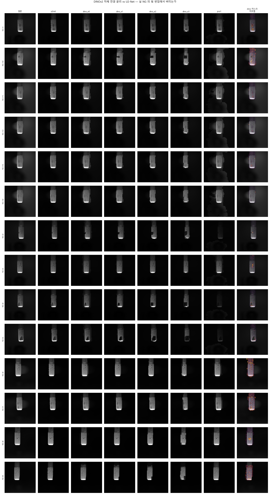
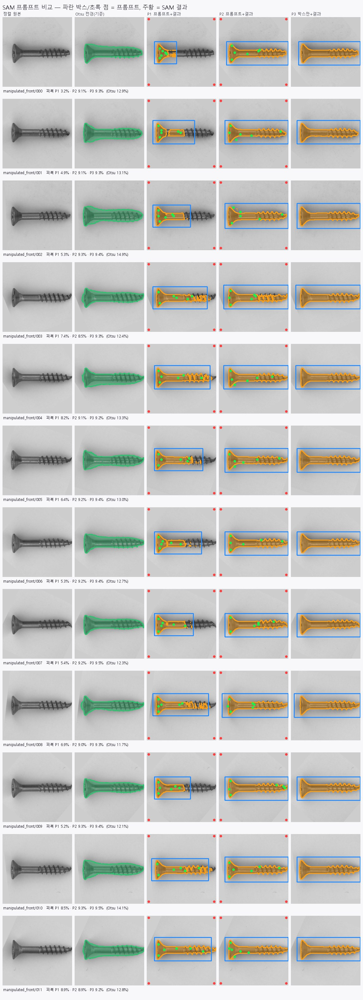

# 이전 anomaly_dino의 DINO 분리 코드 검토

## 질문과 확인 범위
사용자가 `E:/DH/Sandbox/sandbox/01_vision/07_anomaly_dino`에서 시도한 물체·배경 분리 코드를 참고하도록 요청했다. 소스·저장CSV·시각화를 직접 읽었다. 새 모델 실행·학습은 하지 않았고 기존 프로젝트와 원본을 변경하지 않았다. 아래 수치는 과거 저장 결과이며 현재 실행의 재현 성능이 아니다.

## 실제 PCA 분리 구현을 찾음
`experiments/bolt/probe_bolt_dino_mask.py:62`의 **Pca1Masker**는 별도 구현이다.

1. 여러 학습 이미지의 DINO 패치 특징을 모으고 평균을 뺀다.
2. `torch.pca_lowrank(..., q=4, niter=4)`의 첫 축으로 투영한다.
3. 투영값의 Otsu 임계값으로 두 그룹을 나눈다.
4. 학습 앞8장의 테두리에 덜 나타나는 쪽을 전경으로 정한다.
5. 3×3침식 → 최대연결성분 → 구멍채움 → 팽창으로 정리한다.

정상 물체 참조벡터와의 유사도 통과 조건은 없다. 다만 PCA축·임계값·극성은 여러 정상 학습 이미지에서 적합하므로, 검사 이미지 한 장만으로 매번 PCA를 구하는 구현과는 다르다. DINOv2 특징 자체의 비지도 분리 후보라는 사용자의 설명과 연결되지만 두 방식을 혼동하지 않는다.

`output/bolt_dino_mask/summary.csv`의 과거 PCA1 결과: 전경비율31.16%, U2-Net대비IoU0.2987, 선택마스크내U2-Net배경70.13%, 이미지AUROC82.50%, NG9/14검출. 분할수치는 NG14장에 대한 **U2-Net을 대리기준으로 한 일치도**이며 인간라벨 물체GT와의IoU가 아니다. per_image.csv에서평가OK60/NG14를확인했다. 검출임계값은평가OK점수의최댓값이므로독립CAL임계값실험과직접비교하지않는다. 코드기본값은train80/입력980/coreset15000이나당시실행인자전체manifest는이산출물에없어기본값을실제실행값으로확정하지않는다. 저장masks.png에서도PCA1이배경번짐을많이남긴사례가보인다. 이것이현재screw에서실패한다는증거는아니다.

## 이번에 사용한 것은 다른 구현
`adcore/masks.py:77`의 **ForegroundPCA**는 PCA축 대신 정상특징centroid거리/Otsu·정상전경참조유사도·연결성분처리를 쓴다. 현재 `E:/DH/Sandbox/Dinopatch/dinopatch/masks.py`의 동명class와 **AST가완전히동일함**을 직접 비교했다. 즉이번DINO배경분리실험은이미이전helper를재사용했지만별도Pca1Masker실험을반영한것은아니다. 두이름의혼동을해소하고최근설명정정을유지한다.

## 특징 내부 신호로도 분리했음
`experiments/mvtec/probe_dino_fgbg.py:67`의 RichExtractor가CLS→patch와register→patch어텐션을Q/K로추출한다. `map_to_mask:121`에서Otsu·테두리극성·연결성분으로마스크를만든다. 어텐션/토큰노름분리자체에는정상메모리뱅크비교가없다. 다만스크립트전체에는별도의학습/부분공간실험도함께있다. 폴더명은mvtec이지만이파일의DATA는industrial/bolt다.

`output/dino_fgbg/spatial.csv`: U2-Net대비CLS평균IoU0.2242,register평균0.1778,token norm0.0. 이는정답분할IoU가아니다. best-head0의0.2453은같은평가표본에서최고헤드를선택한탐색값이다. 스크립트의NG+OK앞20평가조건과현재screw를구분한다.

## 박스 → MobileSAM도 이미 실험했음
`experiments/screw/probe_screw_sam_prompt.py:77`은정렬한screw NG119장에세프롬프트를비교했다. 정렬과정상학습전경적합이포함되며현재원본무정렬조건과같지않다. 저장 `output/screw_sam_prompt/summary.txt`:

| MobileSAM 프롬프트 | 이미지 내 마스크 피복률 | Otsu 전경과 IoU |
|---|---:|---:|
| DINO_e2 마스크에서 박스·점 | 5.2% | 0.379 |
| Otsu 전경에서 박스·점 | 9.5% | 0.647 |
| Otsu 전경에서 박스만 | 9.3% | 0.668 |

Otsu기준피복은13.4%. 이표는**분할대리기준 일치도**이지NG검출정확도가아니다. 저장prompts.jpg에서DINO의작은박스가머리만가리키는반면Otsu의넓은박스는나사전체를포함함을직접확인했다. 따라서SAM을추가하는것뿐아니라박스를어디서만드는지가핵심이라는현재논의를뒷받침한다. 스크립트는SAM예외를빈마스크로대체하며별도오류카운트를남기지않으므로기록만으로오류없음을보증할수없다. Otsu도단순배경가정이있으므로범용검출기로단정하지않는다.

## 추가로 남아 있던 배경 뱅크 분리
`adcore/bank.py:85` split_bank는학습패치를k-means32군집으로나누고테두리출현율이평균의1.8배이상인군집을배경뱅크로분리한다. 물체/배경최근접거리로채점패치를고르는방식이며,이미지별촘촘한마스크를만드는방식과다르다. 기존상태문서의최종방향은배경변화gate와이방법의조합이었다. 상태문서의결론을현재모델의성능증거로소급하지않는다.

## 결정과 다음 단계
먼저별도Pca1Masker를현재정상FIT/CAL에맞춰비교할수있고,사용자가원한검사이미지단독PCA는별도조건으로명시해야한다. 생PCA분리와침식/최대성분후처리를분리해나사끝이사라지는단계를확인하는것이우선이다. 이후박스영역그대로채점 vs 박스→MobileSAM을비교하되박스의물체전체포함을먼저확인한다. 기존helper의재실행을새로운DINO자체분리실험으로부르지않는다. 현재검토에서는새실험이나알고리즘변경을하지않았다.

기록: 이전소스/결과는읽기만했다. 핵심과거시각화2장과소스·표복사본에출처해시를붙여현재보고서에보관한다. 원본데이터·모델·자격증명은연구노트저장소에복사하지않는다. 수동Gitcommit/push없음.

[Report](http://127.0.0.1:8765/output/comparisons/prior_dino_segmentation_review_20261007_234653/index.html)

