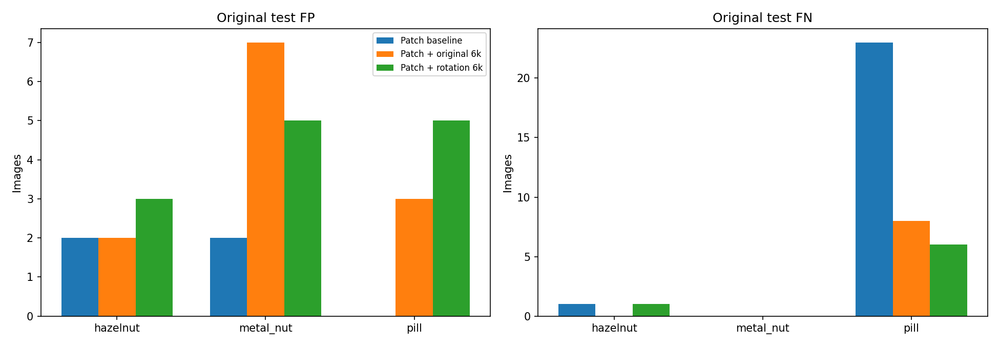
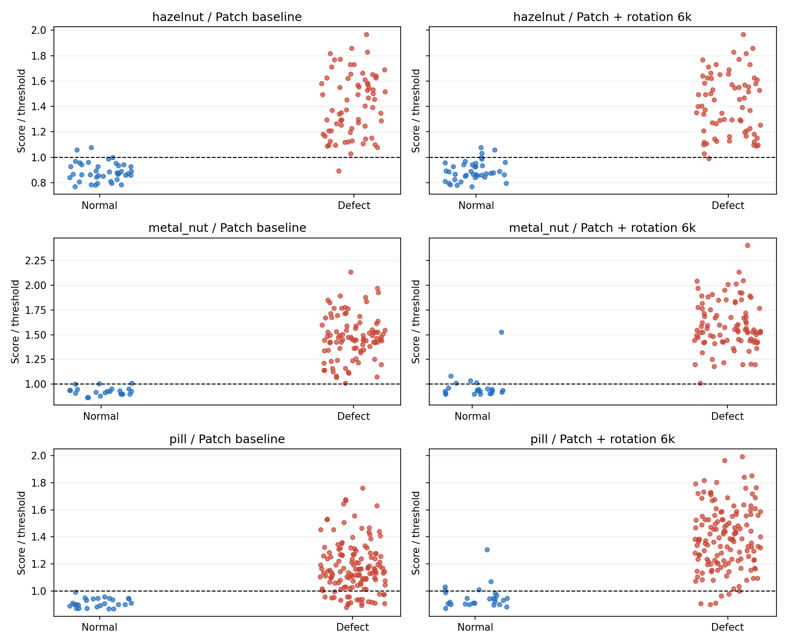
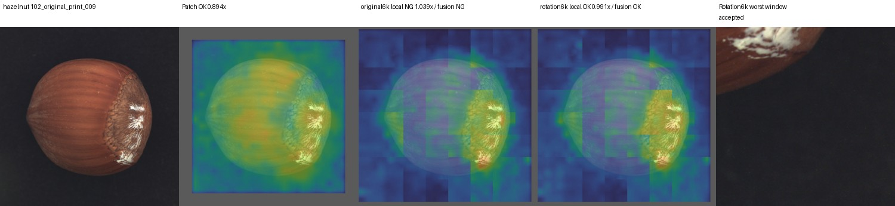
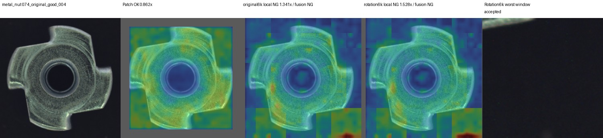
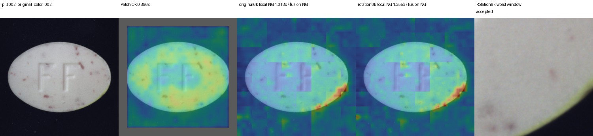

# 타 카테고리 회전 6k 결합 — 검증 완료

실행 ID: `cross_category_rotation_20261007_094003`.

질문: Cable에서 원본 미탐을 줄인 국소 회전6k + Patch OR 결합을 다른 제품에도 적용할 수 있는가?

## 완료한 사전 점검

Cable 이외 MVTec 14종의 정상 train에서 20장씩 중심 추정기를 점검했다.
hazelnut, metal_nut, pill은 각각20/20 통과했고 나머지11종은 각각0/20이었다.
따라서 통과한3종을 선택해 현재 학습·평가 중이다. 이는 테스트 성능으로 카테고리를 선택한 것이 아니다.
다른11종에서는 현재 Cable용 중심 추정기를 그대로 사용할 수 없다는 한계가 먼저 확인되었다.

## 고정한 비교 설계

- 정상 official train을 이미지 내용 해시 그룹으로 FIT80%/CAL20% 분리(seed42), official TEST는 전수 사용.
- 원본 파일은 보존한다. 입력은 1024 정사각형으로 리사이즈하고 원본/15도 회전/이동(+5%,-4%)/조합을 평가한다.
- 기존 증강 Patch12k, 원본 국소6k, 회전 국소6k, 각 국소 검사와 Patch의 OR 결합을 비교한다.
- 회전6k는49개 창마다 원본3000 + ±10/±20도 각750 정상 패치이며, CAL은 원본 정상만 사용한다.
- 중심 실패는 제외하지 않고 REVIEW로 집계한다. 결합은 기존 Patch NG를 보존한다.
- 임계값은 테스트 전에 고정하며 GT는 사후 범위 감사에만 사용한다.
- 이번 Patch 표본은 카테고리별 소스 균등 추출이다. Cable과 특징·점수·예산·증강은 같지만 추출 표본/절차가 완전히 같지는 않다.

현재 새 데이터에서의 성능 수치는 아직 확인하지 않았다. 결과 확인 후 이 실행 기록에 검증 수치와 핵심 그림을 추가한다.

## 출처와 다음 단계

- 데이터: `E:/DH/Sandbox/Dinopatch/datasets/mvtec/{hazelnut,metal_nut,pill}`
- 실행: `E:/DH/Sandbox/Dinopatch/output/comparisons/cross_category_rotation_20261007_094003`
- 사전 점검: 실행 폴더 `preflight.json`
- 설계: `E:/DH/Sandbox/Dinopatch/docs/CROSS_CATEGORY_ROTATION_PROTOCOL_20261007.md`
- 코드: `tools/experiment_cross_category_rotation.py`, `tools/report_cross_category_rotation.py`, `tools/audit_cross_category_rotation.py`
- 다음: 전수 평가 → 중복/정상 샘플링/CAL/판정/변환/GT 영역 감사 → 오탐·미탐 시각화 → 카테고리별 채택 여부 판단.

데이터·모델·인증정보는 이 보관함에 복사하지 않았다. Git 반영은 기존18:00 예약 정책을 따른다.

## 09:53 중간 결과 — hazelnut 검증 완료

위의 실행 시작 시점에는 성능 수치가 없었고, 이후 hazelnut 평가와 감사를 완료했다.
FIT313 / CAL78 / TEST110이다. 원본 국소 CAL에서 중심 추정 실패2장을 제외했다.
시험4조건440입력과5비교군2200판정,881 HTTP 자산을 검증했다.

| 조건 | Patch 정확도 | 회전6k 결합 정확도 | Patch FP/FN | 결합 FP/FN |
|---|---:|---:|---:|---:|
|원본|97.27%|96.36%|2/1|3/1|
|회전|98.18%|99.09%|1/1|1/0|
|이동|96.36%|96.36%|2/2|2/2|
|회전+이동|98.18%|97.27%|1/1|2/1|

결합 보류는 모든 조건0건이다. 국소 중심 추정 실패는 조건당2건이며 기존 Patch NG로 보존됐다.
원본 `good/010.png`가 새 오탐(1.034배)이고 `print/009.png`는 계속 미탐(0.991배)이다.
후자는 증강 없는 국소6k 결합에서는 검출됐었다(국소1.039배).
육안으로 확인한 새 오탐의 최대 점수 창은 배경이 대부분이었다. 이것만으로 전체 오탐 원인을 확정하지 않는다.
중심 보정 GT 보존율 및 국소 검사 지원 영역 GT 포함률 최솟값은100%, 합성 자세 변환의 GT 픽셀 면적비 최솟값은99.800%였다.
특징 추출 자체의 독립 재추론은 하지 않았으며 저장된 거리·표본 추출·CAL·판정을 재현했다.

출처: 실행 폴더 `hazelnut/predictions/metrics.json`, `hazelnut/logs/audit.json`, `hazelnut/cards/`.
나머지2종 결과 전까지 범용 채택 여부는 판단하지 않는다.

## 중간 질문: hazelnut의 다른 모델 결과

보존한 EfficientAD 저자 비교 자료에서 이미지 AUROC는 PatchCore100.00%, EfficientAD-S99.09%, EfficientAD-M99.35%, SimpleNet99.68%이다.
이번 실행의 Patch99.43%, 회전6k 결합99.75%와 비교하면 순위 구분 능력은 높지만,
실제 고정 임계값 정확도는97.27→96.36%로 낮아졌다. AUROC100%와 운영 임계값에서 정확도100%는 같은 뜻이 아니다.
학습 수량·해상도·분할·평가 설정이 달라 동일 조건 우열로 해석하지 않는다.

로컬 과거 레지스트리에는 Dinomaly AUROC100%, NG70/70; EfficientAD AUROC95.0357%, NG53/70가 있다(각100 epoch).
과거 PatchCore/PaDiM은 중복 행 중 후속 폐기 표시가 있어 유효 비교에서 제외했다.
이 수치는 과거 핵심 아카이브를 재확인한 것이며 현재 코드로 새로 재현한 결과가 아니다.

출처: `E:/DH/Sandbox/Dinopatch/results/efficientad_paper_mvtec_by_category.csv`,
`results/efficientad_paper_per_scenario_results.json`, `results/SOURCES.md`, `results/registry.csv`.

## 10:00 중간 결과 — metal_nut 검증 완료

FIT176 / CAL44 / TEST115, 460입력·2300판정·921 HTTP 자산 검증을 완료했다.
원본 Patch 정확도98.26%(FP2/FN0), 회전6k 결합95.65%(FP5/FN0)이다.
기존 Patch가 불량을 모두 검출한 상태여서 결합의 검출 이득이 없고 오탐만3장 늘었다.
회전은99.13→98.26%, 이동98.26→93.04%(결합 FP6/FN0/보류2),
조합98.26→92.17%(FP3/FN0/보류6)였다. 실패 중심은460입력 중73건이며 제외하지 않았다.
원본 새 오탐은 `good/004.png`, `good/017.png`, `good/019.png`이다.
004의 최대 점수 창은 배경이 대부분이며 회전 국소 점수는 임계값의1.528배였다.

추가 한계: `bent/011.png` 조합 변환은 GT 픽셀 면적의60.933%만 화면에 남았다.
회전/이동의 최소 면적비는88.170%/68.584%였다. 면적비에는 최근접 보간의 픽셀 수 변화도 포함된다.
중심 보정 자체의 GT 면적비는 모든 사례100%였으나, 이동 조건의 중심 추정 성공 사례 중
국소 유효 패치 GT 포함률은 최저89.291%였다. 원본 조건은 GT 면적비·지원 영역 포함률 모두100%이다.
따라서 합성 자세 결과를 결함 전체가 보이는 실제 재촬영 조건의 강건성으로 그대로 해석하지 않는다.

출처: 실행 폴더 `metal_nut/predictions/metrics.json`, `metal_nut/logs/audit.json`, `metal_nut/logs/defect_coverage.json`.

## 최종 검증 결과 094003

실행 ID: `cross_category_rotation_20261007_094003`. 원본392장, 네 조건1568입력, 다섯 비교군7840판정.

Cable에서 선택한 회전6k+원본CAL+Patch OR 결합을 카테고리별로 새로 구성했다. 정상 사전 점검을 통과한3종 평가이며 MVTec 전체 일반화 결과가 아니다.

### 원본 입력 결과

| 카테고리 | FIT/CAL/TEST | Patch 정확도 (FP/FN) | 원본6k 결합 정확도 (FP/FN) | 회전6k 결합 정확도 (FP/FN/보류) |
|---|---|---|---|---|
|hazelnut|313/78/110|97.27% (2/1)|98.18% (2/0)|96.36% (3/1/0)|
|metal_nut|176/44/115|98.26% (2/0)|93.91% (7/0)|95.65% (5/0/0)|
|pill|214/53/167|86.23% (0/23)|93.41% (3/8)|93.41% (5/6/0)|

### 자세 변화 결과

| 카테고리 | 조건 | Patch 정확도 | 회전6k 결합 정확도 | 결합 FP/FN/보류 |
|---|---|---:|---:|---|
|hazelnut|rotation|98.18%|99.09%|1/0/0|
|hazelnut|translation|96.36%|96.36%|2/2/0|
|hazelnut|combined|98.18%|97.27%|2/1/0|
|metal_nut|rotation|99.13%|98.26%|2/0/0|
|metal_nut|translation|98.26%|93.04%|6/0/2|
|metal_nut|combined|98.26%|92.17%|3/0/6|
|pill|rotation|85.03%|94.61%|4/5/0|
|pill|translation|85.63%|88.02%|17/2/1|
|pill|combined|85.03%|90.42%|12/4/0|

### 평가 조건과 해석

- 원본 파일은 보존했다. 각 입력을1024×1024 bilinear로 리사이즈했으며 원본 조건은 자세 변환이 없다는 뜻이다.
- 정상 train을 decoded-image hash 그룹으로 FIT80%/CAL20% 분리(seed42). 공식 TEST는 모두 사용했고 TEST로 임계값을 조정하지 않았다.
- Patch는 입력392의 순서 있는5×5 특징과 원본4k+증강8k 메모리이다. Cable과 설정·예산은 같지만 이번에는 소스 균등 추출로 새 메모리를 구성했다.
- 국소49창(256,간격128), 입력98. 회전6k는 창마다 원본3000 + ±10°/±20° 각750개 정상 패치이다. 6000장의 학습 이미지를 뜻하지 않는다.
- 국소 창 상위5% 거리 평균을 CAL q95로 정규화한 뒤 최대 창 점수의 CAL q95로 판정한다. 같은 CAL을 두 단계에 재사용하므로 운영 오탐률5%를 보장하지 않는다.
- 중심 실패는 국소 REVIEW이며 결합은 Patch NG를 보존하고 그 외 REVIEW이다. 보류도 정확도 분모에 포함했다.
- 정상 사전 점검20장씩에서3종20/20, 나머지11종0/20. 이11종의 이상탐지 성능을 측정한 것은 아니다.
- 금속 너트의 합성 조합에서 결함 GT 면적비는 최소60.93%, 이동 조건 국소 유효 영역 GT 포함률은 최소89.29%였다. 원본은 모두100%였다. 변형 사례를 삭제하지 않았으며 실제 재촬영 강건성과 구분한다.
- pill의 이동/조합 조건도 국소 유효 영역 GT 포함률이 최소88.84%로 낮아졌다. 원본과 회전 단독은100%였다. 현재 유효 패치 규칙의 경계 손실도 후속 개선 대상으로 남긴다.

### 확인한 오류와 결정

- hazelnut: 원본 good010 새 오탐. print009는 원본6k 결합이 검출했지만 회전6k는0.991배로 미탐했다. 원본6k 대비 회전 입력 오탐은 크게 줄었다.
- metal_nut: 기존 Patch는 원본 불량을 모두 검출했다. good004/017/019 새 오탐으로 원본 성능이 낮아졌다. good004 국소 점수는1.528배였다.
- pill: 원본 미탐23→6(색상13→4, 균열7→2, 오염1→0, 스크래치2→0), 오탐0→5, 정확도86.23→93.41%. 회전은85.03→94.61%였다. 남은 원본 미탐은 color000/005/007/020 및 crack014/024이다.
- pill의 증강 없는 국소6k 결합도 원본 정확도93.41%(FP3/FN8)였다. 따라서 원본의 개선 전체를 회전 증강에 귀속시키지 않는다. 회전6k는 원본에서 FN2건을 더 줄이며 FP2건을 더 만들었고, 회전 입력에서는 원본6k의 정상26장 전체 오탐을4장으로 줄였다.
- pill의 이동 조건은 결합 정확도가88.02%여도 정상26장 중17장이 오탐이고1장이 보류였다. 불량141장으로 치우친 구성에서 정확도만 보고 정상 대응이 충분하다고 결론 내리지 않는다.
- 직접 본 hazelnut good010과 metal_nut good004의 최대 점수 창은 배경이 대부분이었다. 전체 오탐 원인을 입증한 분석은 아니지만 후속 검증 후보이다.
- Cable 결과만으로 이 구성을 범용 기본 모델에 채택하지 않는다. 제품별 원본·변형 조건을 함께 평가하고, 배경·경계 창의 오탐 및 유효 영역 손실을 먼저 분리 검증한다.
- 다음은 같은 FIT/CAL/TEST에서 단순 PatchCore/기본 DINO 대조군, 물체 내부·경계·배경별 국소 점수 처리, 화면 밖 잘림이 없는 자세 평가를 비교하는 것이 적절하다. 이번 실행에서 이 후속 실험을 수행했다고 주장하지 않는다.

### hazelnut 다른 모델과의 관계

보존한 저자 공개 비교 자료의 이미지 AUROC는 PatchCore100.00%, EfficientAD-S99.09%, EfficientAD-M99.35%, SimpleNet99.68%이다. 이번 Patch99.43%, 회전6k 결합99.75%와는 학습·평가 조건이 달라 직접 순위 비교하지 않는다. AUROC와 고정 임계값 정확도는 다르다.
과거 로컬 레지스트리에는 Dinomaly AUROC100%, NG70/70; EfficientAD95.04%, NG53/70가 기록되어 있다. 과거 PatchCore/PaDiM의 후속 폐기 표시는 그대로 존중해 유효 비교에서 제외했다. 과거 체크포인트를 다시 실행한 결과는 아니다.

### 검증과 출처

- 단위 테스트136개 통과. 정상 표본·CAL·저장 거리 판정, 원본 파일/픽셀 해시, 역할 분리, 공식 TEST 전수, 변환RGB·중심·유효 영역, GT 영역, 모든 정적 시각화와 HTTP 자산을 검증했다.
- 특징 추출 자체의 독립 재추론은 하지 않았다. 웹 필터의 실제 브라우저 조작은 자동화하지 않았으며 JavaScript 문법과 정적 파일·링크를 확인했다.
- 실행 원본: `E:/DH/Sandbox/Dinopatch/output/comparisons/cross_category_rotation_20261007_094003`
- 코드: `tools/experiment_cross_category_rotation.py`, `tools/report_cross_category_rotation.py`, `tools/audit_cross_category_rotation.py`.
- 과거 비교 출처: `results/registry.csv`, `results/efficientad_paper_per_scenario_results.json`, `results/efficientad_paper_mvtec_by_category.csv`, `results/SOURCES.md`.
- [전체 시각화](http://127.0.0.1:8765/output/comparisons/cross_category_rotation_20261007_094003/index.html)

그림 및 결과 출처 SHA-256은 첨부 폴더의 출처.json·검증출처.json에 저장했다. 원본 데이터와 모델은 복사하지 않았다. 예약된18:00 동기화 외 Git 커밋·push는 수행하지 않았다.
