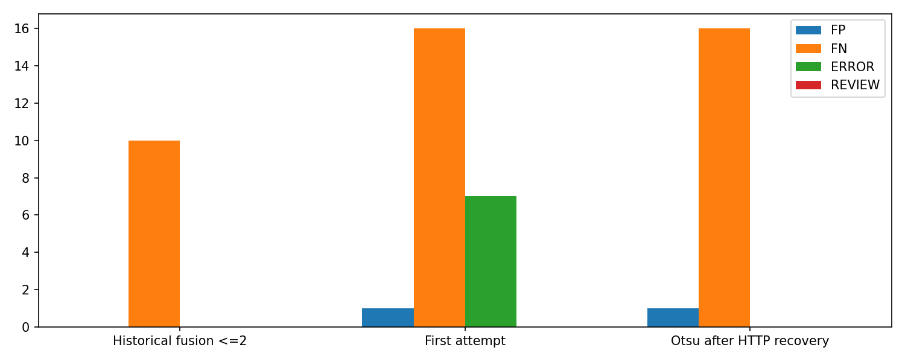
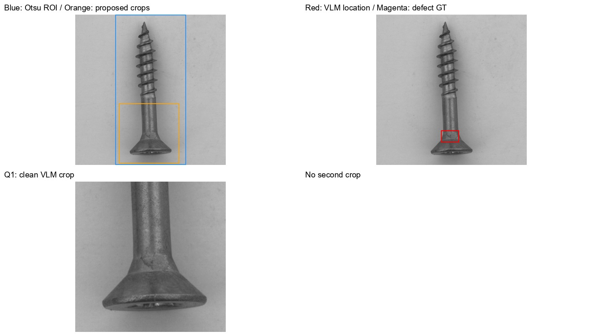

# 원본 + Otsu 의심영역 확대 + VLM — 20261008_003004

## 질문·변경
사용자 요청: 배경 제거 없이 Otsu 물체위치와 기존 검출기 의심부위를 원본과 함께 VLM에 전달. 원본은 바이트단위 동일, 모델 재학습·회색교체·SAM 없음. 확대영역 가이드만 바꾸고 정상참고3장·일반프롬프트·모델은 이전과 동일.

## 데이터·사전 고정 조건
MVTec screw 원본test160(OK41/NG119), 검출기FIT256/CAL64 동일. DINOv2/ DINO기반ReCon변형/ EfficientAD10k 원본학습 모델의 저장맵 해시검증 후 재사용. Otsu 회색조·테두리극성·5×5 opening·최대성분→박스 긴변10%씩 확장. 50×50맵 bilinear→3×3평활 후 중심좌표가 박스 안인 패치 중 모델별 최고점. 정상CAL도 같은제한으로 peak분포를 만들고 (peak-median)/(q95higher-median)로 강도보정. score는 결함확률 아님.

모델별40%크롭410×410, 후보 IoU>=0.3이면병합, 합의모델수·강도순 우선, 두번째는강도>=1/첫크롭IoU<=0.2, 최대2장. Otsu실패시 전체Q만 전달하도록설계. 원본과크롭내배경은 보존하고, 크롭은1024 Lanczos확대. 히트맵/GT/결함유형/검출점수/후보합의 수는 VLM에 미전달. 정상3장+전체Q+최대2크롭과 원본좌표라벨, 기존 일반 KoreanJSON프롬프트 그대로.

Qwen qwen/qwen3-vl-235b-a22b-instruct, temperature0,max_tokens3000, Parasail FP8 only/order, allow_fallbacks=False, data_collection deny/zdr 유지. 최초10순차·이후4병렬, 주실험160회에서재시도0. 실행중429/502 오류가발생하여사용자에게설명후 HTTP실패이미지만같은공급자에순차1회추가요청했다. 추가호출 7회, 총 167회. 최초결과와복구결과를각각저장했고정상응답을성능개선목적으로재요청하지않았다. [OpenRouter 공식 공급자고정 문서](https://openrouter.ai/docs/guides/routing/provider-selection) 확인 후설정. API시간은업로드·대기·응답 포함이며로컬검출시간제외.

## 결과
|조건|정확도%|오탐|미탐|오류/보류|형식포함정답%|평균API초|
|---|---:|---:|---:|---:|---:|---:|
|historical|93.750|0|10|0|93.750|14.42|
|first_attempt|85.000|1|16|7|85.000|7.50|
|otsu|89.375|1|16|0|89.375|7.43|

Otsu 주변 의심crop 최대2 + 원본 + 정상3장 → Qwen235B: 정확도89.375%, 오탐1, 미탐16, 오류/보류0. 이전통합crop 93.750%. 공급자 고정 Parasail, 과거대조군은 공급자/시점 혼재.

입력변경 41/160, 동일입력인데판정변경 ['Q002', 'Q021', 'Q037', 'Q065', 'Q081', 'Q092', 'Q160']. 개선ID [], 악화ID ['Q002', 'Q021', 'Q037', 'Q065', 'Q081', 'Q092', 'Q160']. 남은미탐유형 {'thread_top': 3, 'scratch_head': 3, 'thread_side': 6, 'manipulated_front': 3, 'scratch_neck': 1}. 확대영역 결함GT포함률(사후분석): {'historical': {'gt90': 106, 'gt_none': 7}, 'otsu': {'gt90': 107, 'gt_none': 6}}. 전체Q는모든영역을포함하므로 crop미포함이즉결함미노출은아님.

실제공급자 {'Parasail': 160}, API비용USD 0.216772, 시간 {'serial': {'n': 17, 'mean': 6.4688160882360535, 'median': 6.132289399996807, 'p95': 10.651994760005618}, 'parallel4': {'n': 143, 'mean': 7.547439634965015, 'median': 6.840026699996088, 'p95': 15.462988659995617}, 'all': {'n': 160, 'mean': 7.432835883125063, 'median': 6.753425500002777, 'p95': 14.191225120000283}}. 형식검증통과포함정답 89.375%. 주표분류는JSON좌표오류여도원문decision이유효하면분류로별도집계하고엄격형식점수를함께표시한다. ERROR/REVIEW는분모160에유지,OK로치환없음. 연속이상점수없어AUROC없음. VLM좌표는설명용박스이며정확한픽셀결함맵아님.

## 한계·결정·다음
이번에는 확대입력이 달라진41장 모두 이전과 같은판정이었고, 악화7장은 모두 입력이미지·참고·확대좌표가같은119장 안에서 발생했다. 따라서 이번 정확도하락을 Otsu 크롭 변경 때문이라고 해석할 근거는 없다. 동시에 Otsu로 바뀐41장에서 새로복구한미탐도0건이어서 검출개선도 확인되지 않았다. Q002 정상목부의 표면무늬를 균열이라고 설명하여오탐, Q021 머리부결함이확대에들어갔는데도참고와동일하다고답해미탐. 두 사례는확대누락보다는VLM판단문제가드러난다. 한국어JSON을요청했으나이유는영어로응답한사례가있어원문그대로보존했다. 언어준수는현재엄격스키마지표에포함하지않았다.

이미 여러차례 본screw개발평가이고 새카테고리일반화근거아님. 이전 fusion2는공급자혼재·과거실행이므로Otsu만의인과효과를분리하지못한다. 동일입력결정변화도따로집계했다. 좋은결과여도자동운영채택하지않으며남은미탐과GT확대포함을함께확인한다. 이후필요하면같은공급자·동시점의원본crop대조군을새로실행해확인해야한다. 이번조건선택에test정답사용없음.

## 실패·출처·검증
준비 최초실행 output/comparisons/otsu_vlm_crops_20261008_002922에서 numpy.bool_ JSON직렬화오류, API호출0. Python bool명시변환으로수정한뒤 새run생성,실패run상태보존.
- [원본·확대·정상참고·VLM이유·좌표 전체보고서](http://127.0.0.1:8765/output/comparisons/otsu_vlm_crops_20261008_003004/index.html)
- 실행 `E:/DH/Sandbox/Dinopatch/output/comparisons/otsu_vlm_crops_20261008_003004`, 원본검출기 `E:\DH\Sandbox\Dinopatch\output\comparisons\qwen_screw_model_fusion_20261007_221248`, 과거대조군 `E:/DH/Sandbox/Dinopatch/output/comparisons/qwen_screw_model_fusion_20261007_221248/fusion2`.
- tools/probe_otsu_vlm_crops.py, tools/probe_dino_candidate_crops.py(기존API실행기), tools/report_otsu_vlm_crops.py. logs/코드사본, proposal_plan.json·all_proposals.json·normal_calibration.json·roi.json, responses/원문, paired.csv전환, coverage.json사후GT, metrics.json.
- 사전원본/참고해시·FIT/CAL/test분리·160크롭픽셀재현, 응답160·고정모델/공급자·파싱/좌표매핑·정확도/오류집계·시각화전체상대링크·브라우저검증. artifact_manifest.json전체산출물해시. 원본데이터보존, 자격증명출력/노트복사없음.
- Obsidian요약·그림만저장,수동Gitcommit/push없음,18시예약동기화대상.

