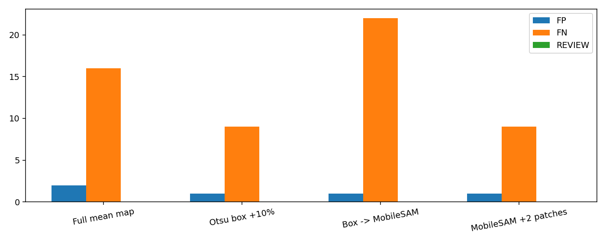
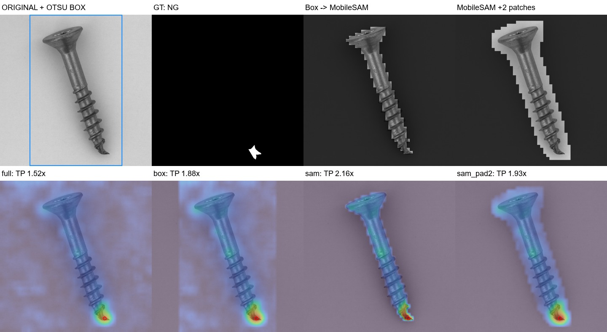
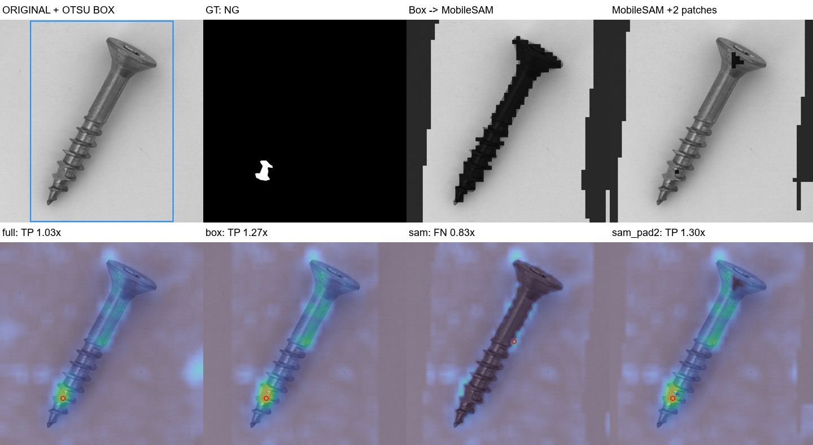

# Otsu 확장 박스 → MobileSAM 비교 — 20261007_235658

실행 시작 2026-10-07 23:56:58 KST, 검증·기록 완료 2026-10-08T00:01:17.682312 KST.

## 질문·변경
사용자가 “좀 여유롭게 박스를 만들면?” 제안 후 실험 승인. Otsu 박스를 넓혀 원본 RGB와 함께 MobileSAM에 입력하고, 박스만 채점하는 대조군과 비교했다. 원본 데이터·기존 모델·운영 설정은 변경하지 않았다. VLM/API 호출 및 검출기 재학습 없음.

## 데이터·사전 고정 설정
MVTec screw 정상 FIT256/CAL64, 원본 test160(OK41/NG119), 기존 split 재사용. 이미지 SHA256 기준 세 집합 중복 없음. 이미 여러 차례 살펴본 개발용 평가이며 독립 일반화 검증이 아니다.

기존 DINOv2/ DINO 기반 ReConPatch 변형/ EfficientAD10k의 정상CAL 픽셀 정규화 평균맵을 그대로 재사용. ReConPatch는 원논문 공식구현과 동일하지 않고 DINO 특징을 공유한다. 50×50 맵, 기존3×3 평활 후 마스크 곱하기, 최고점을 이미지 점수로 사용. 조건별 정상CAL 점수 q95(higher)를 임계값으로 고정하고 score>threshold면 NG. 시험 정답으로 임계값을 고르지 않았다. 마스킹과 CAL 재보정을 함께 비교하므로 정확도 개선을 분리 품질만의 효과로 해석하지 않는다.

Otsu: 원본 RGB→회색조→전역 Otsu→테두리 다수결 극성→5×5 opening→최대 연결성분. bbox 긴 변10%를 올림하여 상하좌우 각각 확장, 이미지 경계로 제한. SAM 입력은 전체 원본RGB와 박스만, 점 프롬프트/정합 없음. 공식 MobileSAM vit_t 체크포인트, multimask_output=False. SAM 출력의 픽셀 포함률>0.3으로50×50 마스크 생성, 확장은3×3커널2회(원본1024에서 약41px). SAM 추가 극성선택·최대성분·박스클리핑은 하지 않았다.

Otsu 면적0.5~95% 밖/누락 또는 SAM 예외/마스크 면적 범위 밖은 REVIEW. 실패CAL은 따로 계수하고 유효32장 미만이면 중단. 이번CAL64/test160 모두 면적검사를 통과했으나 실제 배경 선택 실패가 있었으므로 보류0건을 분리성공으로 간주하지 않는다.

## 검증한 결과
|조건|정확도%|오탐|미탐|AUROC%|임계값|
|---|---:|---:|---:|---:|---:|
|Full mean map|88.750|2|16|97.807|1.341569|
|Otsu box +10%|93.750|1|9|99.201|1.081688|
|Box -> MobileSAM|85.625|1|22|96.188|0.940320|
|MobileSAM +2 patches|93.750|1|9|99.160|1.056338|

Otsu 박스를 긴 변의10%씩 확장하면 screw 정확도88.75→93.75%, 오탐2→1/미탐16→9. SAM+2패치도93.75%이나 일부 배경 선택 실패가 있어 정확한 물체분리로 간주하지 않음. 우선 박스만 사용하는 단순 방식이 유망.

박스와 SAM확장은 기존TP→FN 손실0, 각각 기존FN7건을 복구했다. 같은 정확도여도 Q031/Q121의 판정은 서로 다르다. 기존 오탐Q120/Q129를 해결했지만 Q125가 새 오탐이 되었다. SAM 기본은 기존TP11건을 새로 놓쳤고 기존FN5건만 복구했다.

사후 결함GT 포함률: 박스90%이상119/119·완전누락0, SAM42/119·완전누락18, SAM확장103/119·완전누락2. 전체 물체 GT가 아닌 결함 GT 기준이므로 물체 분할IoU라고 부르지 않는다. 이 결과로 설정을 소급 수정하지 않았다. 세부ID·미탐유형은 analysis.json에 보존: {'box': {'rescued': ['Q019', 'Q033', 'Q094', 'Q103', 'Q112', 'Q121', 'Q128'], 'lost': [], 'fp': ['Q125'], 'fn': ['Q016', 'Q028', 'Q031', 'Q065', 'Q071', 'Q077', 'Q082', 'Q106', 'Q136'], 'fn_types': {'manipulated_front': 4, 'thread_side': 5}, 'gt90': 119, 'gt_none': 0}, 'sam': {'rescued': ['Q031', 'Q033', 'Q065', 'Q112', 'Q136'], 'lost': ['Q010', 'Q022', 'Q037', 'Q045', 'Q055', 'Q089', 'Q092', 'Q105', 'Q117', 'Q153', 'Q156'], 'fp': ['Q125'], 'fn': ['Q010', 'Q016', 'Q019', 'Q022', 'Q028', 'Q037', 'Q045', 'Q055', 'Q071', 'Q077', 'Q082', 'Q089', 'Q092', 'Q094', 'Q103', 'Q105', 'Q106', 'Q117', 'Q121', 'Q128', 'Q153', 'Q156'], 'fn_types': {'thread_top': 6, 'manipulated_front': 3, 'thread_side': 9, 'scratch_head': 4}, 'gt90': 42, 'gt_none': 18}, 'sam_pad2': {'rescued': ['Q019', 'Q031', 'Q033', 'Q094', 'Q103', 'Q112', 'Q128'], 'lost': [], 'fp': ['Q125'], 'fn': ['Q016', 'Q028', 'Q065', 'Q071', 'Q077', 'Q082', 'Q106', 'Q121', 'Q136'], 'fn_types': {'manipulated_front': 4, 'thread_side': 5}, 'gt90': 103, 'gt_none': 2}}

## 직접 관찰한 실패·한계
- Q048/Q130: 이전 DINO 마스크가 잘랐던 변형 끝단을 이번 박스와 SAM확장이 보존하고 TP 유지.
- Q010: SAM 기본 마스크가 나사 대신 주위 배경을 남김. 기본SAM FN→확장TP여도 올바른 물체분리의 증거가 아니다.
- Q125: 정상 나사인데 SAM이 배경을 선택. 박스 안 상단 배경의 고점이 남고 CAL 재보정으로 임계값이 낮아져 full TN→세 조건 FP. 확장 박스도 배경을 모두 제거하지 않는다.
- 면적만으로 마스크 품질검사를 하면 배경 선택이나 부분 누락을 놓친다. Otsu와 SAM의 겹침, 물체 내부점 등 품질판정은 다음 실험 대상이며 이번에는 추가하지 않았다.
- 마스크 전에 평활했으므로 결함영역을 지웠어도 주변에 점수가 남을 수 있다. 이미지NG 정답과 위치정확도는 별개다.
- Otsu는 밝기대비와 단순배경에 기대며 다른 카테고리/어두운 영상/다중물체 일반화를 입증하지 않는다. 10% 이외 여유폭 최적화도 하지 않았다. SAM 시간은 segments.json의 관측치만 저장했으며 정식 속도 벤치마크 아님.

## 결정·다음
이번 평가에서 확장박스만으로 SAM확장과 같은 정확도 및 더 높은 결함영역 보존을 얻었다. 우선 박스 대조군을 유지하고, SAM을 자동으로 더 좋은 방법이라 채택하지 않는다. SAM 배경 선택을 정상CAL만으로 감지/보류할 수 있는지 독립 실험하고 다른 카테고리로 재검증해야 한다. 생산 기본값 변경 없음.

## 산출물·검증
- [160장 원본·마스크·이상맵·점수 대시보드](http://127.0.0.1:8765/output/comparisons/otsu_box_mobile_sam_20261007_235658/index.html)
- 실행: `E:/DH/Sandbox/Dinopatch/output/comparisons/otsu_box_mobile_sam_20261007_235658`
- 모델·split 출처: `E:/DH/Sandbox/Dinopatch/output/comparisons/qwen_screw_model_fusion_20261007_221248`
- 평균맵 출처: `E:/DH/Sandbox/Dinopatch/output/comparisons/pixel_fusion_no_vlm_20261007_231904`
- 코드: tools/probe_otsu_box_mobile_sam.py, tools/finish_otsu_box_mobile_sam.py, dinopatch/align.py, dinopatch/masks.py. 실행 코드 사본logs/, checkpoint 출처·SHA256 run.json.
- 원본224장 해시, 박스계산/격자변환/팽창224건, 가중맵640개·최고점·판정·혼동행렬·CAL임계값, 결함GT119건 포함률 재계산. 브라우저 필터/161이미지 로딩 및161페이지 링크 확인. artifact_manifest.json에 전체 산출물 해시.
- Obsidian에는 핵심그림3장과 요약만 저장. 데이터·모델·자격증명 제외. 수동 commit/push 없음, 기존18시 예약 동기화 대상.

