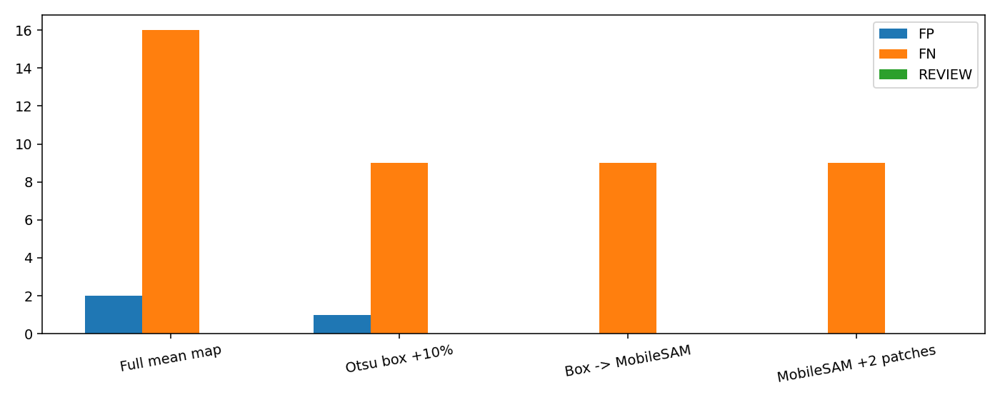
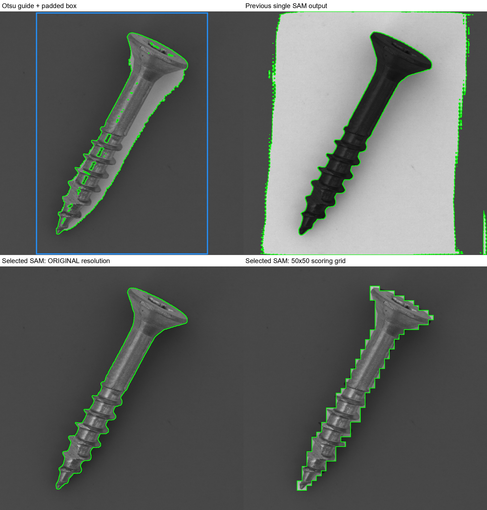
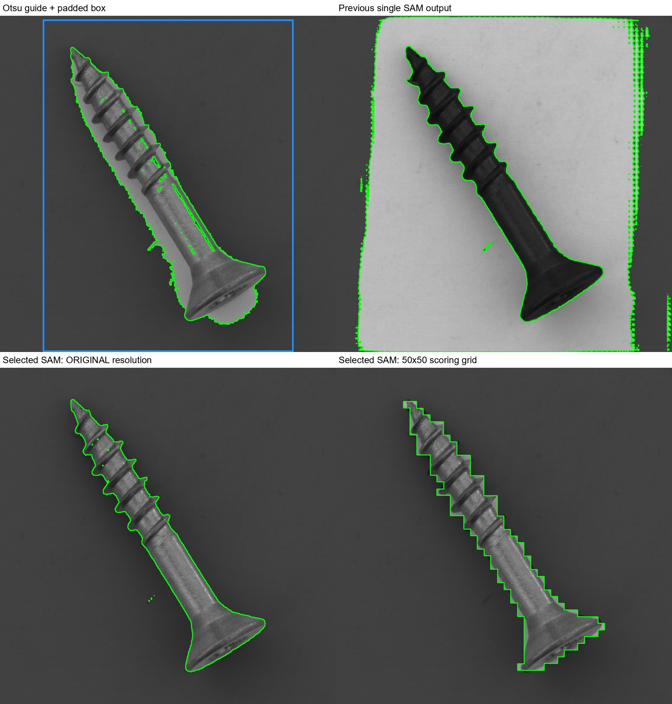

# Otsu 박스 → MobileSAM 후보 선택 — 20261008_000558

## 질문·변경
사용자는 Otsu로 물체 위치와 여유 있는 박스를 잡고 MobileSAM이 내부 물체 경계를 추출하기를 요청했다. 이전 단일 마스크가 배경을 선택하는 문제가 있어 동일 박스를 입력하되 후보3개 중 Otsu 전경과 원본해상도 IoU가 최대인 것을 선택했다. 최종 경계는 SAM 출력 그대로이며 Otsu와 교집합/합집합하거나 박스로 자르지 않는다. 점 프롬프트도 없다. 기존 제품 동작과 원본 데이터는 변경하지 않은 비교 실험.

## 데이터·설정
MVTec screw FIT256/CAL64, 원본 test160(OK41/NG119), 이전과 동일 split 및 원본 SHA256 검증. 기존 DINO·DINO기반ReConPatch변형·EfficientAD10k 평균 이상맵 재사용, 재학습/VLM/API 없음. CAL과test는 학습에서 분리했지만 이미 반복 확인한 개발 평가이므로 일반화 증거는 아님.

Otsu는 회색조 전역임계값·테두리극성·5×5 opening·최대성분. 박스 긴변10%씩 사방확장, 경계제한. 공식 MobileSAM vit_t 가중치 고정, 전체 RGB+box 입력, multimask_output=True. 후보3개 중 Otsu와 IoU 최대 선택, 동률은 첫 후보. SAM 자체 predicted quality는 기록만 하고 선택에 사용하지 않았다. 결함GT와 이상점수도 선택에 사용하지 않았다.

원본SAM→50×50 피복률>0.3, 확장은3×3커널2회. 기존3×3평활된 평균맵에 마스크를 곱하고 최대점수 사용. 방식별 정상CAL q95(higher), score>threshold NG. 면적0.5~95% 밖/예외는 REVIEW, 전체 평가 분모에 유지. 면적만으로 모든 분리 실패를 감지할 수 없음.

## 검증 결과
|조건|정확도%|오탐|미탐|보류|AUROC%|
|---|---:|---:|---:|---:|---:|
|기존 전체|88.750|2|16|0|97.807|
|확장 박스|93.750|1|9|0|99.201|
|이전 SAM 단일출력|85.625|1|22|0|96.188|
|SAM 후보선택|94.375|0|9|0|99.508|
|SAM 후보선택+2패치|94.375|0|9|0|99.467|

SAM 후보를 Otsu IoU로 선택: 기본 정확도94.375%/오탐0/미탐9, 2패치 확장 94.375%/오탐0/미탐9. 박스 대조군93.75%.

사후 GT 포함률·기존 전체맵 대비 복구/손실: {'box': {'rescued': ['Q019', 'Q033', 'Q094', 'Q103', 'Q112', 'Q121', 'Q128'], 'lost': [], 'fp': ['Q125'], 'fn': ['Q016', 'Q028', 'Q031', 'Q065', 'Q071', 'Q077', 'Q082', 'Q106', 'Q136'], 'fn_types': {'manipulated_front': 4, 'thread_side': 5}, 'gt90': 119, 'gt_none': 0}, 'sam': {'rescued': ['Q019', 'Q031', 'Q033', 'Q094', 'Q103', 'Q112', 'Q128'], 'lost': [], 'fp': [], 'fn': ['Q016', 'Q028', 'Q065', 'Q071', 'Q077', 'Q082', 'Q106', 'Q121', 'Q136'], 'fn_types': {'manipulated_front': 4, 'thread_side': 5}, 'gt90': 76, 'gt_none': 0}, 'sam_pad2': {'rescued': ['Q019', 'Q031', 'Q033', 'Q094', 'Q103', 'Q112', 'Q128'], 'lost': [], 'fp': [], 'fn': ['Q016', 'Q028', 'Q065', 'Q071', 'Q077', 'Q082', 'Q106', 'Q121', 'Q136'], 'fn_types': {'manipulated_front': 4, 'thread_side': 5}, 'gt90': 116, 'gt_none': 0}}

원본해상도SAM 결함GT90%이상 포함 75/119, 완전누락 0/119. 이는 물체전체 분할 정확도가 아니다. Otsu 대비 test 평균IoU 이전 0.3863 → 선택후 0.6684. 선택기준 자체가 OtsuIoU이므로 이 수치 상승은 독립적인 분할성능 증거가 아니다.

## 해석·실패·결정
직접 확인한 Q010/Q125는 이전 배경 마스크 대신 나사 본체 경계를 선택했다. Q125의 오탐도 해소됐다. 전체맵 대비 기존TP 손실0건, 미탐7건 복구이며 남은 미탐9건은 manipulated_front4건/thread_side5건이다. 박스 대조군과 비교하면 Q031은 추가 검출, Q121은 검출 손실이므로 단순히 모든 불량에서 우월하다고 할 수 없다. 기본SAM과2패치확장의 판정 결과는 같지만 결함GT90%이상 포함은76→116/119로 달랐다.

후보 선택과 원본 해상도 경계 시각화를 분리하여 저장했다. 원본SAM과50×50격자의 경계차이를 눈으로 확인할 수 있다. 배경 선택/부분물체 선택이 후보 변경으로 개선될 수 있어도 정상검출 정확도가 함께 오르리라는 보장은 없다. 이미 평활된 맵의 마스크 안 점수와 정상CAL 재보정이 함께 작용하므로 이미지TP는 결함위치를 정확히 찾았다는 뜻이 아니다. 미탐·새검출손실은 analysis.json에 유지했다. 원본 결함 정답을 보고 후보선택 기준이나 임계값을 수정하지 않았다.

원본해상도 마스크와 패치마스크의 차이 및 남은 미탐을 보고 다음 단계를 정한다. Otsu 가이드 자체가 실패할 수 있는 복잡배경/다른카테고리는 검증하지 않았다. 운영기본 변경 없음. SAM 후보가 모두 잘못된 경우를 판정보류로 보낼 품질 기준은 별도 검증 필요.

## 시각화·출처·검증
- [전체160장 보고서](http://127.0.0.1:8765/output/comparisons/otsu_candidate_mobile_sam_20261008_000558/index.html), 각 사례에 원본해상도 경계4분할·후보3장·이상맵·점수 링크.
- 실행: `E:/DH/Sandbox/Dinopatch/output/comparisons/otsu_candidate_mobile_sam_20261008_000558`
- 대조군: `E:/DH/Sandbox/Dinopatch/output/comparisons/otsu_box_mobile_sam_20261007_235658`
- 코드: tools/probe_otsu_box_mobile_sam.py --candidate-selection, tools/finish_otsu_box_mobile_sam.py --audit-only, tools/finish_sam_candidates.py. 코드사본logs/, 가중치SHA256/설정run.json.
- 224장 원본해시·박스 동일성·후보IoU/최대선택/최종마스크, 640맵·최대점수·임계값·혼동행렬, 119개 결함GT 포함률 재계산. full/box 지표 이전과 정확히 일치. 브라우저 이미지·필터 및 모든 사례페이지 상대링크 검증. 전체 산출물manifest 해시 보존.
- Obsidian에는 요약과 핵심시각화만 저장. 수동git commit/push 없음, 기존18시 예약동기화 대상. 시간은 정식벤치마크가 아니며 이번 후보PNG저장 등도 포함한다.

