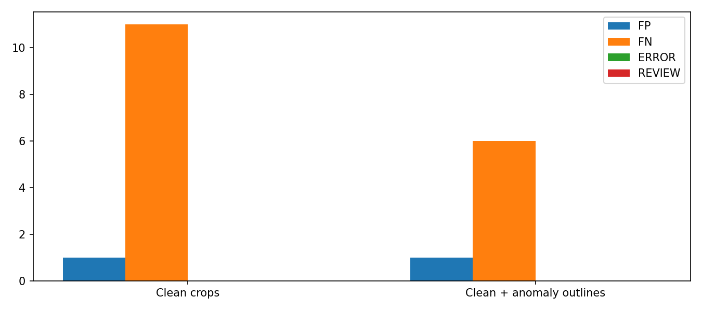
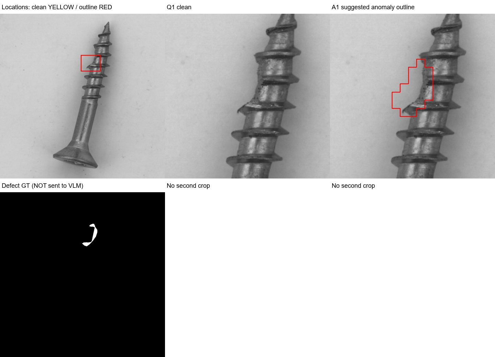

# VLM에 이상 영역 윤곽선 추가 — 20261008_004614

## 질문·변경
사용자는 이상맵/이상마스크를 함께 보내면 VLM이 더 잘판단할지 요청했다. 깨끗한 확대를 유지하면서 같은확대의 의심윤곽선 보조이미지를 추가하는 조건과 깨끗한확대만의 조건을 새로 대응비교했다. 원본배경변경·SAM·재학습 없음.

## 데이터·설계
MVTec screw160(정상41/불량119). 기존 FIT256/CAL64 원본학습 검출기와 Otsu가이드 crop 최대2개 그대로. 정상참고3장·전체Q·깨끗한Q1/Q2는 두조건 바이트동일. outline조건만 A1/A2 추가. 총확대178개, 기준이하52개는 윤곽없음. 표시있는이미지 114, 없는이미지 46. 표시없는조건도모두분모에유지.

의심영역: 정상CAL pooled픽셀 median/q99.5로정규화한 DINO/ReCon변형/EfficientAD 평균맵,3×3평활,50×50. 각crop 안에서 평균점수>1인8연결성분 중 crop최고점을포함하는하나선택. 최고점<=1이면표시없음. 50×50을원본1024로nearest확대→crop→1024nearest확대→외곽선빨강3px만그림. fill없음. GT/불량유형을영역선택에사용하지않음. 일반물체마스크가아니라검출기고점영역이며경계는패치해상도의근사다.

같은일반프롬프트를양쪽에사용: 빨간선은다른검출기의제안이며결함정답아님, 원본·정상과실제차이를확인하고표시밖도검사. Qwen3-VL235B instruct, temperature0,max_tokens3000,Parasail/fp8 only/order,fallbackFalse,data deny/ZDR. 조건선행순서80/80 seed20261008셔플, 최초2쌍순차·이후4병렬. 주실험320회새호출, HTTP오류만동일조건순차1회복구. 재시도호출수 {'clean': 1, 'outline': 2}. 원응답덮어쓰기없음. 정상응답을정답개선목적으로재호출하지않음.

## 결과
|조건|정확도%|오탐|미탐|오류/보류|형식포함정답%|평균API초|
|---|---:|---:|---:|---:|---:|---:|
|clean|92.500|1|11|0|92.500|7.39|
|outline|95.625|1|6|0|95.625|9.11|

동시점·고정공급자 VLM 비교: 깨끗한 확대 92.500% (오탐1/미탐11), 의심윤곽 추가 95.625% (오탐1/미탐6). 개선5건/악화0건.

개선ID ['Q060', 'Q092', 'Q094', 'Q103', 'Q112']; 악화ID []. 불일치 5, 정확도차이에대한탐색적대응이항검정(McNemar exact) p=0.062500. 단일실행개발평가이고다중탐색중이므로검정값을일반화성공근거로사용하지않는다.

표시유무별 {'False': {'n': 46, 'improved': 0, 'regressed': 0}, 'True': {'n': 114, 'improved': 5, 'regressed': 0}}. 의심영역이결함GT와조금이라도겹친불량 105/119, GT90%이상포함 72/119. 이분석은사후이며선택/프롬프트에미사용. 윤곽선내부전체를검출기제안영역으로계산하며, 실제VLM에는얇은선과깨끗한이미지만제공했다.

윤곽내부가GT와겹쳤지만윤곽조건에서미탐인ID: ['Q010', 'Q062', 'Q109']. 부분겹침만으로VLM이충분한결함근거를봤다고확정하지않으며사례별입력을함께확인해야한다.

VLM이반환한박스와결함GT가겹친불량수 {'clean': 101, 'outline': 107}/119. 분류는개선됐으나VLM박스와GT가전혀겹치지않은ID ['Q094', 'Q112']. 큰박스가GT와겹치는것은정밀위치검출을보장하지않으며이수치를픽셀AUROC처럼해석하지않는다.

미탐유형 {'clean': {'thread_top': 3, 'thread_side': 6, 'manipulated_front': 1, 'scratch_neck': 1}, 'outline': {'thread_top': 1, 'thread_side': 3, 'manipulated_front': 1, 'scratch_neck': 1}}. 최초조건별결과 {'clean': {'n': 160, 'TP': 107, 'TN': 40, 'FP': 1, 'FN': 11, 'ERROR': 1, 'REVIEW': 0, 'accuracy': 91.875, 'coverage': 99.375, 'recall': 89.91596638655462, 'strict': {'TP': 107, 'FN': 11, 'TN': 40, 'FP': 1, 'ERROR': 1, 'REVIEW': 0, 'n': 160, 'normal': 41, 'ng': 119, 'correct_valid_percent': 91.875, 'timing': {'serial': {'n': 2, 'mean': 4.656804850001208, 'median': 4.656804850001208, 'p95': 5.441417695003111}, 'parallel4': {'n': 157, 'mean': 7.424177599362703, 'median': 6.548535099995206, 'p95': 13.93115131999511}, 'all': {'n': 159, 'mean': 7.389367879244948, 'median': 6.50066379999771, 'p95': 13.879463859994573}}, 'providers': {'Parasail': 159, None: 1}, 'cost_usd': 0.19605597, 'mean_input_tokens': 5582.471698113208}}, 'outline': {'n': 160, 'TP': 112, 'TN': 39, 'FP': 1, 'FN': 6, 'ERROR': 2, 'REVIEW': 0, 'accuracy': 94.375, 'coverage': 98.75, 'recall': 94.11764705882354, 'strict': {'TP': 112, 'FN': 6, 'TN': 39, 'FP': 1, 'ERROR': 2, 'REVIEW': 0, 'n': 160, 'normal': 41, 'ng': 119, 'correct_valid_percent': 94.375, 'timing': {'serial': {'n': 2, 'mean': 6.249584950001008, 'median': 6.249584950001008, 'p95': 6.322219225002845}, 'parallel4': {'n': 156, 'mean': 9.161404596153938, 'median': 7.974675400000706, 'p95': 18.155312524999317}, 'all': {'n': 158, 'mean': 9.124546119620357, 'median': 7.946532750000188, 'p95': 18.12505587499909}}, 'providers': {'Parasail': 158, None: 2}, 'cost_usd': 0.24340194, 'mean_input_tokens': 6775.835443037975}}}. 오류/보류도분모160유지. 주분류와좌표형식을포함한엄격정답률을구분한다. 한국어를요청해도영어이유가나올수있고언어준수는현재스키마정답률과별개. 연속이상점수없어AUROC없음. VLM좌표는설명박스이며픽셀정답마스크아님.

## 한계·결정·다음
Q010은 두조건 모두OK로미탐이었다. 윤곽조건의원문이유는 A1의표시영역을정상나사산특징으로해석했다. 실제입력 A1에서의심윤곽이손상부위를가리키는것을직접확인했으므로, 적어도이사례는단순히확대위치를못찾아서발생한오류로만설명할수없다. 모델의해석이맞다는뜻이아니며검출기제안을정상으로오판한실패로기록한다.

Q060/Q092는깨끗한조건OK→윤곽조건NG로바뀌었고, 설명박스가나사산결함GT와겹치는것을확인했다. Q094도분류상FN→TP지만몸통의작은밝은점을표면결함으로설명했다. 실제라벨은다른위치의thread_side이며VLM설명박스와GT는겹치지않는다. 따라서Q094를라벨된결함의정확한검출성공으로간주하지않는다. 표시가다른시각적특징에주의를유도하여이미지분류만맞힌사례일수있다.

Q103은나사산손상과겹치는위치를지목한추가검출이다. Q112는실제나사산결함대신Q2/A2의배경실오라기같은이물을불량이유로설명했다. 의심윤곽이배경에도생길수있고VLM이검사대상범위를오해하면이미지NG만맞힐수있다는사례다. 이번추가검출5건중GT와위치겹침3건,미겹침2건이며,후자2건을정확한결함검출로계수하면과대해석이다.

같은공급자·근접시점의새로운대응비교로이전과거대조군혼재문제를줄였다. 그래도temperature0이완전결정론을보장하지않고반복실험은아니다. outline조건은추가이미지를보므로표시효과와추가이미지/토큰수효과가함께있다. 같은이미지수의중복깨끗한crop대조군은이번범위아니다. 이미본screw개발평가이며다른카테고리일반화근거아님. 모델의의심을VLM이정답처럼받아들여오탐을늘리는지와결함검출개선을함께판단한다. 운영기본값변경없음; 개선·악화사례를확인한뒤다음단계를정한다.

평균입력수 {'clean': 5.1125, 'outline': 6.225}, API시간 {'clean': {'serial': {'n': 3, 'mean': 5.524112800002816, 'median': 5.528596900003322, 'p95': 7.085715520005761}, 'parallel4': {'n': 157, 'mean': 7.424177599362703, 'median': 6.548535099995206, 'p95': 13.93115131999511}, 'all': {'n': 160, 'mean': 7.388551384374705, 'median': 6.524599449996458, 'p95': 13.853620129994297}}, 'outline': {'serial': {'n': 4, 'mean': 7.141535349999685, 'median': 6.456616550000035, 'p95': 9.048865394999302}, 'parallel4': {'n': 156, 'mean': 9.161404596153938, 'median': 7.974675400000706, 'p95': 18.155312524999317}, 'all': {'n': 160, 'mean': 9.110907865000081, 'median': 7.946532750000188, 'p95': 18.094799224998855}}}, 응답usage기준비용 {'clean': 0.19746878, 'outline': 0.24668754}. API시간에는네트워크·대기·응답포함,로컬모델/마스크생성제외. 복구전실패시간까지포함한현장종단지연아님.

## 출처·검증
- [전체160장 두조건판정·깨끗한확대·윤곽선·이유](http://127.0.0.1:8765/output/comparisons/vlm_anomaly_contours_20261008_004614/index.html)
- 실행 `E:/DH/Sandbox/Dinopatch/output/comparisons/vlm_anomaly_contours_20261008_004614`; 입력출처 `E:\DH\Sandbox\Dinopatch\output\comparisons\otsu_vlm_crops_20261008_003004`; 이상맵 `E:\DH\Sandbox\Dinopatch\output\comparisons\pixel_fusion_no_vlm_20261007_231904`.
- tools/probe_vlm_anomaly_contours.py, tools/audit_vlm_anomaly_contours.py, tools/report_vlm_anomaly_contours.py. 실행코드logs/, data/selection.json, masks/, contour_details.json, clean/outline각responses및recovery_responses, paired.csv, metrics.json.
- 원본/참고/crop해시동일,178윤곽 재계산·빨간선외픽셀동일·빈영역/연결성분toy검사, 각160응답·실제모델/공급자·위치변환·판정/오류검증, 모든보고서상대참조·브라우저필터/이미지검증, manifest전파일해시. 원본데이터·자격증명보존.
- Obsidian에는핵심그림과요약만복사,수동commit/push없음,기존18시예약동기화대상.

