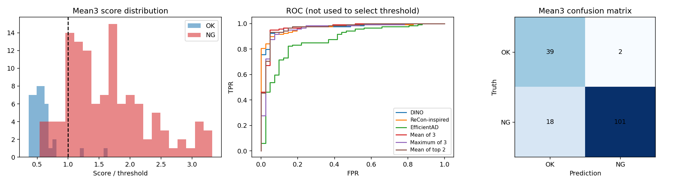
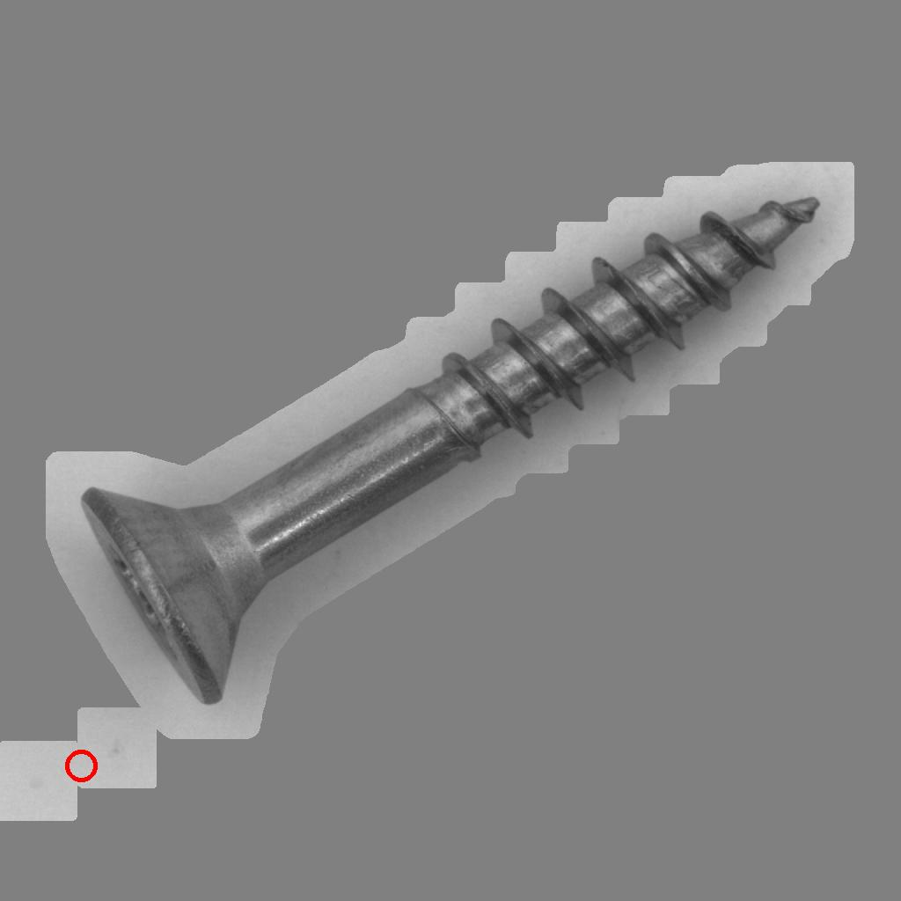
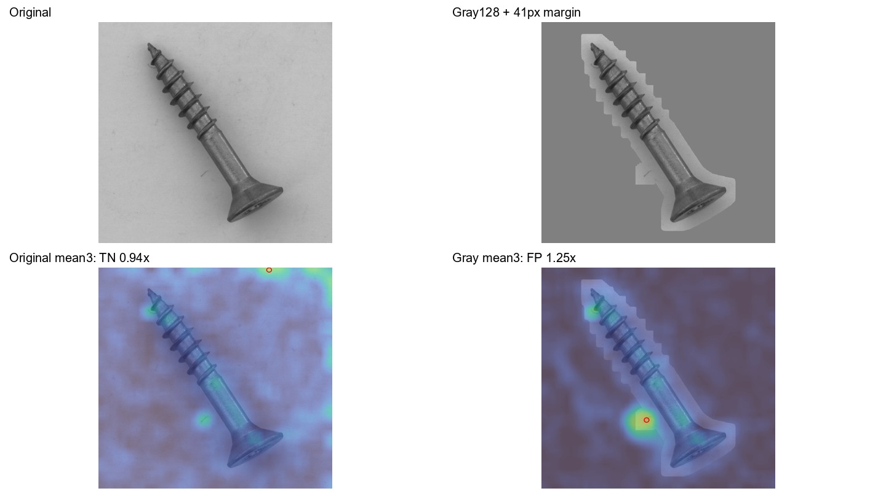

# 회색 배경 교체 후 전체 이상맵 검사 — 20261008_001622

## 질문·변경
사용자는 경계 밖 점수를 제거하면 나사산 결함을 놓칠 수 있으므로 이미지의 배경만 통일하는 방법을 제안했다. RGB128 회색 한 조건, SAM 경계 여유 후 바깥만 교체, 전체 이상맵 채점으로 비교했다. 원본은 보존했고 처리본을 별도저장했다. VLM/API 없음.

## 데이터·설정
MVTec screw 정상FIT256/CAL64, 검사160(OK41/NG119) 동일 원본 분할. 원본SHA256 세집합 중복없음. 동일원본을 사용하지만 이번 모델입력은 배경을 합성한 이미지이므로 무처리 원본시험으로 표기하지 않는다. 이미 여러 번 본 개발평가이며 독립 일반화 증거 아님.

전처리: Otsu박스 긴변10%씩 확장, MobileSAM3후보 중 Otsu IoU최대 선택. CAL/test 마스크는 직전 실험 해시 확인후 재사용, FIT256은 같은 알고리즘으로 새로 추출. 원본해상도SAM마스크를 사각커널로 사방 ceil(2*긴변/50)=41px 팽창, 안쪽 RGB원본 완전보존, 밖 RGB128. 경계 blending없음. 따라서 물체 주위41px의 기존 배경은 남고, 그보다 바깥만 통일된다. 면적범위 실패 시 실험중단하도록 했으며 이번480장 모두 통과. 면적 통과는 완전분할 보장 아님.

DINOv2 동일동결가중치700입력50×50, 정상FIT 특징/coreset30000 재구축. ReConPatch는 DINO768→512 adapter120epoch×32step/coreset30000인 기존변형을 같은seed로 재학습(원논문WRN아님). EfficientAD small official teacher고정, student+AE 재초기화10000step, 동일ImageNette 보조penalty(이 보조데이터는 배경처리하지 않음). FIT만 학습, CAL은ST/AE분위보정과 각모델정규화/임계값에 사용. 검출기 평가일정은 이전동일; 반복seed실험은 아님.

각모델CAL pooled픽셀 median/q99.5 정규화, 공통50×50 동일가중평균,3×3평활, 전체맵 최고점. SAM마스크로 점수를 지우지 않음. 조건별CAL q95(higher)보다크면NG. test정답으로 threshold/색상/여유폭 선택없음. 흰색·검은색은 이번 미실험.

## 검증 결과
|모델|원본 정확도%|회색 정확도%|원본 오탐/미탐|회색 오탐/미탐|
|---|---:|---:|---|---|
|dino|73.750|91.875|3/39|2/11|
|recon|78.750|89.375|3/31|2/15|
|efficientad|86.250|41.250|0/22|1/93|
|mean3|88.750|87.500|2/16|2/18|

회색 배경 교체 후 세 모델 재학습: 평균 정확도87.500%, 오탐2/미탐18. 원본 평균88.75%·2/16, 이전SAM점수제거94.375%·0/9와 비교.

전환: {'original': {'rescued': ['Q031', 'Q094', 'Q112', 'Q128'], 'lost': ['Q010', 'Q021', 'Q024', 'Q069', 'Q109', 'Q160']}, 'sam_gating': {'rescued': [], 'lost': ['Q010', 'Q019', 'Q021', 'Q024', 'Q033', 'Q069', 'Q103', 'Q109', 'Q160']}}
미탐 유형: {'thread_top': 1, 'manipulated_front': 6, 'thread_side': 9, 'scratch_head': 1, 'scratch_neck': 1}. 오탐ID ['Q124', 'Q125'], 미탐ID ['Q010', 'Q016', 'Q019', 'Q021', 'Q024', 'Q028', 'Q033', 'Q065', 'Q069', 'Q071', 'Q077', 'Q082', 'Q103', 'Q106', 'Q109', 'Q121', 'Q136', 'Q160'].
배경교체 전 보존영역이 결함GT90%이상 포함한 수 116/119, 결함GT완전제외 0/119. 이GT는 사후분석이며 전처리 선택에 사용하지 않음. 물체전체분할GT가 아니므로 분할IoU 아님.

## 한계·결정·다음
정상CAL C036을 직접 확인하면 나사와 별개인 작은 SAM 잔여영역이41px 팽창하면서 배경조각으로 남고, EfficientAD 최고점은 그 부근(50×50격자x4,y42)에 찍혔다. 처리본 위 최고점 시각화 logs/C036_efficientad_peak.jpg에 보존했다. EfficientAD 단독 정상CAL 임계값2.524213, test정상중앙0.910999/불량중앙1.813608로 다수불량이 임계값 아래에 있었다. 이것은 이번 실행의 관찰이며 배경교체 일반의 불가능성을 뜻하지 않는다. 정상test Q125도 물체 바깥의 남은 배경조각 근처에서 평균 최고점이 생겨 FP였다. Q016은 나사끝 결함 근처 반응이 있지만 임계값보다 낮아 미탐이었다.

마스크 밖 점수를 제거하는 방법과 배경색 교체 전처리를 구분했다. SAM이 결함을 누락하면 여유 밖 결함은 픽셀 자체가 바뀔 수 있고, hard한 회색 경계가 새로운 특징/이상반응을 만들 수도 있다. 성능 변화만으로 원인을 확정하지 않으며 경계·물체·배경의 점수 위치를 시각화로 확인해야 한다. 현재결과만으로 생산기본값이나 일반해법을 채택하지 않는다. 남은 오류와 인공 경계 영향 확인 후 다른색/완만한전환/다른카테고리 비교 여부를 정한다. 기존 점수제거94.375% 결론을 덮어쓰지 않고 별도 실험으로 보존했다.

## 산출물·검증
- [전체160장 입력·모델별 이상맵·점수·비교](http://127.0.0.1:8765/output/comparisons/gray_background_20261008_001622/evaluation/index.html)
- 실행 `E:/DH/Sandbox/Dinopatch/output/comparisons/gray_background_20261008_001622`; 모델출처 `E:\DH\Sandbox\Dinopatch\output\comparisons\qwen_screw_model_fusion_20261007_221248`; 마스크출처 `E:\DH\Sandbox\Dinopatch\output\comparisons\otsu_candidate_mobile_sam_20261008_000558`.
- tools/probe_gray_background.py, tools/prepare_model_candidate_fusion.py, tools/probe_pixel_fusion_no_vlm.py, tools/finish_gray_background.py. 실행코드사본logs/, model/에 가중치와 학습이력, preprocessing.json원본/처리본해시.
- 480장 원본보존해시·영역안 픽셀 동일/밖128·팽창재계산·FIT/CAL/test분리, 모델가중치 출처/학습step, 672원시맵 및960결합맵 재계산, 정상CAL정규화·threshold·혼동행렬·HTML상대참조·브라우저검증. 비교이미지는 동일한점수/자기threshold색상범위0~2이며 확률 아님.
- Obsidian에는 요약·핵심그림만 복사. 수동commit/push없음, 기존18시 예약 동기화 대상. 정식추론속도벤치마크 없음.

